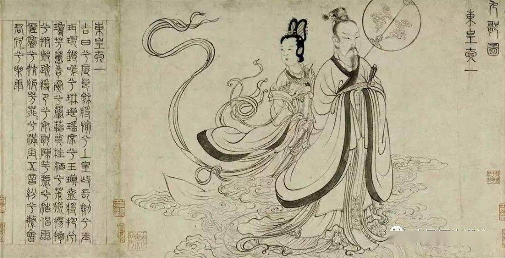
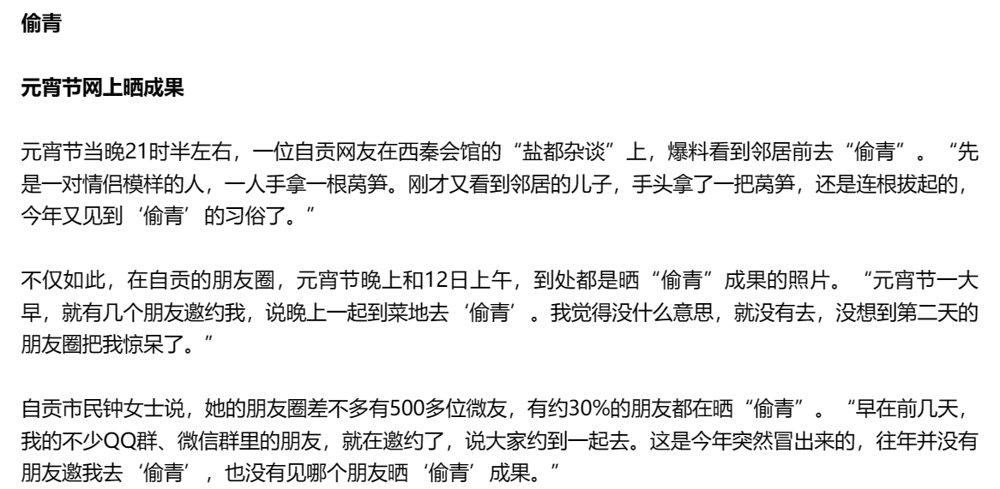

元宵节，是中国春节年俗中最后一个重要节令，时间为每年农历正月十五。以古代历法而言，正月是农历的元月。《说文解字》记载：“元，为始；宵，为夜。”

这是新年第一个月圆之夜，所以名之为“元宵节”

宋辛弃疾《元夕》词云：“东风夜放花千树，更吹落，星如雨。宝马雕车香满路。凤箫声动，玉壶光转，一夜鱼龙舞。”形象生动地展现了元宵灯会的繁荣场景。今天，元宵放灯、观灯，仍是中国广大地区人民喜闻乐见的民俗娱乐活动。特别是近几年，出现了空前繁荣的景象

## 来历

元宵节，在民间又称为上元节、小正月、元夕或灯节，是春节过后第一个重要的节日。古人称夜为“宵”，所以把一年中第一个月圆之夜的正月十五就称为“元宵节”。它的起源在民间的说法不一

### 汉武帝“太一神”祭祀活动

最有影响力

汉武帝正月十五月圆夜，祭祀天神，而劳动人民效仿用来祈求庄稼丰收，而后逐步转换成了热闹的庆祝活动，都希望将春节喜气的气氛，在元宵节中得以延续，而喜迎春天的到来。这时，天气转暖，在四季轮回、大地复苏中，人们继续农耕生产，实现安居乐业

> 太一,是西汉时期十分重要的祭祀神灵,《史记》与《汉书》中多有记载。太一源于道家思想。郭店楚简有《太一生水》篇,记载“大(太)一生水,水反辅大(太)一,是以成天。天反辅大(太)一,是以成地。天地(复相辅)也,是以成神明。”

唐代：

《初学记》载:“《史记·乐书》曰:‘汉家祀太一,以昏时祠到明,今人正月望日夜游观灯,是其遗事。”

《艺文类聚》载:“史记曰:‘汉家以望日祀太一,从昏时到明。’今夜游观灯,是其遗迹。”

认为：元宵节是“汉武帝上辛日祀太一神之遗事”

源于：《史记·乐书》:“汉家常以正月上辛祠太一甘泉,以昏时夜祠,到明而终。常有流星经于祠坛上。使童男童女七十人俱歌”

这是一段对汉代祭祀风俗的描述，从黄昏开始，用盛大的灯火祭祀太一神，并让童男童女们一起唱歌，从黄昏开始，通宵达旦，唐代《艺文类聚》猜想这正是元宵节夜游观灯的起源。

问题：

- 上辛日与正月十五日之间尚有一段时间间隔

> 秦汉时期的节日,是按照天干地支相组合的纪日法来制定节期的
>
> 根据古代计算天干地支的方法推算,上辛日是正月的第一个“辛日”,至早可能会是正月初一日,至晚不会超出正月初十日

- 活动方式与民俗活动差异较大

> 西汉武帝祭祀太一神,其行为本身是一种帝王的祭祀活动,遵循严格的祭祀礼仪。
>
> 南北朝时期（汉朝之后）关于正月十五日的记载,活动形式多样而分散。《北齐书·尔朱文畅传》记载:“自魏氏旧俗,以正月十五日夜为打竹簇之戏,有能中者,即时帛赏。”从其描述不难发现,正月十五日打竹簇之戏由来已久,是“魏氏旧俗”。打竹簇等活动在夜间举行,魏氏是鲜卑族拓跋氏。这说明,在北魏时期,宫廷之中已经出现欢庆正月十五夜的现象。
>
> 从民俗活动来看,南北朝时期的节日内容与“太一神”之间很难发现必然的承继关系

### 道教“三元说”

元宵燃灯的习俗起源于道教的“三元说”；正月十五日为上元节，七月十五日为中元节，十月十五日为下元节。主管上、中、下三元的分别为天、地、人三官，天官喜乐，故上元节要燃灯。

道家解释宇宙分为天、地、水三界，分别以天官、地官、水官掌管。到了[北魏](https://baike.baidu.com/item/北魏/914008?fromModule=lemma_inlink)时，以三官配三元节，农历正月十五日定为天官诞辰，为上元节，七月十五日地官诞辰为中元节，十月十五日水官诞辰为下元节 [80]。三元日和三官主三元日的说法，最早见于[东晋](https://baike.baidu.com/item/东晋/456028?fromModule=lemma_inlink)末[刘宋](https://baike.baidu.com/item/刘宋/10862114?fromModule=lemma_inlink)初的古灵宝经《太上洞玄灵宝三元品戒经》。南宋[吴自牧](https://baike.baidu.com/item/吴自牧/3980377?fromModule=lemma_inlink)在《[梦粱录](https://baike.baidu.com/item/梦粱录/1998347?fromModule=lemma_inlink)》中说：“正月十五元夕节，乃上元天官赐福之辰。”

### 正式形成于唐

元宵在早期节庆形成过程之时，只称正月十五、正月半或月望，隋以后称**元夕或元夜**

元宵张灯即成为法定之事，唐末才偶称元宵

隋唐时期是中国节令风俗大变革时期,也是元宵节重要的形成期。此一时期的节日活动俗伴随着城市生活的发展而逐渐繁盛，逐渐抛弃了汉魏时期以禁忌、祓除等为主的祷祭风俗,开始向全民娱乐的方向发展。

此时的元宵节称为正月十五日、望日或上元日,是夜称为正月十五夜、望夜或元夕。隋炀帝有诗《元夕于通衢建灯夜升南楼》云:“法轮天上转,梵声天上来。灯树千光照,花焰七枝开”,记载了元夕夜的盛况。

至唐,则有更多的诗描述正月十五日夜景。其中,苏味道的诗《正月十五夜》最为知名:“火树银花合，星桥铁锁开。暗尘随马去，明月逐人来。”描绘了灯月交辉，游人如织，热闹非凡的场景

现代元宵节主流习俗之一的吃元宵，也是在唐朝有了雏形

唐宋时代兴起吃面蚕。王仁裕的《开元天宝遗事》记载：“每岁上元，唐朝都城人造面蚕的习俗到宋代仍有遗留，但不同的应节食品则较唐朝更为丰”。《岁时杂记》详细地反映了北宋首都汴京上元吃面茧的风俗。可知面茧是肉馅或素馅的馒头。馅中放入写着官品的纸签或木片，以占将来官位高低。或选取古今名人警句中可以占前途的吉祥词句。

## 习俗

### 逐鼠

正月十五逐老鼠，这一习俗盛行于古代南方盛产桑蚕的广大地区。

始于魏晋时期。主要是对养蚕人家所说的。因为老鼠常在夜里把蚕大片大片地吃掉，人们传说正月十五用米粥喂老鼠，它就可以不吃蚕了。

传统古俗中，正月十五还是个逐鼠的日子，这项活动主要是对养蚕人家所说的。因此正月十五逐老鼠，这一习俗也主要盛行于古代南方盛产桑蚕的广大地区。正月十五，冬日刚过，立春不久，此时老鼠开始活动，但行动迟缓，正是除鼠的好时机。然而古人迷信，认为老鼠是五谷神，不敢轻易得罪，但又担忧老鼠在夜里把蚕大片大片地吃掉，于是只能讨好它。中国古俗中，正月十五还是个逐鼠的日子。 　　

南朝梁吴均《续齐谐记》载：“世人正月半做粥糜祷之，加肉覆其上，登屋食之。咒曰：登高糜，挟鼠脑，欲来不来，待我三蚕老。则是为蚕逐鼠矣！”正月十五，冬日刚过，立春不久，此时老鼠开始活动，但行动迟缓，正是除鼠的好时机。然而古人迷信，认为老鼠是五谷神，不敢轻易得罪，就在元宵节这天煮一锅肉粥，放在老鼠时常出没的地方，一边放一边嘴里还念念有词，诅咒老鼠吃了肉粥后再祸害庄稼就不得好死。 　

在南北朝的古籍《荆楚岁时记》中，也有关于“逐鼠”这一习俗的记载：“正月十五日，作豆糜，加油膏其上，以祠门户。先以杨柳插门，随杨柳所指，仍以酒脯饮食乃至粥插箸而祭之。”其用意亦是以之逐鼠护蚕　

### 偷青

 四川重庆一带有最为“特別”的习俗——元宵“四偷”：“一偷汤圆二偷青，三偷檐灯四偷红。”

偷青这种行为最开始起源于古代农耕社会，不一定是青菜，包括农作物，葱蒜这些

传统意义上的春节一般持续到正月十五，过了这天，一年的忙碌就要开始了，所以人们在正月十五夜晚，偷别家田地里的青菜（仪式性）,寓意“偷青不偷白”，以祈求好运和丰收，被愉的人家也不会责怪，反而会认为这样会带来好运。

偷”来的青却又有一定的规矩：一是不得携带进屋；二是不得存放过夜，需当晚野炊

最早的记载是在《魏书》。该书中，有关于东魏孝景帝天平四年（公元537年）有“禁十五日相偷戏”的记载，讲的是北朝拓跋鲜卑族在元宵夜时，相偷戏盛行，这其中就包含偷情，江苏省《沙川抚民厅志》(清道光十六)提到妇女出门观灯时，“或私摘人家菜叶，以拍肩背，曰拍油虫。”

唐守一《兴义竹枝词》中《偷青》诗句：

谁家蔬菜有余馨，珍重园丁户早扃。

最是上元明月夜，健儿三五学偷青。

随着时间的推移，由于偷青和元宵日子重合，人们渐渐将其作为元宵节习俗一同庆祝

之后再随着道德与法治的健全以及城市化，偷青这一行为渐渐消失，只有少数农村仍保留着这种习俗

但近年来在城市中似乎有复苏趋势，不少人会在元宵节晒出偷青的图片

这样的行为在当今颇具争议，不符合法治要求，也难以避免有人假以传统习俗为由，行偷窃之事，让偷青变成真正的偷菜

### 放烧火

元宵节习俗，流行于江苏南通一带。 每逢正月半的下午，南通农村的家家户户就用芦苇、红草或者茅草，扎成了碗口粗，几尺长的大草把，少的一个，多的三四个。等到傍晚或在早晨把草把点起来，再捧着火把，挨着自家的田岸上一边跑一边喊一些吉利俗语

《诗经·小雅·大田》中说：“去其螟塍，及其蟊贼，无害我田雅。田祖有神，重畀炎火。”诗中说的就是乡民手持火把驱虫赶兽，护卫庄稼的情景。田边草丛是害虫的越冬栖息地，将杂草烧掉，既能够消灭虫害，草木灰又能肥田。正如一句农谚所说的“要想来年虫子少，冬天去掉田边草”一样的道理。 “正月半，放草火”是自古以来就有的南通民俗，来自远古时代先民对火神和火的崇拜。

过去，每年到了正月十五左右，北方大地开始解冻，万物复苏，草长莺飞，劳动人民的即将开展春耕生产，忙于田间备耕，而农村田地里去年的杂草，经过寒冬的肆虐，草枯地干，农民在正月十四晚上月圆之际，把地里的枯枝杂草收集起来放火烧掉，以除田间冬眠寄生的害虫，以防天暖复活残害农作物庄稼

农谚:“元宵的烧火色红主旱,色绿主水。”可见乡人还凭烧火火焰之颜色,预卜旱涝。