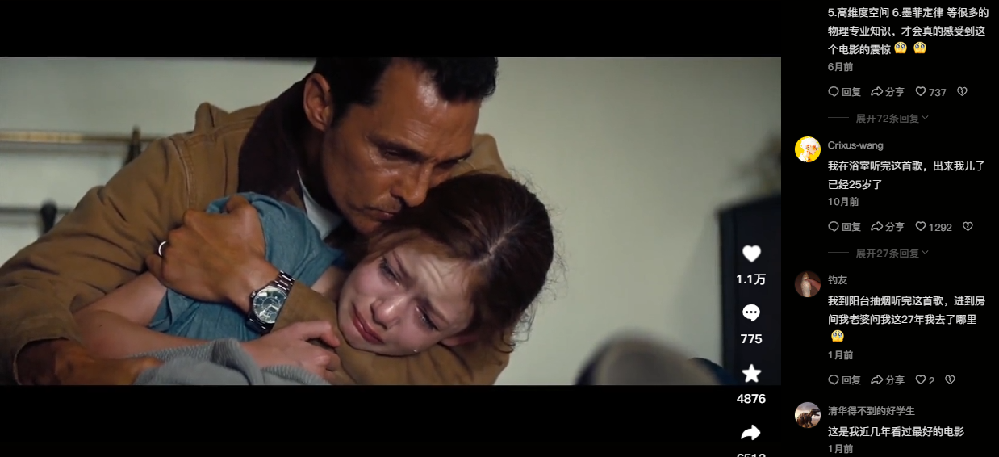
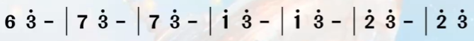

# 《星际穿越》电影原声《Cornfield Chase》赏析

​																																						PB21111728刘芷辰

## 绪论

[音乐链接](https://www.bilibili.com/video/BV1Mb4y1N7EG/?spm_id_from=333.337.search-card.all.click&vd_source=fb023418259bdf946fe320ce030e5bed)

​		《星际穿越》是英国导演克里斯托弗·诺兰所主导的一部有关于宇宙与爱的科幻电影，其中电影开头在玉米地追逐时的原声（实际在电影多处都有出现，在玉米地追逐片段最为集中），是德国音乐家汉斯·季默的作品《Cornfield Chase》，因其表现出极强的宇宙时间与空间的浩瀚与虚无感而在各大视频平台大热，许多网友如下图一样纷纷表示音乐一响，仿佛自己已经在玉米地中追逐，忘记了时间。

​		我本人也在电影院看过两次该电影，每次看完都很长时间难以走出其所带来的震撼和虚无感，情绪仿佛随着音乐余音久久在心中无法忘却。为什么这首音乐能够做到如此地震撼人心，代入感如此之强烈？下面我将分享我的一些看法。

## 乐理分析

​		不难发现，整个音乐最核心的部分，用简谱表示应该是

这一段穿插在这首音乐之中，无论开头还是高潮部分都有所蕴含，两两成组，震荡起伏，但却似乎又一直回到原点“mi”，似乎时钟在滴答滴答走动，旋律往上递进，时间随之流逝，但却又似乎表现着宇宙规则的不确定性，这与电影中男主库珀在宇宙规则下的渺小，最后又自己成为了拯救自己与地球的“神”的感觉有类似之处，宇宙正是这样，时间是滴答滴答往前走，但随着时间发生的事却又是无规则的。

​		整个音乐中，在这段音符的底层，可以听到有一个持续而有规律的低音，这正与每一小节中辨识度最高的高音“mi”是同一个音符，在这样持续音的作用下，更能表现出上面讲到的不断回到原点的感觉，在与其他音符拉扯的过程中，离开又回去，从而在剧情的推动下完成彻底的情感表达。

​		其和声搭配是4565的循环递进，形成456545654565......这样的形式，其中蕴含着许多的456和654，分别配合着男主由地球进入宇宙，由现在到未来，以及男主坠入黑洞，跌入高维空间，给予过去的世界提示，拯救了自己与地球，由此形成的悖论关系：究竟先有男主进入宇宙跌入黑洞对过去进行提示，还是先得到了来自未来的提示，才会有后续剧情的发展？这种宇宙时空交错的关系正如同456和654在和声中交错一般，带给观众强烈的共鸣感，仿佛自身也随着音符坠入了高维空间一般，忘却了时间。

​		更有趣的是，这段音符在稍作变换后几乎穿插在了整个电影配乐中，例如将选出其中几个音符并上升五度，就得到了影片中另一段重要音乐：最后空间站对接的背景乐。这一段和玉米地追逐的关系是什么呢?不难发现，最后空间站对接的分镜和镜头和玉米地追逐十分相似，但是剧情更为紧凑，需要的情感更为强烈，因此音乐上采用类似的部分音符并升五度，配合剧情变化再合适不过，观众的情绪基调在最开始的《CornField Chase》中奠定，随着剧情的发展，其配乐都是《CornField Chase》的变调，牢牢牵制住了观众的情感，并将其带向高潮完成情感宣泄。

## 管风琴

​		《CornField Chase》采用管风琴作为主导音乐，管风琴是世界上体积最大的乐器，也叫做教堂风琴，常常代表神性。

​		管风琴通过气流的推进来发声，庞大的进气量与电影中庞大的世界观相对应，其宏伟壮阔的声音更能凸显宇宙的广阔无垠。同时，管风琴代表的神性恰好与电影中的“神”对应，这里的“神”表达的是主角库珀推动了这个悖论的第一次开始，是他将自己送上了宇宙，又是他在见识过宇宙的无情之后在高维空间回到过去给予过去的女儿提示使得自己和地球得到拯救，“神”的代表也是人，而管风琴通过气流发声的方式正如同人呼吸一样，在浩瀚无情的宇宙中，总有需要你存在的人，音符在空气中漂浮，正如人在宇宙中生存，神性也是来源于人的创造。