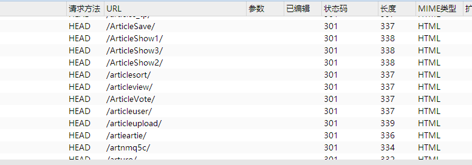
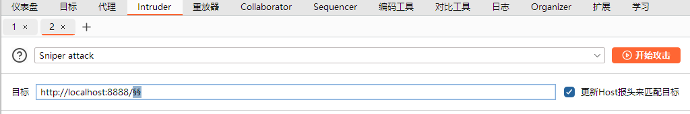
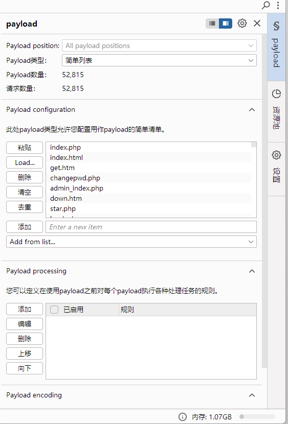
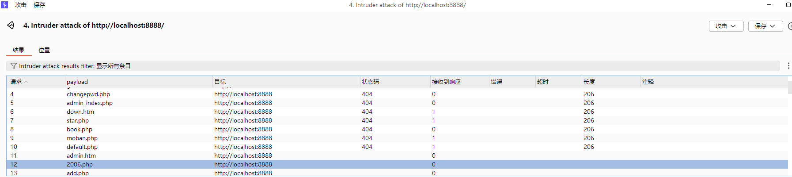

## T1

- 被拦截记录请求与常规HTTP请求的区别：

  1. http类型常规一般是get/post，被拦截记录请求都是head

  2. 源ip常规比较分散，被拦截记录请求是相同ip短时间内多次访问

  3. 访问目标常规很多网页资源，被拦截记录请求中有很多.mdb/.rar，属于敏感文件探测

     

- 区别的作用
  1. 使用head：避免下载文件内容、提升扫描速度，用于判断敏感文件是否存在
  2. 相同ip多次访问：自动化工具行为，可用于防御端黑名单策略
  3. 敏感文件探测：这些文件常含数据库或源码备份，若存在则可被下载，导致数据泄露

## T2

 御剑后台扫描珍藏版工具

- 功能和作用：

  对目标网站的后台目录及文件进行扫描，帮助用户高效地查找网站的后台登录地址，对于攻击者而言可能是获取敏感信息的入口；通过扫描结果，安全人员或网站管理员可以判断网站是否存在未授权访问的风险点

- 工作原理：基于字典枚举和 HTTP 请求交互，工具会从字典中依次取出每一个目录或文件名，与目标域名组合成完整的 URL 地址；然后，通过 HTTP 协议向组合后的 URL 地址发送请求，通常是 GET 请求，来尝试访问该资源；最后根据服务器返回的 HTTP 状态码来判断该 URL 对应的资源是否存在

- 测试过程中使用的http请求格式：为了快速大量进行访问，猜测使用的是head

- 想到的可能验证方法：

  查看配置文件

  burp suite抓包

- 验证结果 ：

  从配置文件中可以看到，里面有许多字典文件，字典文件中会发现大量常见的后台文件名，说明御剑确实是通过字典枚举组合成完整URL的方式和HTTP请求交互的
  
  使用burp suite抓包，在御剑扫描期间，请求如下：
  
  

​		说明确实是head请求格式

## T3

使用burp工具模拟 御剑后台扫描珍藏版 针对后台php文件的扫描

步骤操作及目的：

1. 打开burp suite的intruder界面，选择sniper方式，选择目标

   

2. 在payloader界面添加字典（从御剑配置文件中取得），选择简单列表

   

3. 开始爆破

4. 查看结果

   

