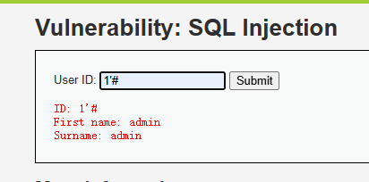
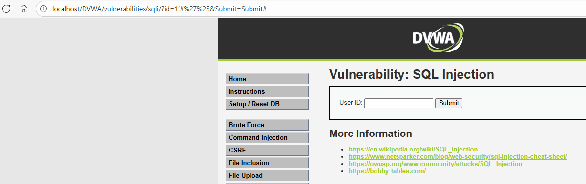
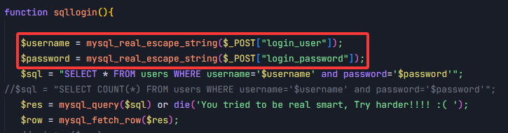
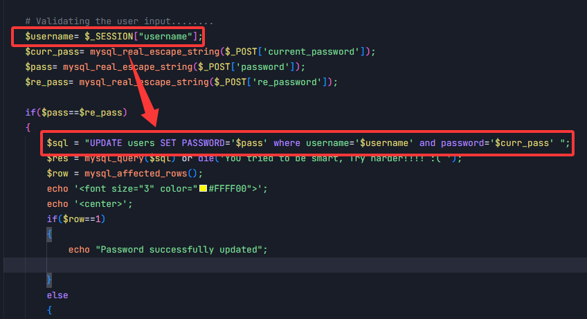
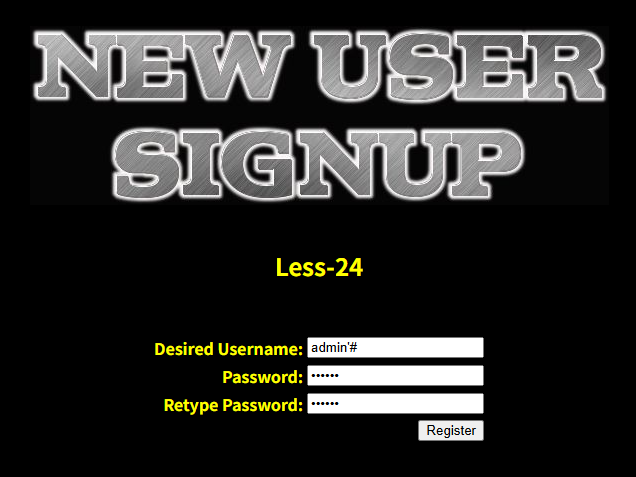
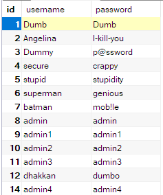
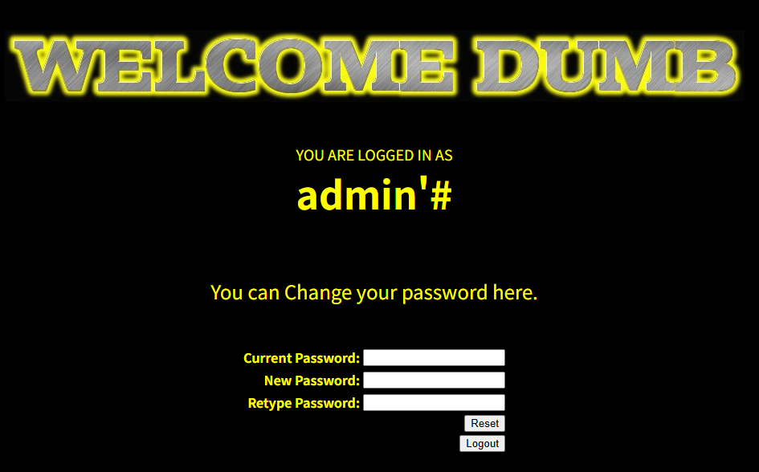
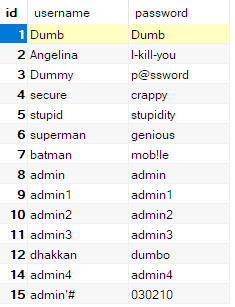
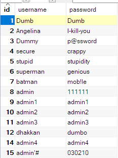
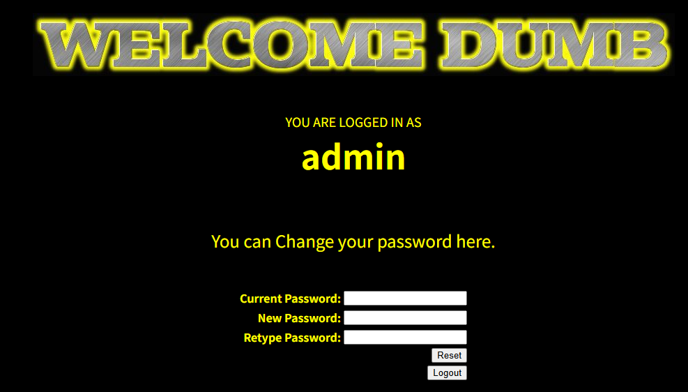

# HW2

## T1

两种方式不同的原因

- 直接输入1'#：

- 在地址栏修改id参数值

  

- 不同的原因：

  在输入框输入1'#，拼接的sql语句是这样的：

  SELECT first_name, surname FROM users WHERE user_id = '1'#';

  但#在sql语句中是注释符号，后面的内容会被注释掉，因此实际执行的sql语句是这样的：

  SELECT first_name, surname FROM users WHERE user_id = '1';因此返回了id=1的user的first_name和surname

  而在浏览器地址栏中修改id参数值为1'#，但是浏览器在解析 URL 时，会对 # 之后的内容当作锚点，不会传给服务器，因此\#&Submit=Submit部分并没有发给服务器

## T2

less24二次注入实验

结合代码说明原理

从login文件中，可以看到使用了mysql_real_escape_string() 函数对SQL 语句中使用的字符串中的特殊字符进行转义，指定了服务端的编码和客户端的编码来防注入：

而在pass_change中，其获取的用户被直接用于更新语句，并没有检查，只进行了转义，因此若用户名中含有注释，则可以修改用户名中包含的另一用户的密码：

因此实验步骤如下：

- 注册一个带有注释的admin用户admin'#

  

  ​	这是未添加新用户之前的用户表：

​		这是添加新用户admin'#之后的用户表：

- 使用admin'#进行登陆，可以看到有修改密码的界面

  

- 在admin'#账号登陆后修改密码

​		这是修改前的用户表：

​		这是修改后的用户表：

​		可以看到admin'#的密码并没有被修改，而真正的管理员admin的密码已经被修改为111111

​		从而可以使用管理员admin账号进行登陆：

