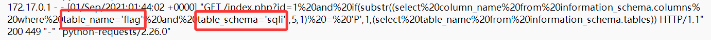
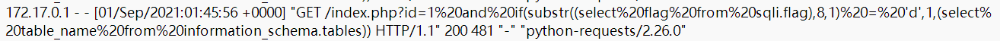

# HW3

## T1

阅读和分析理解漏洞通报内容：

这是登录接口存在的 SQL 注入漏洞，具体是SQL 注入引起的错误信息泄露

首先使用账号：admin'，随意输入密码，登陆异常而改为admin''恢复正常，说明单引号触发SQL错误，然后s使用Burp拦截并修改请求数据，进一步验证注入点：利用 MySQL 的 extractvalue() 拼接 POC ，从响应信息中泄露了 user()（root@localhost）和 database()（db_vireducation）等敏感信息，证明了SQL注入点的存在


回答下列问题：

> 文中的 PoC 是什么意思，另外自行扩展学习两个概念：exp、payload 是什么意思， 描述三者差别和关系 

​		PoC：概念验证；

​		exp：漏洞利用程序；

​		payload：有效负载；

​		三者层次关系：POC，是用来验证漏洞是否存在的一段代码；EXP，指利用系统漏洞进行渗透；payload，指成功EXP之后，真正在目标系统执行的代码或指令。先有POC，后有EXP，最后再EXP


> 根据漏洞通报中的信息，详述漏洞的成因是什么，结合课程内容，判断利用方式属于课程中哪种sql 注入方式（Union,报错,boolean 盲注,时间盲注），并解读说明使用的注入语句含义 

​		**成因：**该漏洞发生在登录接口。系统直接将用户输入的用户名拼接进 SQL 语句，没有使用参数化查询或输入过滤。当用户输入中包含 '时，会破坏 SQL 语法结构，引发数据库错误或返回异常信息，从而可注入自定义 SQL 代码

​		**类型：**属于报错注入

​		**注入语句含义：**以admin'-extractvalue(1,concat(0x7e,user(),0x7e))-' 为例，将username替换，POC 中的单引号 `'` 提前结束了原本用户名的字符串，从而允许在原语句位置插入额外的 SQL 表达式

​		extractvalue(1, X )：把第二个参数 X 传成非合法的值会让 MySQL 抛出错误。报错注入就是利用这个特性把我们想知道的内容嵌入 X，从错误信息中读出。

​		concat(0x7e, user(), 0x7e)：拼接得到~ root@localhost ~

​		两者结合使得错误信息里会包含user() 的值


> 根据漏洞通报中的信息，写出获取当前数据库中第三个表名的利用请求代码

当前数据库名为 db_vireducation

```sql
admin'-extractvalue(1,concat(0x7e,(select table_name from information_schema.tables where table_schema=database() limit 2,1),0x7e))-' 
```


> 仔细观察漏洞通报中的信息，尝试分析猜测后台数据库中用户口令可能的保存方式， 并通过自主学习叙述这种保存方式的目的和作用

**可能的保存方式**：用户口令可能通过哈希存储进行保存，并通过一定的加密方式进行加密，如MD5

**目的和作用**：防止数据库泄露后密码被直接读取


## T2

回答下列问题：

> 结合课程内容，攻击过程采用的注入方式是什么？

分析攻击过程：

从日志内容：

```sql
/index.php?id=1 and if(substr(database(),1,1)='s',1,(select table_name from information_schema.tables))
```

可以看见攻击者通过不断尝试不同字符，判断返回响应长度差异，来逐字符推测数据库名，从而可以确定攻击的方式是SQL盲注


> 攻击过程获取的 flag 的数据库名、表名和列名分别是什么？

从日志内容：



可以确定数据库名为sqli，表名为flag

从日志内容：



可以得到核心SQL语句：select flag from sqli.flag

因此列名为flag


> 攻击过程最终获取的 flag 字符串是什么？格式为 flag{XXXXXXX}

关注响应长度异常（如 480/481/482）的记录，提取各位置正确字符

| 字符位置 | 正确字符 | 关键日志依据（示例）                  |
| -------- | -------- | ------------------------------------- |
| 1        | f        | substr(...,1,1)=f对应响应长度 480     |
| 2        | l        | substr(...,2,1)='l'对应响应长度 481   |
| 3        | a        | substr(...,3,1)='a'对应响应长度 481   |
| 4        | g        | substr(...,4,1)='g'对应响应长度 481   |
| 5        | {        | substr(...,5,1)='{'对应响应长度 481   |
| 6        | d        | substr(...,8,1)='d'对应响应长度 482   |
| 7        | 6        | substr(...,7,1)='6'对应响应长度 482   |
| 8        | a        | substr(...,8,1)='a'对应响应长度 481   |
| 9        | 3        | substr(...,9,1)='3'对应响应长度 482   |
| 10       | b        | substr(...,10,1)='b'对应响应长度 481  |
| 11       | 2        | substr(...,11,1)='2'对应响应长度 479  |
| 12       | }        | substr(...,12,1)='}' 对应响应长度 390 |

所以最终字符串为：flag{d6a3b2}