# HW1


## 2.14

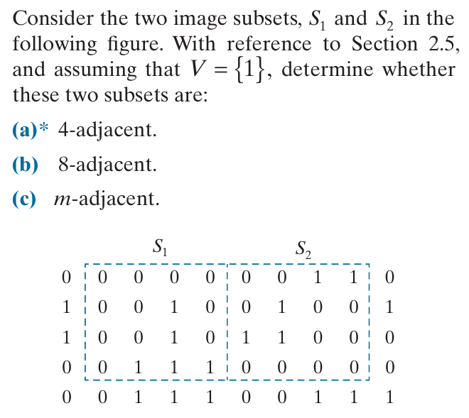

不是4邻接的，是8邻接和m邻接的


## 2.18

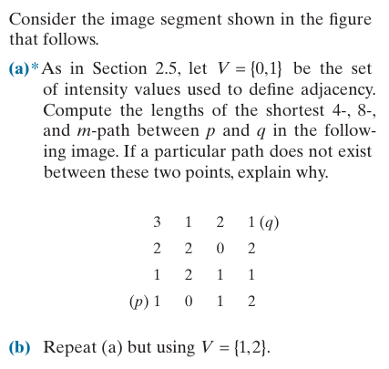

#### a

- 不存在4通路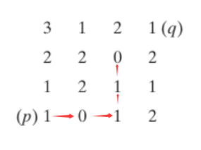

  如图从p出发到达0后不存在4邻接的可走路径到达q

- 最短8通路：4，如图所示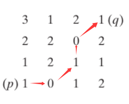

- 最短m通路：5，如图所示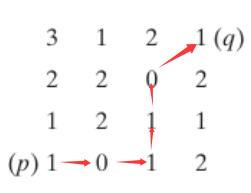

#### b

- 最短4通路：6，如图所示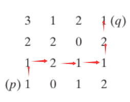
- 最短8通路：4，如图所示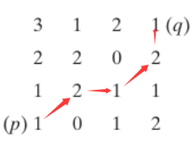
- 最短m通路：6，如图所示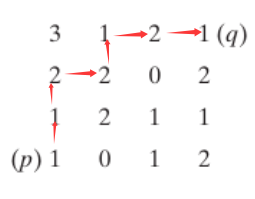

## 3.10

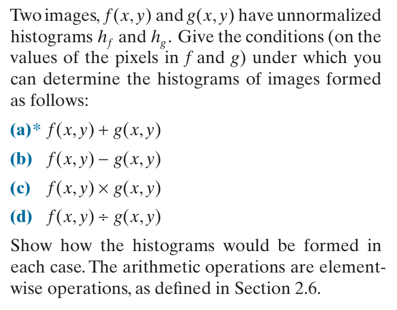

a,b,c,d都要求至少有一个图像是常数图像时，才能形成运算后的直方图；同时d还要求图像g的任何像素g(x,y)不能为0

一下均假设g为常数c

(a)f直方图灰度整体向右平移c个单位

(b)f直方图灰度整体向左平移c个单位

(c)f直方图灰度整体上缩放c

(d)f直方图灰度上整体缩放1/c

## 3.12

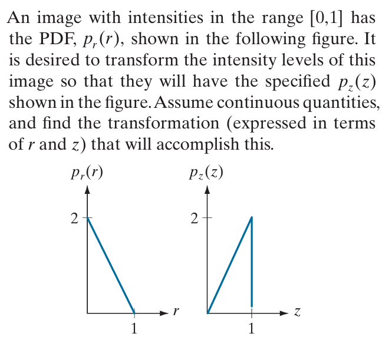

r的pdf：$pdf_r(r)=2(1-r)$

r的cdf：$cdf_r(r)=2r-r^2$

z的pdf：$pdf_z(z)=2z$

z的cdf：$cdf_z(z)=z^2$

直方图变换有式$cdf_r(r)=cdf_z(z)$

得到：$z=\sqrt{2r-r^2}$


## 3.18

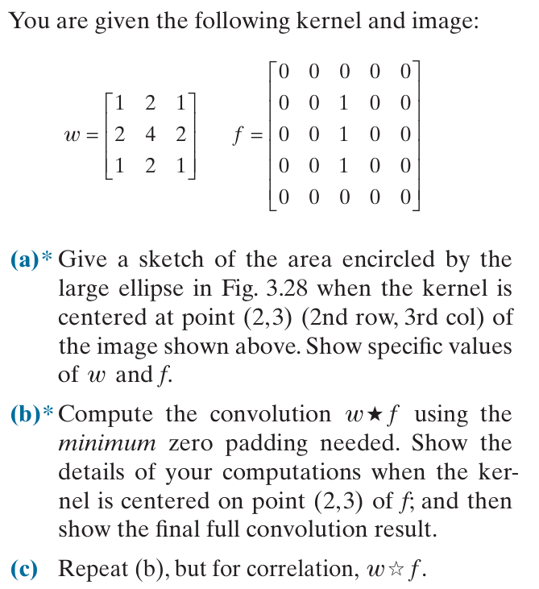

#### a

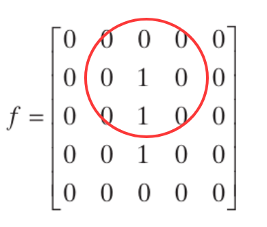

$w=\begin{bmatrix}1&2&1\\2&4&2\\1&2&1\end{bmatrix}$

$f_{2,3}=\begin{bmatrix}0&0&0\\0&1&0\\0&1&0\end{bmatrix}$


#### b

$f_{pad}=\begin{bmatrix}0&0&0&0&0&0&0\\0&0&0&0&0&0&0\\0&0&0&1&0&0&0\\0&0&0&1&0&0&0\\0&0&0&1&0&0&0\\0&0&0&0&0&0&0\\0&0&0&0&0&0&0\end{bmatrix}$

padding后，f中的point(2,3)对应$f_{pad}$的point(3,4)

$f_{pad3,4}=\begin{bmatrix}0&0&0\\0&1&0\\0&1&0\end{bmatrix}$

$w_{flip}=\begin{bmatrix}1&2&1\\2&4&2\\1&2&1\end{bmatrix}$

点积得到，$1\times 4+1\times 2=6$

完整卷积结果：$(w\bigstar f)(x,y)=\begin{bmatrix}0&0&0&0&0&0&0\\0&0&1&2&1&0&0\\0&0&3&6&3&0&0\\0&0&4&8&4&0&0\\0&0&3&6&3&0&0\\0&0&1&2&1&0&0\\0&0&0&0&0&0&0\end{bmatrix}$


#### c

$f_{pad}=\begin{bmatrix}0&0&0&0&0&0&0\\0&0&0&0&0&0&0\\0&0&0&1&0&0&0\\0&0&0&1&0&0&0\\0&0&0&1&0&0&0\\0&0&0&0&0&0&0\\0&0&0&0&0&0&0\end{bmatrix}$

padding后，f中的point(2,3)对应$f_{pad}$的point(3,4)

$f_{pad3,4}=\begin{bmatrix}0&0&0\\0&1&0\\0&1&0\end{bmatrix}$

$w=\begin{bmatrix}1&2&1\\2&4&2\\1&2&1\end{bmatrix}$

点积得到，$1\times 4+1\times 2=6$

由于核对称，卷积和相关结果一样，完整相关结果：$\begin{bmatrix}0&0&0&0&0&0&0\\0&0&1&2&1&0&0\\0&0&3&6&3&0&0\\0&0&4&8&4&0&0\\0&0&3&6&3&0&0\\0&0&1&2&1&0&0\\0&0&0&0&0&0&0\end{bmatrix}$

## 3.39

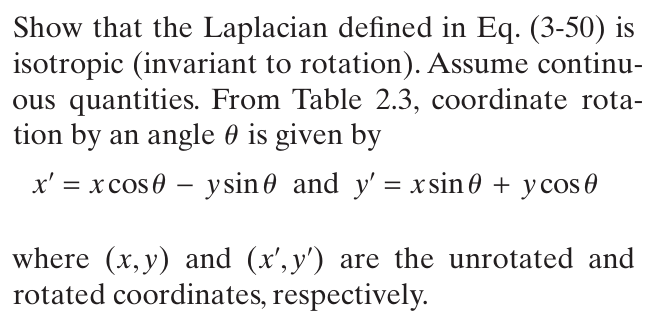

即证明坐标旋转后拉普拉斯算子形式不变

$\frac{\partial f}{\partial x}=\frac{\partial f}{\partial x^{\prime}}\frac{\partial x^{\prime}}{\partial x}+\frac{\partial f}{\partial y^{\prime}}\frac{\partial y^{\prime}}{\partial x}=\frac{\partial f}{\partial x^{\prime}}\cos\theta+\frac{\partial f}{\partial y^{\prime}}\sin\theta$

$\frac{\partial f}{\partial y}=\frac{\partial f}{\partial x^{\prime}}\frac{\partial x^{\prime}}{\partial y}+\frac{\partial f}{\partial y^{\prime}}\frac{\partial y^{\prime}}{\partial y}=\frac{\partial f}{\partial y^{\prime}}\cos\theta-\frac{\partial f}{\partial x^{\prime}}\sin\theta$

$\begin{aligned}\frac{\partial^{2}f}{\partial x^{2}}&=\frac{\partial^2f}{\partial x^{\prime2}}\cos^2\theta+2\frac{\partial^2f}{\partial x^{\prime}\partial y^{\prime}}\sin\theta\cos\theta+\frac{\partial^2f}{\partial y^{\prime2}}\sin^2\theta\end{aligned}$

$\begin{aligned}\frac{\partial^{2}f}{\partial y^{2}}&=\frac{\partial^2f}{\partial x^{\prime2}}\sin^2\theta-2\frac{\partial^2f}{\partial x^{\prime}\partial y^{\prime}}\sin\theta\cos\theta+\frac{\partial^2f}{\partial y^{\prime2}}\cos^2\theta\end{aligned}$

$\begin{aligned}\frac{\partial^2f}{\partial x^2}+\frac{\partial^2f}{\partial y^2}&=\frac{\partial^2f}{\partial x^{\prime2}}(\cos^2\theta+\sin^2\theta)+\frac{\partial^2f}{\partial y^{\prime2}}(\sin^2\theta+\cos^2\theta)=\frac{\partial^2f}{\partial x^{\prime2}}+\frac{\partial^2f}{\partial y^{\prime2}}\end{aligned}$


## 其他题目

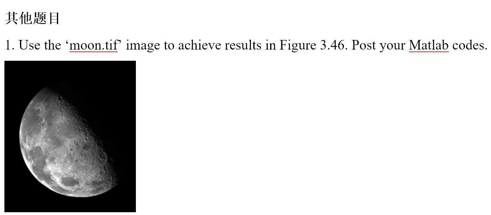

```matlab
I = imread('moon.tif');
I = im2double(I);
laplacian_kernel_a = [0 1 0; 1 -4 1; 0 1 0];
laplacian_kernel_b = [1 1 1; 1 -8 1; 1 1 1];
% 图 3.46(a)
subplot(2,2,1);
imshow(I);
title('(a)');
% 图 3.46(b)
laplacian_a = imfilter(I, laplacian_kernel_a, 'replicate');
subplot(2,2,2);
imshow(laplacian_a);
title('(b)');
% 图 3.46(c)
c = -1;
I_sharpened_c = I + c * laplacian_a;
I_sharpened_c = mat2gray(I_sharpened_c);
subplot(2,2,3);
imshow(I_sharpened_c);
title('(c)');
% 图 3.46(d)
laplacian_b = imfilter(I, laplacian_kernel_b, 'replicate');
I_sharpened_d = I + c * laplacian_b;
I_sharpened_d = mat2gray(I_sharpened_d);
subplot(2,2,4);
imshow(I_sharpened_d);
title('(d)');
```

