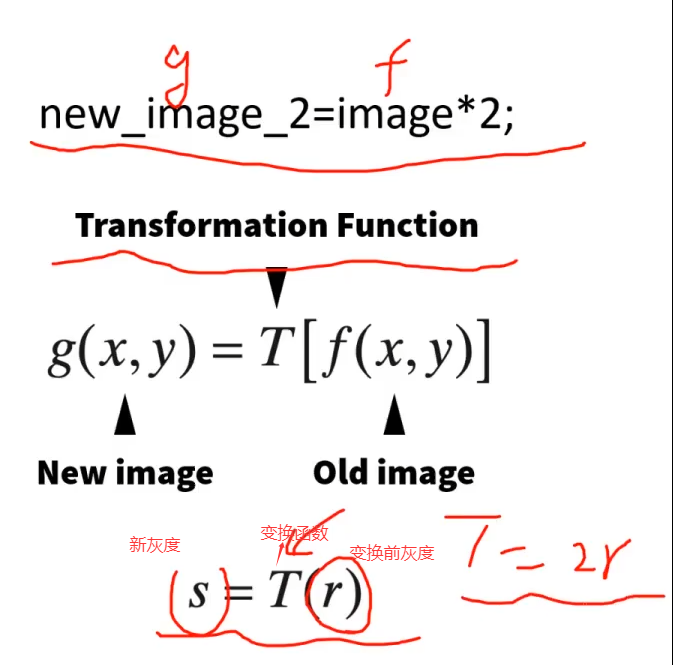
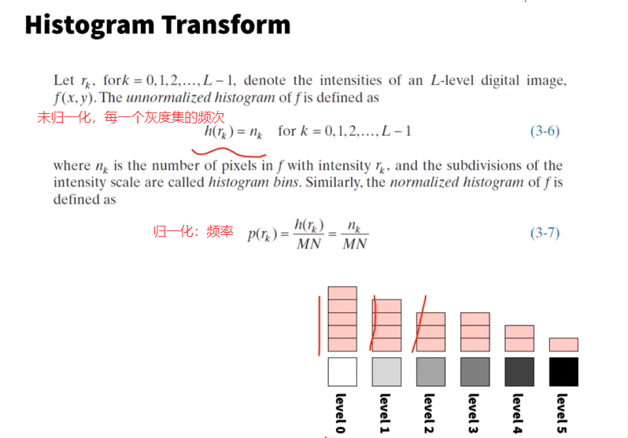
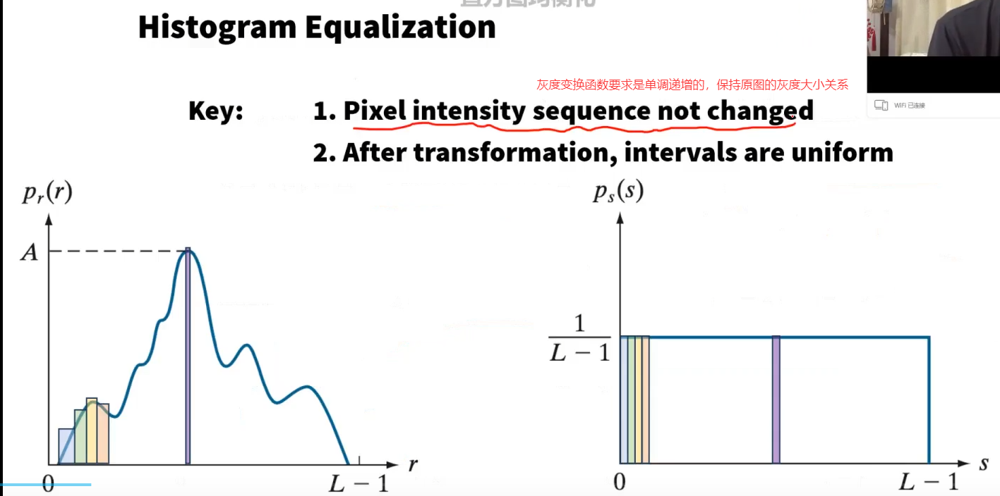
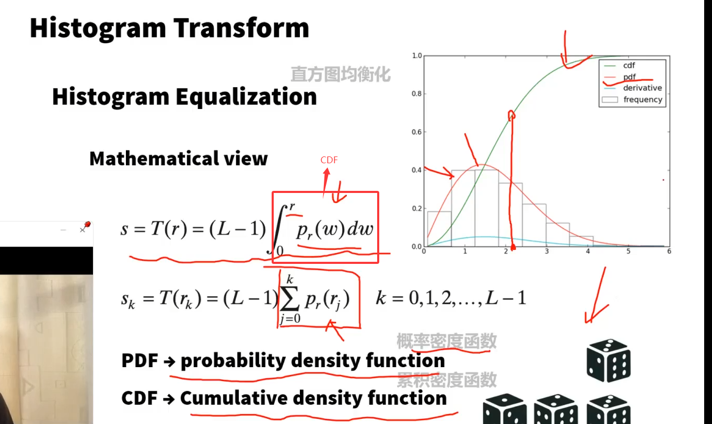
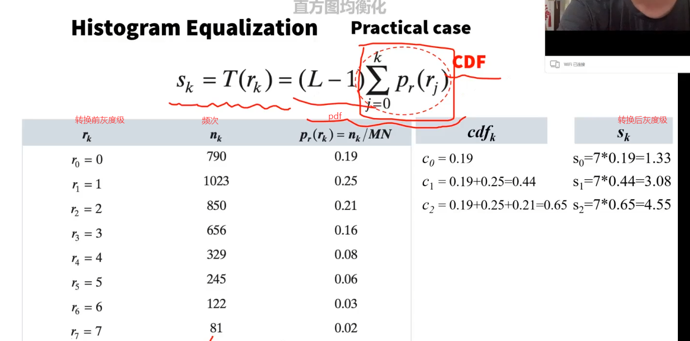
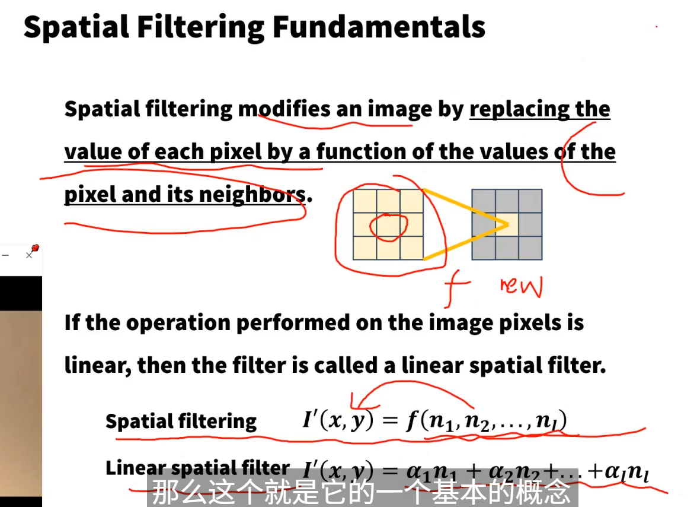
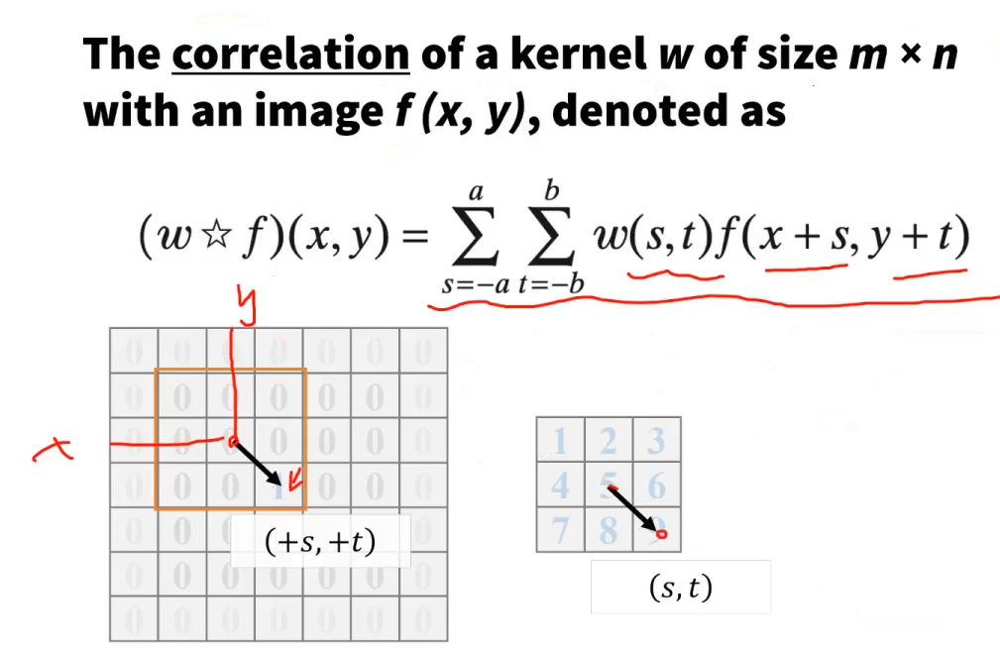
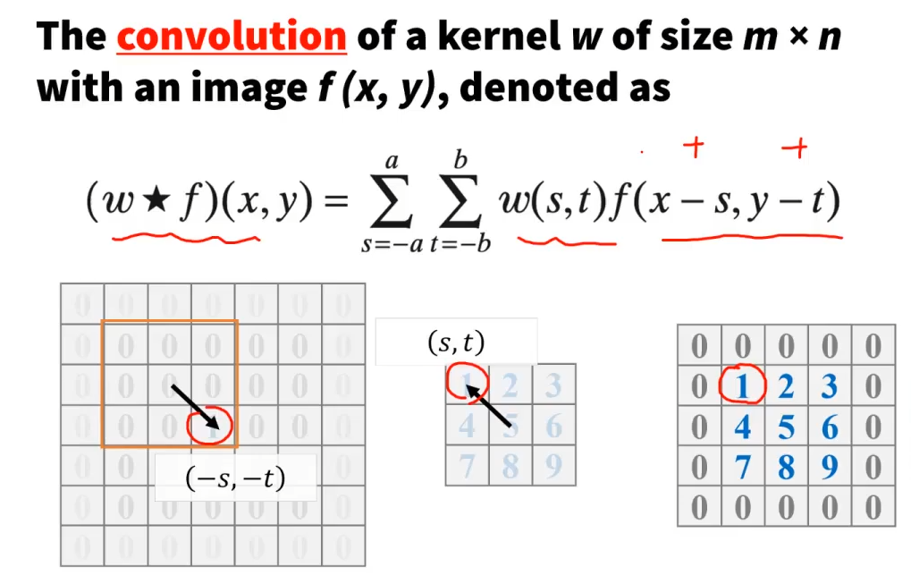
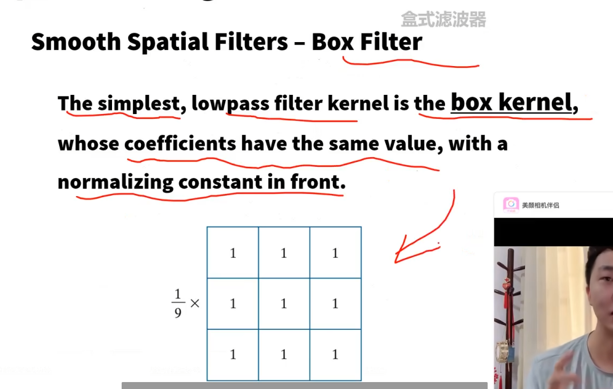
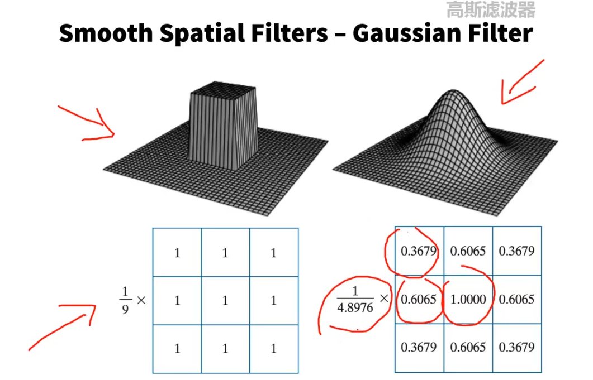

## 强度变换

### 灰度值变换

### 直方图

#### 直方图

#### 直方图均衡化

变换后的图像直方图灰度分布均匀

最后四舍五入

#### 直方图规定化

将灰度直方图改变为希望成为的直方图，也就是直方图均衡化是直方图规定化的特例

例如希望将r转换为z，使得cdf(r)=cdf(z)即可，不方便求可以使用直方图均衡化转换，即

r通过T(r)均衡化为s，z通过G(z)均衡化为s，则s=T(r)=G(z)，得到$z=G^{-1}(T(r))=H(r)$

离散形式：GML和SML   

### 空间滤波

多个像素点的值决定一个像素点的值

线性滤波（相关和卷积都属于线性滤波）

- 相关

- 卷积

将相关核旋转180度，再进行相关，就是卷积

盒式滤波器：每个格子相同权值，并且有归一化系数

高斯滤波器：中间大

