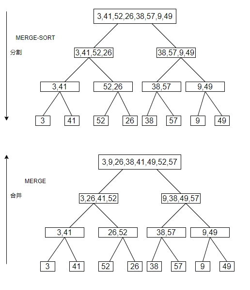

# 2.3-1

> Using Figure 2.4 as a model, illustrate the operation of merge sort on the array A = [3, 41, 52, 26, 38, 57, 9, 49].

> 使用图2.4作为模型，说明归并排序在数组A=[3,41,52,26,38,57,9,49]上的操作。



# 2.3-2

> Rewrite the MERGE procedure so that it does not use sentinels, instead stopping once either array L or R has had all its elements copied back to A and then copying the remainder of the other array back into A.

> 重写MERGE过程，使其不使用哨兵，而是只要数组L或R中的元素都已经全部复制回A，就停止，并将另一个数组的剩余元素复制回A。

```
MERGE(A, p, q, r)
    n1 = q - p + 1  // 计算左半部分 L 的长度
    n2 = r - q      // 计算右半部分 R 的长度
    创建数组 L[1..n1] 和 R[1..n2]

    // 将 A[p..q] 复制到 L[1..n1]
    for i = 1 to n1
        L[i] = A[p + i - 1]

    // 将 A[q+1..r] 复制到 R[1..n2]
    for j = 1 to n2
        R[j] = A[q + j]

    i = 1  // 初始化 L 的索引
    j = 1  // 初始化 R 的索引
    k = p  // 初始化 A 的索引

    // 合并 L 和 R 回 A
    while i <= n1 and j <= n2
        if L[i] <= R[j]
            A[k] = L[i]
            i = i + 1
        else
            A[k] = R[j]
            j = j + 1
        k = k + 1

    // 如果 L 中还有剩余元素，复制回 A
    while i <= n1
        A[k] = L[i]
        i = i + 1
        k = k + 1

    // 如果 R 中还有剩余元素，复制回 A
    while j <= n2
        A[k] = R[j]
        j = j + 1
        k = k + 1
```

# 2.3-3

> Use mathematical induction to show that when n is an exact power of 2, the solution of the recurrence is $T(n) = n\lg n$

> 使用数学归纳法证明，当n为2的幂次时，递推方程的解为 $T(n) = n\lg n$

$$
\begin{cases}
2, 若n =2\\ 
2T(n/2) + n,若 n = 2^k, k > 1
\end{cases}
$$

定义F(k) = T($2^k$)

当 k = 1,n = 2 时, F(1) = T(2) = 2 = $2\lg 2$ = $2^1\lg 2^1$

假设 F(k) = $2^klg2^k$

F(k+1) = T($2^{k+1}$) = 2T($2^k$) + $2^{k+1}$ = $2 \times 2^{k}lg2^k+2^{k+1}$ = $2^{k+1}(\lg 2^k+1)$ = $2^{k+1}(\lg 2^k+\lg 2)$ = $2^{k+1} \times \lg 2^{k+1}$

# 2.3-4

> Insertion sort can be expressed as a recursive procedure as follows. In order to sort A[1..n], we recursively sort A[1..n -1] and then insert A[n] into the sorted array A[1..n - 1]. Write a recurrence for the running time of this recursive version of insertion sort.

> 插入排序可以表示为一个递归过程，如下所示。为了对数组A[1..n]进行排序，我们先递归地对A[1..n-1]进行排序，然后将A[n]插入到已排序的数组A[1..n-1]中。写出插入排序的递归版本的运行时间的递推式。

插入排序的递归版本可以描述为以下过程：

- 递归地对子数组 A[1..n-1] 进行排序。

- 将 A[n] 插入到已排序的子数组 A[1..n-1] 中。

运行时间的递推式

    设 T(n)T(n) 表示对长度为 nn 的数组进行递归插入排序的运行时间。

递归调用：

    对子数组 A[1..n-1] 进行排序的时间为 T(n−1)T(n−1)。

插入操作：

    将 A[n] 插入到已排序的子数组 A[1..n-1] 中，最坏情况下需要遍历整个子数组，时间为 O(n)O(n)。

因此，递推式为：

    T(n)=T(n−1)+O(n)
    T(n)=T(n−1)+O(n)

# 2.3-5

> Referring back to the searching problem (see Exercise 2.1-3), observe that if the sequence A is sorted, we can check the midpoint of the sequence against v and eliminate half of the sequence from further consideration. Binary search is an algorithm that repeats this procedure, halving the size of the remaining portion of the sequence each time. Write pseudocode, either iterative or recursive, for binary search. Argue that the worst-case running time of binary search is Θ(lg n).

> 回到搜索问题（练习2.1-3），如果序列A是有序的，我们可以将序列的中间元素与v进行比较，并排除序列的另一半，从而减少要考虑的元素的数量。二分搜索算法重复这个过程，每次都将剩余的元素数量减半。给出二分搜索的伪代码，可以是迭代的或递归的。论证二分搜索的最坏情况运行时间为Θ(lg n)。

```
BINARY-SEARCH(A, v) // 迭代版本
    low = 0
    high = A.length - 1
    while low <= high
        mid = (low + high) / 2
        if A[mid] < v
            low = mid + 1
        else if A[mid] > v
            high = mid - 1
        else
            return mid
    return -1 // v not found

BINARY-SEARCH-RECURSIVE(A, v) // 递归版本
    if A.length == 0
        return -1 // 空数组
    else if A.length == 1
        if A[0] == v
            return 0
        else
            return -1
    else
        mid = A.length / 2
        if A[mid] == v
            return mid
        else if A[mid] < v
            return BINARY-SEARCH-RECURSIVE(A[mid+1..A.length], v)
        else
            return BINARY-SEARCH-RECURSIVE(A[0..mid-1], v)
```

递推关系

    每次将搜索范围减半，剩余的元素数量为 n/2。

    设 T(n)T(n) 为二分搜索的运行时间，递推关系为：
    T(n)=T(n/2)+O(1)

        T(n/2)是递归调用或迭代中处理剩余部分的时间。

        O(1)是比较中间元素和目标值的时间。

递推式的解

通过展开递推式：

    T(n)=T(n/2)+O(1)

    T(n/2)=T(n/4)+O(1)

    ⋮

    T(1)=O(1)

将所有等式相加，得到：

    T(n)=O(1)+O(1)+⋯+O(1)(共 lg⁡n 项)

    T(n)=O(lgn)

渐近紧确界

    最坏情况下，二分搜索需要 lg⁡n 次比较才能确定目标值是否存在。

    因此，最坏情况运行时间为 Θ(lg⁡n)。

# 2.3-6

> Observe that the while loop of lines 5 - 7 of the INSERTION-SORT procedure in Section 2.1 uses a linear search to scan (backward) through the sorted subarray A[1..j - 1]. Can we use a binary search (see Exercise 2.3-5) instead to improve the overall worst-case running time of insertion sort to Θ(n lg n)?

> 观察第2.1节中的INSERTION-SORT过程的第5-7行中的while循环，它使用线性搜索（向后）扫描已排序的子数组A[1..j-1]。是否可以使用二分搜索（练习2.3-5）代替，以提高插入排序的最坏情况运行时间为Θ(n lg n)？

1. 伪代码
    ```
    BINARY-INSERTION-SORT(A)
        for j = 2 to A.length
            key = A[j]
            // 使用二分搜索找到插入位置
            low = 1
            high = j - 1
            while low <= high
                mid = floor((low + high) / 2)
                if A[mid] < key
                    low = mid + 1
                else
                    high = mid - 1
            // 插入位置为 low
            // 将 A[low..j-1] 的元素向右移动一位
            for i = j - 1 downto low
                A[i + 1] = A[i]
            A[low] = key
    ```
    改进点

        二分搜索：在已排序的子数组 A[1..j-1] 中使用二分搜索找到插入位置，时间复杂度为 O(lg⁡n)O(lgn)。

        元素移动：找到插入位置后，仍然需要将 A[low..j-1] 的元素向右移动一位，时间复杂度为 O(n)O(n)。

2. 时间复杂度分析

    查找插入位置

        使用二分搜索，每次查找插入位置的时间为 O(lg⁡n)。

        对于 n 个元素，总查找时间为 O(nlg⁡n)。

    元素移动

        每次插入需要移动的元素数量在最坏情况下为 O(n)。

        对于 n 个元素，总移动时间为 O(n2)。

    总时间复杂度

        查找插入位置的总时间：O(nlg⁡n)。

        元素移动的总时间：O(n2)。

        因此，改进后的插入排序的最坏情况运行时间仍然是 O(n2)。

3. 为什么不能改进到 Θ(nlg⁡n)Θ(nlgn)？

    尽管二分搜索将查找插入位置的时间优化到了$O(\lg n)$，但插入排序的核心瓶颈在于元素移动：

        每次插入操作需要将插入位置后的所有元素向右移动一位，这是一个线性操作，时间复杂度为 O(n)。

        即使查找插入位置的时间优化到了 O(lg⁡n)，元素移动的总时间仍然是 O(n2)。

    因此，插入排序的最坏情况运行时间无法改进到 Θ(nlg⁡n)。

# 2.3-7

> Describe a Θ(n lg n) time algorithm that, given a set S of n integers and another integer x, determines whether or not there exist two elements in S whose sum is exactly x.

> 描述一个Θ(n lg n)时间算法，给定一个整数集合S和一个整数x，判断是否存在两个元素在集合S的和恰好为x。

思路

    1. 排序

        首先对集合S排序，排序的时间复杂度为 O(n lg n)。

    2. 双指针搜索
    
        使用两个指针分别指向数组的开头与结尾，用left和right表示。

        计算S[left] + S[right]:

            如果left和right指向的元素之和等于x，则返回true。

            如果left和right指向的元素之和小于x，则将left右移一位。

            如果left和right指向的元素之和大于x，则将right左移一位。

        重复上述过程，直到 left 和 right 相遇。

    3. 时间复杂度分析

        排序的时间复杂度为 O(n lg n)。

        指针移动的总次数最多为 n 次。

        指针移动的时间复杂度为 O(1)。

        因此，总时间复杂度为 O(n lg n)。