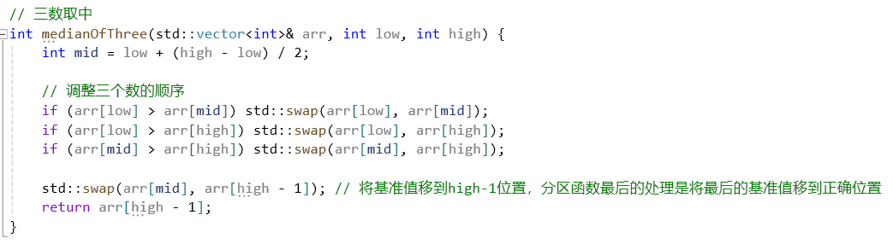
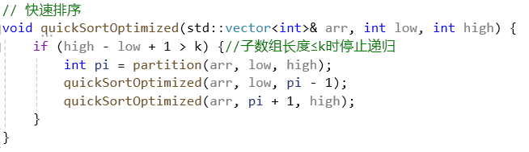
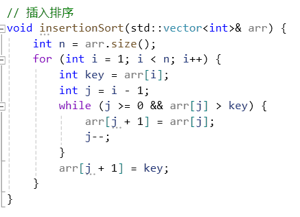

# 实验报告1

## 算法思想

采用了三数取中和插入排序优化的方案

取基准：比较第一个，中间，最后一个数据的中间数作为基准，放在最后位置

分区：i从左往右，找到比基准大的，j从右往左，找到比基准小的，然后交换，最后将基准放在正确位置上

快排：递归调用分区函数，当递归到子数组长度小于阈值时，不做排序直接返回

插入排序：最后将大致有序的数组进行插入排序来收尾

## 核心代码

- 三数取中

- 分区函数

- 快速排序

  

- 插入排序

  

## 实验结果分析

> 优化前后对比

- 插入排序优化对比（基准固定选择最后一个）：

无插头排序：21.3428 ms

| 插入排序阈值 | 运行时间/ms |
| :----------: | :---------: |
|      10      |   20.8937   |
|      20      |   20.9693   |
|      30      |   20.9999   |
|      40      |   23.0453   |
|      50      |   23.4391   |

对比无插入排序，在阈值较小时插入排序收尾可以提高运行效率，阈值较大则会导致快排递归结束时数组有序度不够高，插入排序收尾效率较低，从而降低了整体的运行效率

- 三数取中优化对比：

| 插入排序阈值 | 运行时间/ms |
| :----------: | :---------: |
|      10      |   15.5329   |
|      20      |   15.9533   |
|      30      |   16.7642   |
|      40      |   18.2774   |
|      50      |   19.2088   |

对比上表，无论插入排序阈值取多少，采用了三数取中选取基准优化后，运行时间都有对应的缩短

> 对比其他排序算法

快排选取三数取中和插入排序阈值为10优化方案

| 排序算法 | 运行时间/ms |
| :------: | :---------: |
| 快速排序 |   15.5329   |
| 插入排序 |   25766.7   |
| 归并排序 |   143.866   |
| 冒泡排序 |   82541.1   |

可以看出，快速排序运行效率显著优于其他排序算法
