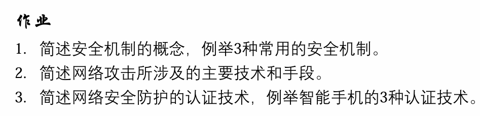

### T1

安全机制的概念：安全机制是一种措施，一些软件或实施一个或更多安全服务的过程

3种常用的安全机制：认证机制、访问控制机制、加密机制

### T2

- **拒绝服务攻击（DoS）**：通过耗尽网络带宽或目标主机资源，降低或剥夺目标系统的可用性，使合法用户无法正常访问服务或无法及时获得服务响应
- **入侵攻击**：指攻击者利用目标系统的漏洞非法进入系统，以获得一定的权限，进而可以窃取信息、删除文件、埋设后门、甚至瘫痪目标系统等行为
- **病毒攻击**：一般指同时具有感染性和寄身性的代码，它隐藏在目标系统中，能够自我复制、传播和侵入到其它程序中去，并篡改正常运行的程序，损害这些程序的有效功能
- **恶意代码攻击**：指任何可以在计算机之间和网络之间传播的程序或可执行代码，其目的是在未授权的情况下有目的地更改或控制计算机及网络系统
- **电子邮件攻击**：利用电子邮件缺陷进行的攻击称为电子邮件攻击
- **诱饵攻击**：指通过建立诱饵网站，诱骗用户去浏览恶意网页，从而实现攻击。诱饵攻击是一种被动攻击，只要用户保持足够的警觉就可以避免

### T3

网络安全防护的认证技术：认证主要包括身份认证和信息认证。身份认证是验证信息的发送者的真实身份；信息认证验证信息的完整性，即验证信息在传送或存储过程中是否被窜改、重放或延迟等。数字签名是实现信息认证的主要技术

3种智能手机的认证技术：密码认证、指纹认证、人脸识别认证

