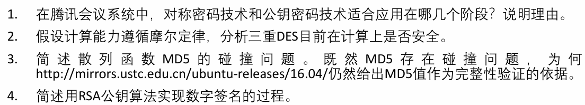
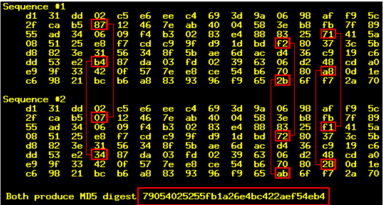

### T1

对称密码技术：用于会议过程中音视频数据传输阶段的加密，因为对称加密速度快，适合对大量实时数据进行加密

公钥密码技术：用于会议开始时的密钥交换与身份认证阶段，因为公钥算法安全性高但速度慢，适合加密会话密钥或验证身份

### T2

按摩尔定律增长，目前 3DES 在计算上仍安全

分析：

1999年，DES的密钥长度仅为56比特，破解密文需要$2^{56}$次穷举搜索

现在2025年，过去26年，根据摩尔定律每18个月计算能力提升一倍，大约17.33个周期，提升$2^{17.33}$，大约160000倍

而3DES破解密文需要$2^{112}$次穷举搜索，对比DES提升$2^{56}$倍，显著高于计算能力的提升

### T3

用于消息鉴别的散列函数H必须满足下面所有条件才不会存在碰撞问题：

- 对于任意给定的值h，要找到一个x满足H(x)=h，在计算上是不可能的
- 对于任意给定的数据块x，要找到一个y*x并满足H(y)=H(x)，在计算上是不可能的
- 要找到一对(x，y)满足H(y)=H(x)，在计算上是不可能的

而 MD5的散列码长度为128比特，已经被证明存在碰撞问题，并被找出实例

但对于一般文件下载、软件镜像校验等场景，其安全性要求并不是极高，因此仍可用于验证消息完整性

### T4

**签名过程：**

1. 发送方 A 对原始消息 M 计算摘要 H(M)
2. A 用自己的私钥对摘要加密，生成数字签名
3. 将消息和签名一起发送给接收方 B

**验证过程：**

1. 接收方 B 用 A 的 公钥对签名解密得到摘要 H1(M)
2. B 再计算接收到消息的摘要 H2(M)
3. 若 H1(M)=H2(M)，则证明消息未被篡改且确系A发送

