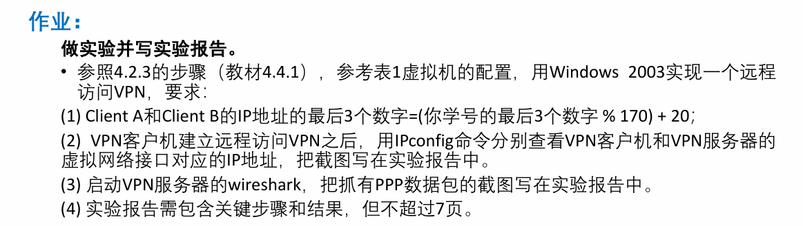
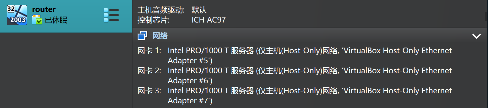
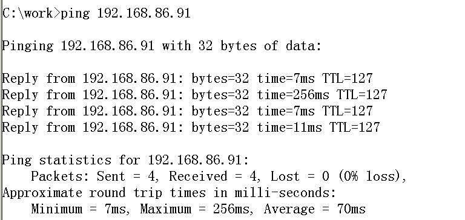
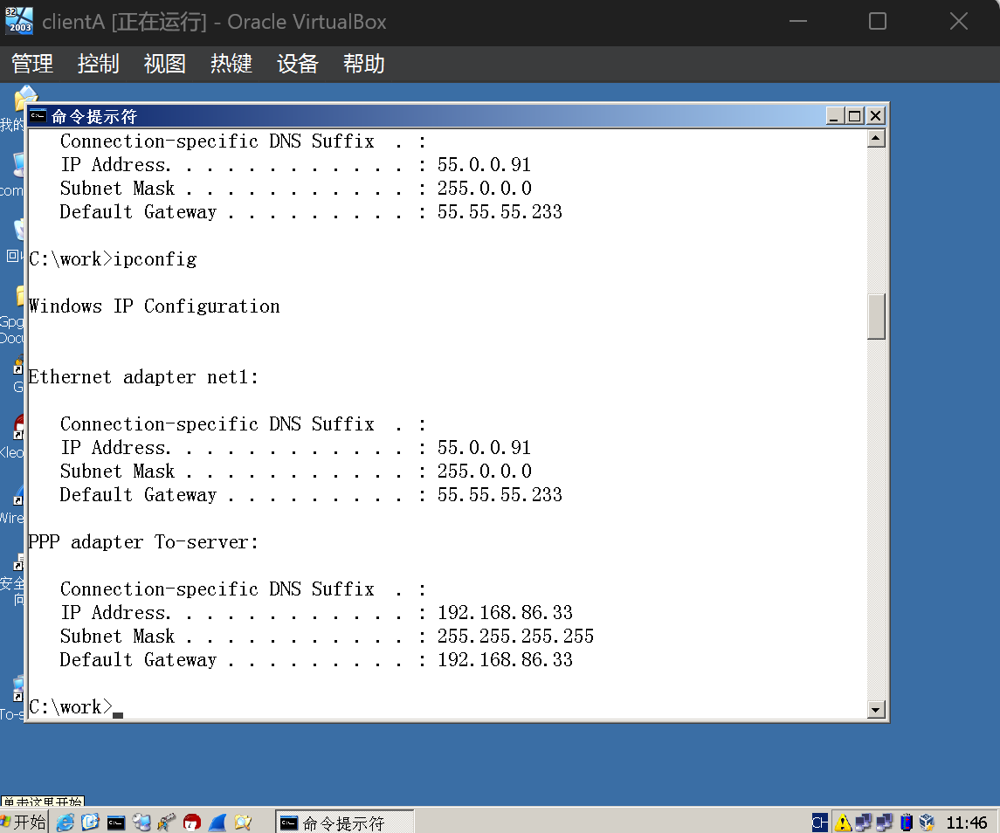
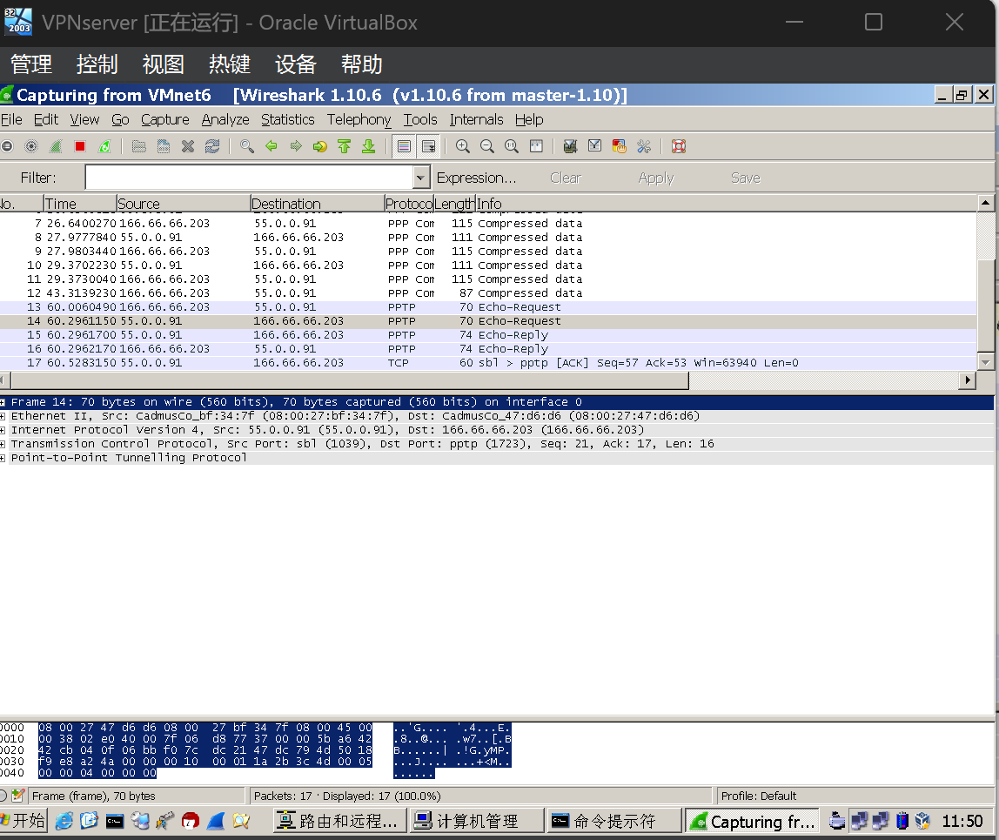

# HW3

## 实验报告

### 实验步骤

- 网卡设置：在工具中设置好网卡

  

- 对不同的虚拟机按照表1对虚拟网络和ip信息配置

  以router为例：

  

​		在网络连接中选中对应的网络进行ip设置，以VMnet5为例：

​		

- 后续几步完全依照4.2.3的步骤进行

  包括router、vpnserver、clientA和clientB的设置

- 在clientA上新建连接To-server，输入166.66.66.203，连接到vpn

### 实验结果

-  Client A和Client B的IP地址

  我的学号后三位是241，对170取模然后加20得到91，所以两者IP地址后三位应该是91

  

  在ClientA上输入ipconfig：

  

​		在ClientA上ping  B

​		

从上面两张图上可以看出ClientA和B的ip地址后三位已经被设置为91

- 用IPconfig命令分别查看VPN客户机和VPN服务器的虚拟网络接口对应的IP地址

​		vpn客户机：

​		vpn服务器：

- 启动VPN服务器的wireshark抓PPP数据包

  