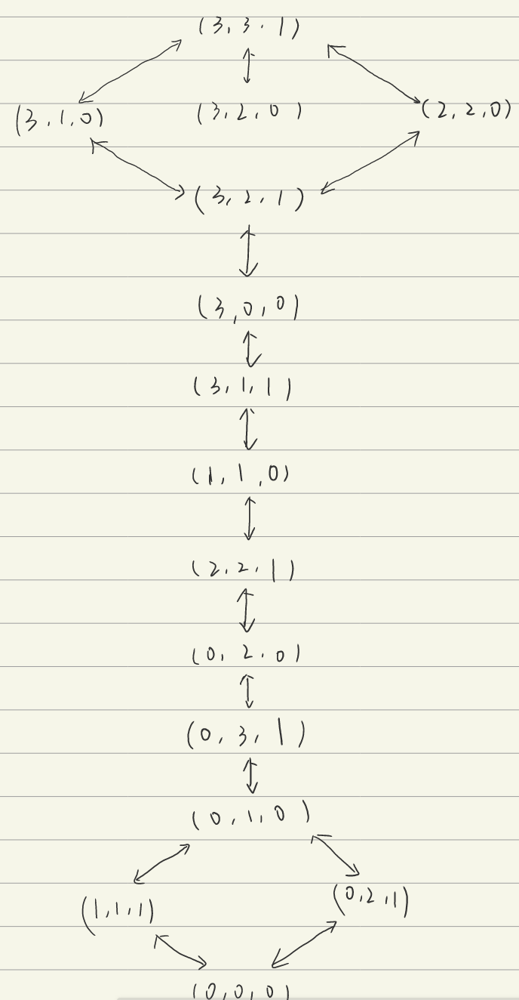

# HW1

## 3.7

> 给出下列问题的初始状态、目标测试、后继函数和耗散函数。选择精确得足以实现的形式化
>
> a. 只用四种颜色对平面地图染色,要求每两个相邻的地区不能染成相同的颜色
>
> b. 一间屋子里有一只3英尺高的猴子，屋子的房顶上挂着一串香蕉,离地面8英尺。屋子里有两个可叠放起来、可移动、可攀登的3英尺高的箱子。猴子很想得到香蕉
>
> d. 有三个水壶，容量分别为12加仑、8加仑和3加仑,还有一个水龙头。可以把壶装满或者倒空，从一个壶倒进另一个壶或者倒在地上。要求量出刚好1加仑水

### a

初始状态：平面地图没有被染成任何颜色

目标测试：所有地区都被染色并且任意相邻的地区不是染成相同的颜色

后继函数：对某个还未染色的地区染色，并且染的颜色和相邻所有颜色不同

耗散函数：给未染色地区染一次色的耗散为一个单位

### b

初始状态：猴子在房间内，香蕉没被吃，箱子未移动

目标测试：猴子拿到了香蕉

后继函数：移动、攀上、滑下、叠加箱子

耗散函数：移动移动、攀上、滑下、叠加箱子的一次操作的耗散为一个单位

### d

初始状态：三个水壶都是空的

目标测试：某个水壶中刚好1加仑水

后继函数：把某个水壶装满或者倒空，从一个壶倒进另一个壶或者倒在地上

耗散函数：倒满水壶或者倒空水壶的一次操作的耗散为一个单位

## 3.9

> 传教士和野人问题通常描述如下：三个传教士和三个野人在河的一边，还有一条能载一个人或者两个人的船。找到一个办法让所有的人都渡到河的另一岸，要求在任何地方野人数都不能多于传教士的人数(可以只有野人没有传教士)。这个问题在AI领域中很著名,因为它是第一篇从分析的观点探讨问题形式化的论文的主题（Amarel, 1968）
> a. 精确地形式化该问题，只描述确保该问题有解所必需的特性。画出该问题的完全状态空间图
>
> b. 用一个合适的搜索算法实现和最优地求解该问题。检查重复状态是个好主意吗?
>
> c. 这个问题的状态空间如此简单，你认为为什么人们求解它却很困难?

### a

初始状态：六个人都在河的同一边，还有一艘能载1-2人的船

目标测试：六个人都在河的另一边

后继函数：1-2人坐船从河的一边到另一边

耗散函数：船载人从一边到另一边的耗散为1个单位

假设初始状态下所有人在左岸，该问题的状态可以用一个三元组来表示，第一个元素表示在左岸的传教士人数，第二个元素表示在左岸的野人人数，第三个元素为1表示船在左岸，为0表示船在右岸

根据要求，所有状态下应该保证第一个元素>=第二个元素或者第一个元素为0

由此可以得到如下的完全状态空间图：

### b

可以采用DFS进行搜索，检查重复状态可以避免在搜索时陷入多余的循环甚至死循环中

### c

- 当处于一个合法状态时，大部分的下一步移动都是不符合要求或者回溯到之前的状态，这就需要进行重复状态的检查，并且不容易枚举到合法的下一个状态；

- 由状态图也可以看出，会有合法状态的下一步无法是合法状态的情况，这就需要进行回溯，也是难点之一