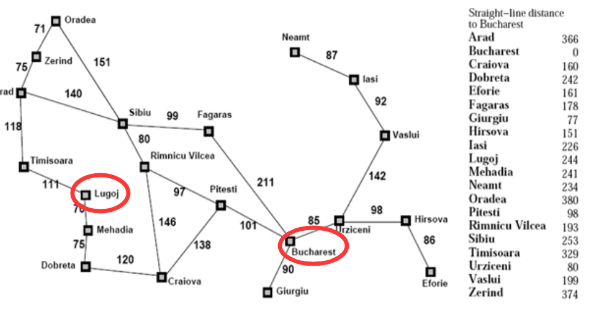
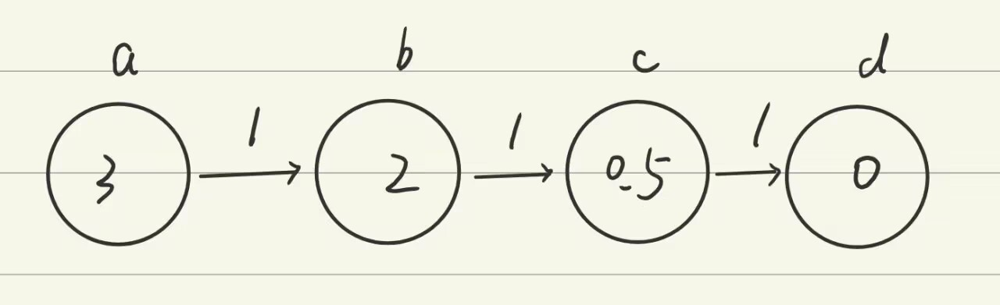

# HW2

## 4.1

> 跟踪A∗搜索算法用直线距离启发式求解从Lugoj到Bucharest问题的过程。按顺序列出算法扩展的节点和每个节点的f,g,ℎ值

根据下图，用首字母代替完整城市

1. L[0+244=244]

2. M[70+241=311]      T[111+329=440]

3. L[140+244=384]     D[145+242=387]     T[111+329-440]

4. D[145+242=387]     T[111+329=440]     M[210+241=451]  T[251+329-580]

5. C[265+160=425]     T[111+329=440]     M[210+241=4511   M[220+241=461]    T[251+329=580]

6. T[111+329=440]     M[210+241=451]    M[220+241=461]      P[403+98=501]      T[251+329=580]      R[411+193=604      D[385+242=627]

7. M[210+241=451]     M[220+241=461]   L[222+244=466]      P[403+98=501]       T[251+329=580]     A[229+366=595]    R[411+193=604]      D[385+242=627]

8. M[220+241=461]    L[222+244=466]     P[403+98=501]   L[280+244=524]    D[285+242=527]     T[251+329=580]    A[229+366=595]     R[411+193=604]    D[385+242=627]

9. L[222+244=466]     P[403+98=501]        L[280+244=524]  D[285+242=527]    L[290+244=534]      D[295+242=537]     T[251+329=580]    A[229+366=595]      R[411+193=604]     D[385+242=627]

10. P[403+98=501]      L[280+244=524]      D[285+242=527]   M[292+241=533]   L[290+244=534]      D[295+242=537]    T[251+329=580]    A[229+366=595]       R[411+193=604]     D[385+242=627]        T[333+329=662]

11. B[504+0=504]       L[280+244=524]      D[285+242=527]    M[292+241=533]   L[290+244=534]      D[295+242=537]   T[251+329=580]    A[229+366=595]      R[411+193=604]     D[385+242=627]    T[333+329=662]      R[500+193=693] C[541+160=701]

## 4.2

> 启发式路径算法是一个最佳优先搜索，它的目标函数是f(n)=(2−w)g(n)+wℎ(n)。算法中w取什么值能保证算法是最优的?当w=0时，这个算法是什么搜索?w=1呢?w=2呢?
>

w=0时，f(n) = 2g(n)，是一致代价搜索

w=1时，f(n) = g(n) + h(n)，是A*搜索

w=2时，f(n) = 2h(n)，是贪心搜索

当$0\lt w\le1$时，算法能取到最优解，w=1时，算法最优

## 4.6

> 设计一个启发函数，使它在八数码游戏中有时会估计过高，并说明它在什么样的特殊问题下会导致次最优解。(可以借助计算机的帮助。)证明：如果ℎ被高估的部分从来不超过c，A∗算法返回的解的耗散比最优解的耗散多出的部分也不超过c
>

函数：$h=h_1+h_2$，$h_1$为错位的个数，$h_2$为最小移动步数

例如当错位个数被高估很多时，就有可能造成次优解

证明：

设$f(n)$是最优解，$h(n)$被高估为$H(n)$，$F(n)$为返回的解则有：

$f(n)=g(n)+h(n)$,$H(n)\le h(n)+c$

所以：

$F(n)=g(n)+H(n)\le g(n)+h(n)+c=f(n)+c$

即$A*$算法返回的解的耗散比最优解的耗散多出的部分不会超过c

## 4.7

> 证明如果一个启发式是一致的，它肯定是可采纳的。构造一个非一致的可采纳启发式

设n为任意状态，G为目标状态，$n\rightarrow m_1\rightarrow m_2,...,\rightarrow m_k \rightarrow G$为n到G的最优路径，则 h(G)=0

由一致性：$h(n)\le c(n,a,n^{\prime})+h(n^{\prime})$

真实代价$h^*(n)=c(n,a_1,m_1)+c(m_1,a_2,m_2)+...+c(m_k,a_{k+1},G)$

上两式结合：$h(n)\le c(n,a_1,m_1)+h(m_1)\le c(n,a_1,m_1)+c(m_1,a_2,m_2)+...+c(m_k,a_{k+1},G)+h(G)=h^*(n)$

所以是可采纳的

构造：

先满足可采纳启发式

$h(b)=2,h(c)=0.5,h(b)\gt h(c)+1$

所以是非一致的可采纳启发式