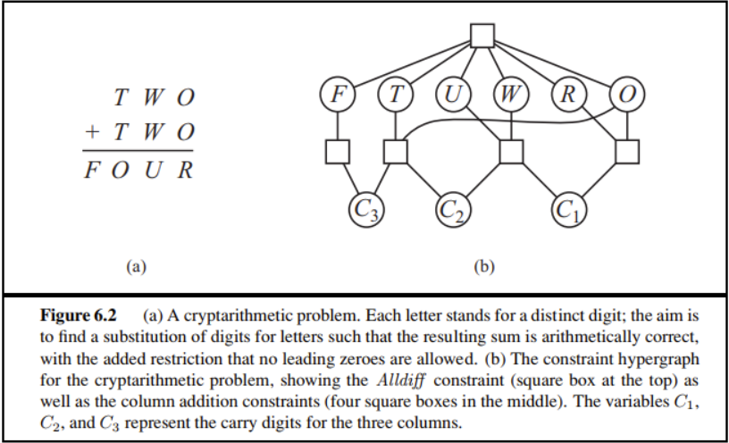
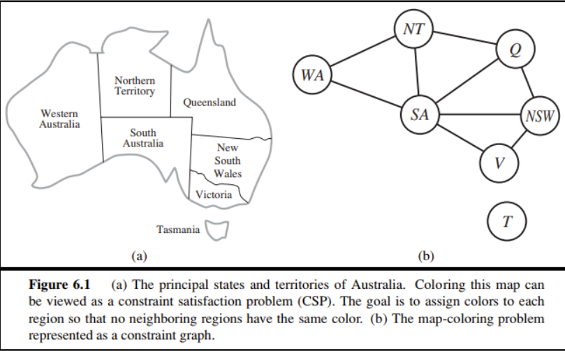

# HW3

## 6.5

> 同时用带有前向检验、MRV和最少约束值启发式的回溯算法手工求解**图6.2**中的密码算数问题

- 对变量 $C_3$，可取0或1，由前向检验限制，附加约束最前面的数字不为0，即$F\ne0$， 所以$C_3=1$

- 对变量 F，由$C_3=1$其只能为1

- 对变量 $C_2$，可取0或1，取$C_{2}=0$

- 对变量$C_1$，可取0或1，取$C_1=0$

- 此时O的可选值域最少，选择变量$O$，由于$O+O=R\leqslant9$，且$T+T=O+10$，因此$O$ 是小于 5 的偶数，取$O=4$

- 此时R的可选值域最少，选择变量 R，只能为8

- 此时T的可选值域最少，选择变量 T，只能为7

- 此时U的可选值域最少，选择变量 U，由于 $W+W=U\leqslant9$，因此$U$ 是小于 9 的偶数

  由前向检验限制，不同的字母表示不同的数字，因此$U$不能取4 或 8，且若U取2或0，W由于重复会没有取值，不满足最少约束值启发式，会回溯，不符合，所以U取6

- 此时W的可选值域最少，选择变量 W，只能取3

  

  综上，一个解为$:F=1,T=7,U=6,W=3,R=8,O=4$

## 6.11

> 用**AC-3**算法说明弧相容对**图6.1**中问题能够检测出部分赋值WA=green，V=red的不相容

值域D={red，green，blue}，用首字母代替颜色

WA={G}，V={R}

对弧（WA，SA），消除不相容，SA值域={R，B}

对弧（SA，V），消除不相容，SA值域={B}

对弧（SA，NSW），消除不相容，NSW值域={R，G}

对弧（V，NSW），消除不相容，NSW值域={G}

对弧（WA，NT），消除不相容，NT值域={R，B}

对弧（SA，NT），消除不相容，NT值域={R}

对弧（NT，Q），消除不相容，Q值域={G，B}

对弧（NSW，Q），消除不相容，Q值域={B}

对弧（SA，Q），消除不相容，Q值域={}

由此可得WA=green，V=red不相容

## 6.12

> 用**AC-3**算法求解树结构**CSP**在最坏情况下的复杂度是多少?

对n个顶点，值域最多d个取值的树形结构CSP问题，最坏复杂度是$O(nd^2)$

n个结点的树有n-1条边，在$O(n)$步内可以完成弧相容改造，每一步需要比较两个变量的d个可能取值，一旦完成弧相容，则无须回溯，直接线性前进即可，所以总时间是$O(nd^2)$