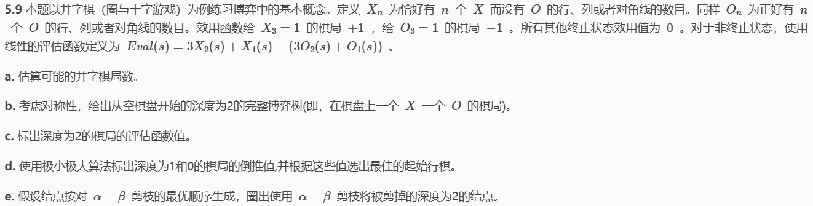
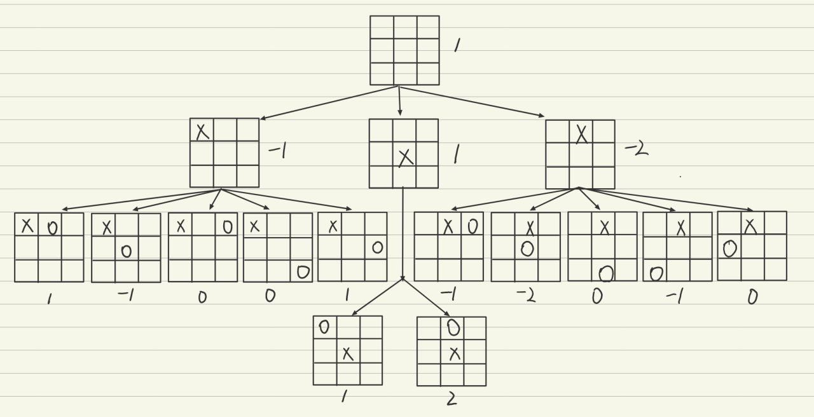
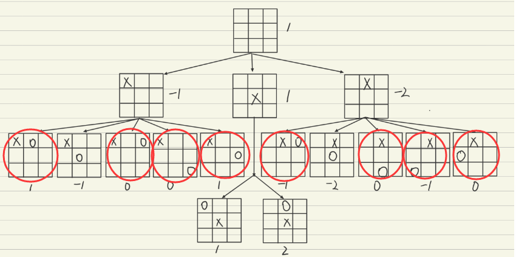
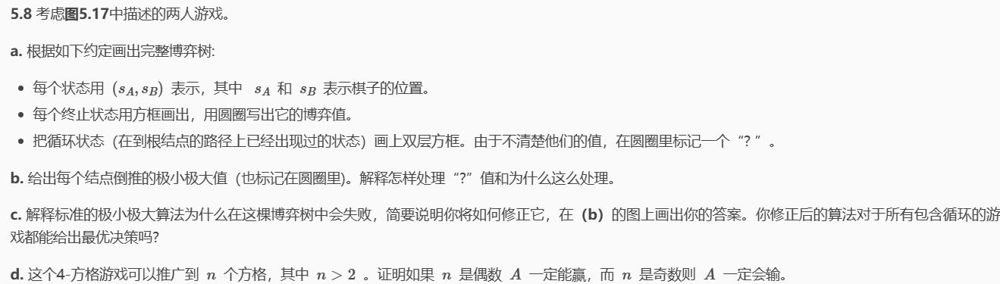
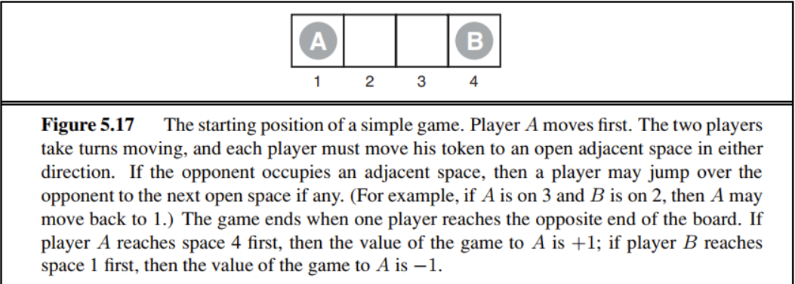
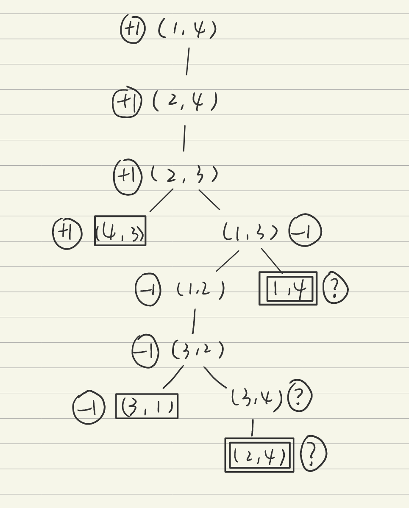
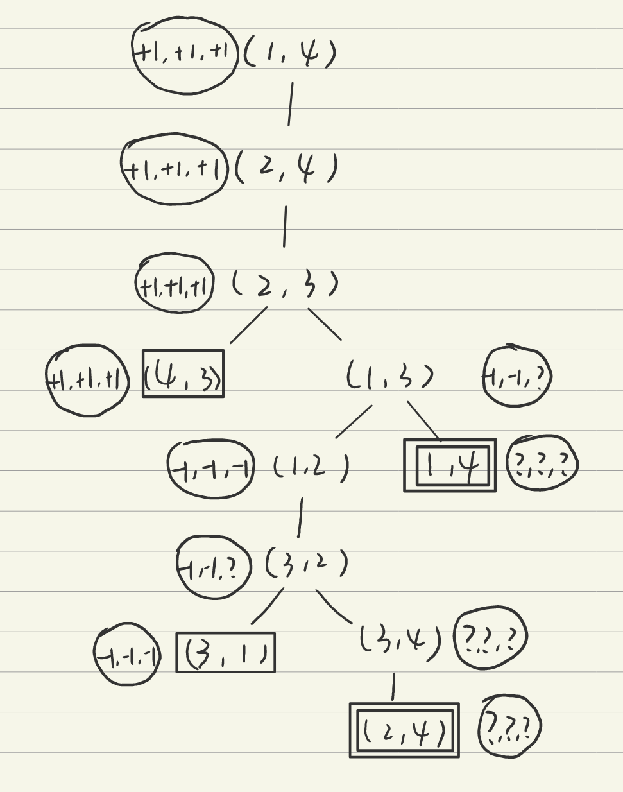
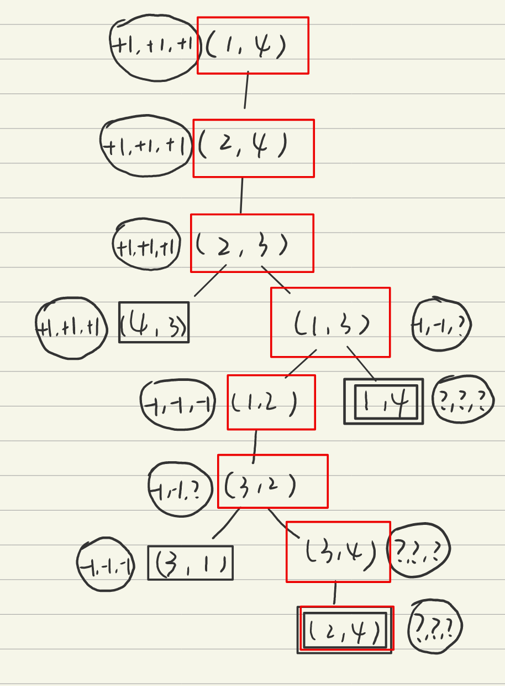
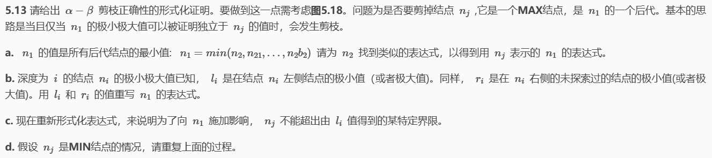
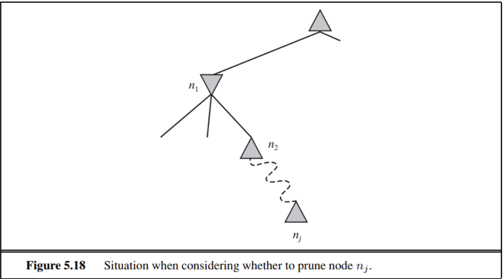

# HW4

## 5.9

### a

最少是先手三轮获胜，为$9!/4!$局

最多是9个格子全部下满，为9！局

所以在$9!/4!$到9！局之间

### b、c、d

如图

最佳起始行棋是在棋盘中间

### e

如图

## 5.8

### a

### b

在圆圈中加上极小极大值（在博弈值后）：

对？的处理方法是视为-1到+1之间的值，因为A如果能够选择则会选择+1，除非后继都是？

### c

标准的极小极大算法是深度优先的，可能会陷入循环，应该通过检测重复状态进行修正，遇到重复状态直接返回？

修正后答案如图所示：

修正后的算法对于所有包含循环的游戏不一定能给出最优决策

因为并不能区分不同的？值，当获胜的情况不唯一时就有可能丢失其他获胜状态

### d

首先考虑n=3时，A输，n=4时，A赢

因此对于大于4的n，如果A在n-2能赢，则开始时A和B各自向前行棋一步，此时只要A不向原位置移动，则两者就处于n-2的状态，则A在n时能赢；同理，A在n-2时输，则n时也输

综上：A在n为奇数时输，在n为偶数时赢

## 5.13

### a

$n_{2}=\max(n_{3},n_{31},\cdots,n_{3b_{3}})$

依次往下类推，得到

$n_{1}=\min(\max(\cdots\max(n_{j},n_{j1},\cdots,n_{jb_{j}})),n_{21},\cdots,n_{2b_{2}})$

### b

$\begin{aligned}
n_{1}& =\min(l_{2},\:n_{2},\:r_{2})  \\
&=\min(l_2,\:\max(l_3,\:n_3,\:r_3),\:r_2) \\&...\\
&=\min(l_2,\:\max(l_3,\:\max(\cdots\max(l_j,\:n_j,\:r_j),\:\cdots),\:r_3),\:r_2)
\end{aligned}$

### c

$n_i=\min(l_{i+1},\max(l_{i+2},\max(\cdots\max(l_j,n_j,r_j),\cdots),r_{i+2}),r_{i+1})$

为了向$n_1$施加影响，$n_j$，也就是上式中的max结点，需要不超过$l_j$，从$n_1$开始，所以$n_j$应该小于$l_2、l_4...l_j$，即不超过$min(l_2,l_4,...,l_j)$

### d

交换上述的min和max即可，也就是可以得到

$n_i=\max(l_{i+1},\min(l_{i+2},\min(\cdots\min(l_j,n_j,r_j),\cdots),r_{i+2}),r_{i+1})$

从而同c得到：

$n_j$不小于$max(l_3,l_5,...,l_j)$