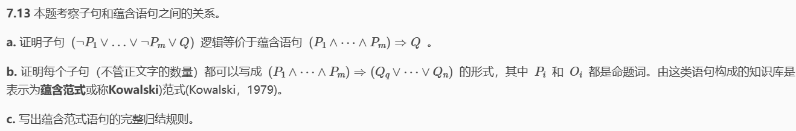

# HW5

## 7.13

### a

由蕴含消去：

$(P_1\wedge\cdots\wedge P_m)\Rightarrow Q$ 等价于 $\neg(P_1\wedge\cdots\wedge P_m)\vee Q$ 

由德摩根律：

 $\neg(P_1\wedge\cdots\wedge P_m)$ 等价于 ($\neg P_1\vee\cdots\vee\neg P_m)$ 
因此：

$(P_1\wedge\cdots\wedge P_m)\Rightarrow Q$ 等价于 $(\neg P_1\vee\cdots\vee\neg P_m\vee Q)$

### b

对于一个子句，正文字分别为 $Q_q,\cdots,Q_n$，有$m$ 个负文字，分别为 $\lnot P_1,\lnot P_2,\cdots,\lnot P_m$,

则可表示为

$\neg P_1\vee\cdots\vee\neg P_m\vee Q_q\vee\cdots\vee Q_n$

根据（a），有

$(\neg P_{1}\vee\cdots\vee\neg P_{m}\vee Q_{1}\vee\cdots\vee Q_{n})\equiv((P_{1}\wedge\cdots\wedge P_{m})\Rightarrow(Q_{q}\vee\cdots\vee Q_{n}))$

所以可以表示

### c

对于文字$p_i,q_i,r_i,s_i$ ，且 $p_i=s_j$ ，

$\frac{(p_1\wedge\cdots\wedge p_m)\Rightarrow(q_1\vee\cdots\vee q_n),\quad(r_1\wedge\cdots\wedge r_l)\Rightarrow(s_1\vee\cdots\vee s_k)}{(p_1\wedge\cdots\wedge p_{i-1}\wedge p_{i+1}\wedge\cdots\wedge p_m\wedge r_1\wedge\cdots\wedge r_l)\Rightarrow(q_1\vee\cdots\vee q_n\vee s_1\vee\cdots\vee s_{j-1}\vee s_{j+1}\vee\cdots\vee s_k)}$

 

## 证明前向链接算法的完备性

证明：
前向链接算法的完备性即每个被蕴含的原子语句都可以推导得出

考虑inferred表的最终状态（在算法到达不动点以后，不会再出现新的推理)

该表把推导出的每个符号设为true，其他符号为false，可以把此表看作一个逻辑模型

先证明原始KB中的每个确定子句在该模型中都为真

> 假设相反的情况成立，即某个子句$a_1\wedge\cdots\wedge a_k\Rightarrow b$在此模型下为假
>
> 那么$a_1\wedge\cdots\wedge a_k$在模型中为真，b必须为假
>
> 但这与算法已到达一个不动点的假设矛盾

因此在不动点推导出的原子语句集定义了原始KB的一个模型

更进一步，被KB蕴涵的任一原子语句q在它的所有模型中为真

因此每个被蕴涵的语句q都可以被算法推导得出
