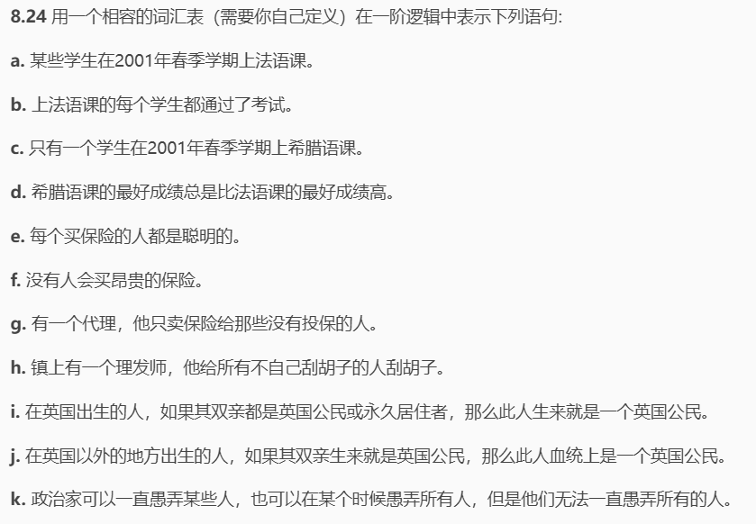
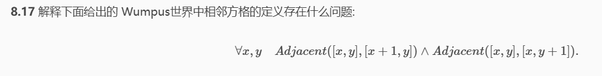
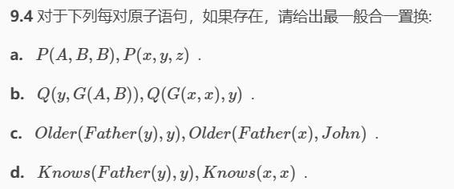
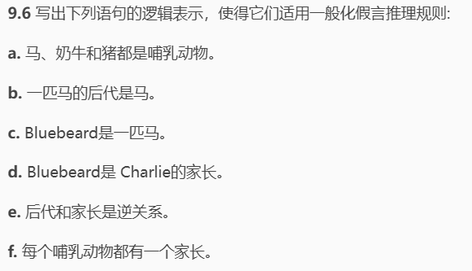
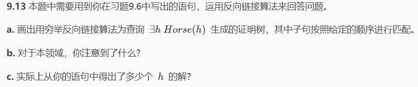
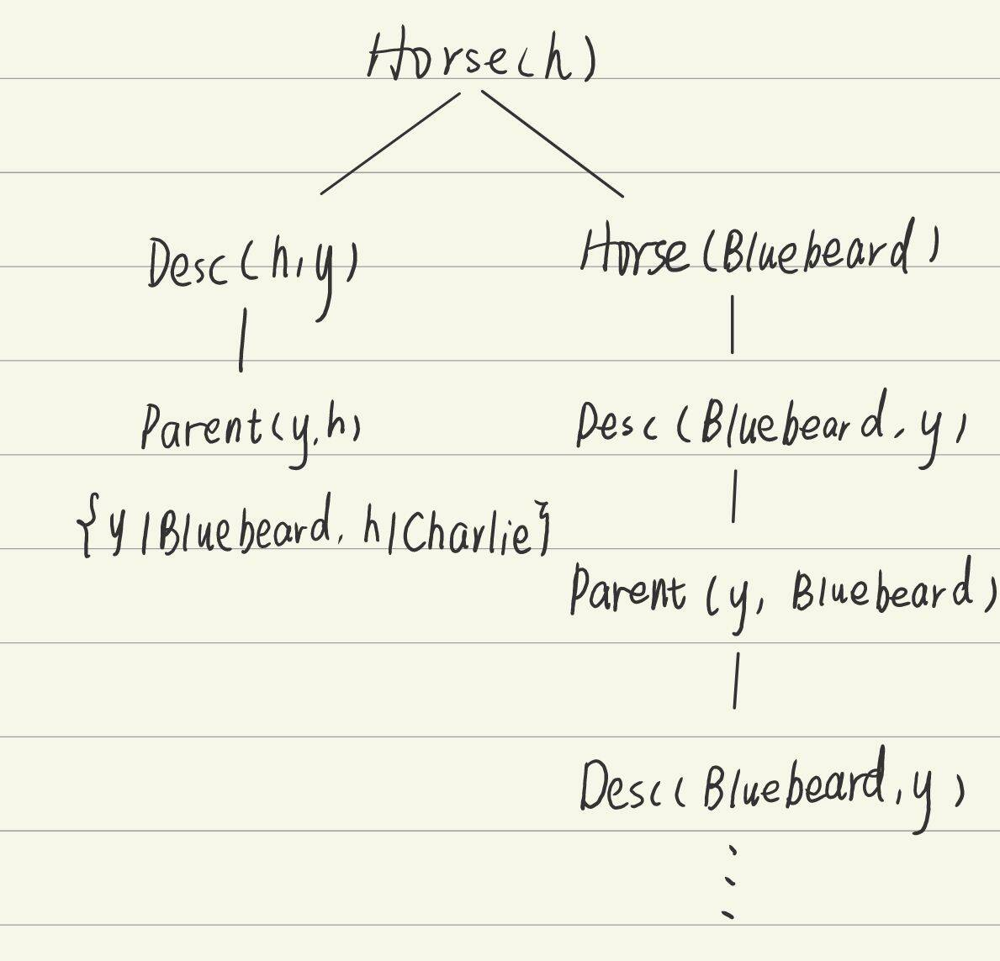

# HW6

## 8.24

词汇表：

Student(x),Person(x),Smart(x),Policy(x),Expensive(x),Agent(x),Insured(x),Barber(x),Politician(x)分别表示x是学生/正常人/聪明的……/理发师/政治家

Select(x,c,s)表示学生x在s学期上c的课

Pass(x,c,s)表示学生x在s学期的c课通过了考试

Grade(x,c,s)表示学生x在s学期的c课上的成绩

Buy(x,y,g)表示x向y购买了g

Sell(x,y,g)表示x把g卖给了y

Shave(x,y)表示x给y刮胡子

Born(x,c)表示x在国家c出生

Parent(x,y)表示x是y的父母

Citizen(x,c,b)表示x基于b是国家c的公民

Resident(x,c)表示x是国家c的永久居民

Fool(x,y,t)表示x在t时刻愚弄了y

语句表述：

##### a

$\quad\exists x\quad Student(x)\wedge Select(x,French,2001Spring)$ 

##### b

$\quad\forall x,s\quad Student(x)\wedge Select(x,French,s)\Rightarrow Pass(x,French,s)$

##### c

$\quad\forall x\quad Student(x)\wedge Select(x,Greek,s)\wedge\left(\forall y\quad y\neq x\Rightarrow\neg Select(y,Greek,2001Spring)\right)$

##### d

   $\:\forall s\:\exists x\:\forall y\quad Grade(x,Greek,s)>Grade(y,French,s)$

##### e

$\quad\forall x,p,a\quad Person(x)\land Policy(p)\land Agent(a)\land Buy(x,a,p)\Rightarrow Smart(x)$

##### f

 $\quad\forall x,p,a\quad Person(x)\wedge Policy(p)\wedge Expensive(p)\Rightarrow\neg Buy(x,a,p)$

##### g

 $\quad\exists a\quad Agent(a)\wedge\left(\forall x,p\quad(Policy(p)\wedge Sell(a,x,p)\right)\quad\Rightarrow\quad(Person(x)\wedge\neg Insured(x)\big)$

##### h

 $\quad\exists x\quad Barber(x)\land\left(\forall y\quad\:Person(y)\land\neg Shave(y,y)\Rightarrow Shave(x,y)\right)$

##### i

  $~\forall x\quad~Person(x)\wedge Born(x,UK)\wedge\left(\forall y~Parent(y,x)\wedge\left((\exists b~Citizen(y,UK,b)\right)\vee\right.Resident(y,UK)\Big)\Rightarrow Citizen(x,UK,~Birth~)$

##### j

 $~\forall x~Person(x)\wedge\neg Born(x,UK)\wedge\left(\forall y~Parent(y,x)\wedge\left(\exists b~Citizen(y,UK,b)\right)\right)\Rightarrow Citizen(x,UK,~^{\prime}Descent^{\prime})$

##### k

$\begin{aligned}&\forall x\quad Politician(x)\Rightarrow\left(\exists y \forall t Person(y)\wedge Fool(x,y,t)\right)\wedge\left(\exists t \forall y Person(y)\wedge\\(x,y,t)\right)\wedge\neg\left(\forall t \forall y Person(y)\wedge Fool(x,y,t)\right)\end{aligned}$

## 8.17

- 仅仅考虑了上相邻方格和右相邻方格，应该还要包括左和下相邻方格
- 忽略了边界情况，例如最上方一行的就没有上相邻方格

## 9.3

语句 b 和 c 都是合法的结果

a 不合法是因为是替换变元是Everest，但其已经作为一个对象，所以不能再属于另一个对象

## 9.4

### a

$\{A/x,B/y,B/z\}$

### b

不存在，x不能同时取得A和B

### c

$\{y/John,x/John\}$

### d

不存在

需要x既是y又是father(y)，矛盾

## 9.6

Horse(x),Cow(x),Pig(x),Mammal(x)分别表示x是马/奶牛/猪/哺乳动物

Desc(x,y)表示x是y的后代

Parent(x,y)表示x是y的家长

所以：

### a

$\:Horse(x)\Rightarrow Mammal(x)\\Cow(x)\Rightarrow Mammal(x)\\Pig(x)\Rightarrow Mammal(x)$

### b

$Desc(x,y)\wedge Horse(y)\Rightarrow Horse(x)$

### c

$Horse(Bluebeard)$

### d

$Parent(Bluebeard,Charlie)$

### e

$Desc(x,y)\Rightarrow Parent(y,x)\\Parent(x,y)\Rightarrow Desc(y,x)$

### f

$\begin{aligned}&Mammal(x)\Rightarrow Parent(Gen(x),x)\end{aligned}$

其中 Gen(x) 是一个 Skolem 范式

## 9.13

### a

### b

由于规则：$Desc(x,y)\wedge Horse(y)\Rightarrow Horse(x)$

产生无限循环

### c

两个解，BlueBeard和Charlie都是马

