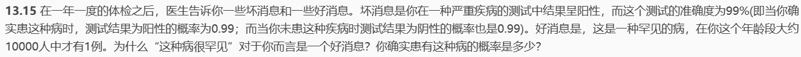
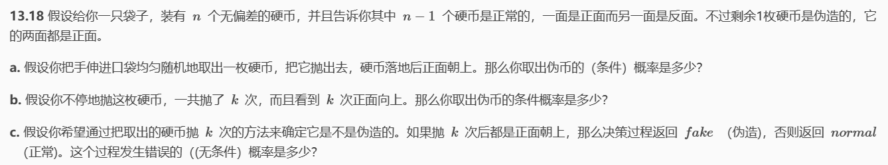
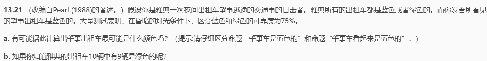
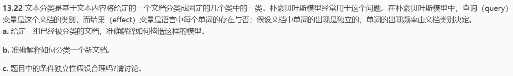
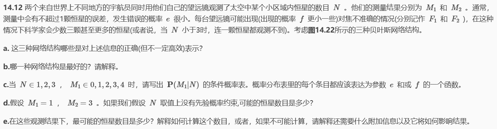
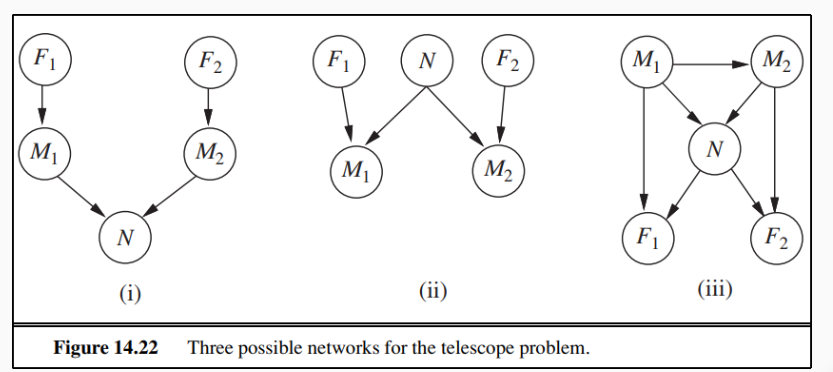
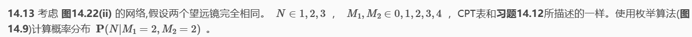

# HW7

## 13.15

因为病很罕见的情况下，即使测试结果为阳性，由于发病率太低，所以实际患病概率也不大

A表示实际患病，B表示测试结果为阳性

则：在为阳性的情况下，我实际患病的概率为：

$\begin{aligned}
P(A|B)& =\frac{P(B|A)\times P(A)}{P(B)}  \\
&=\frac{P(B|A)\times P(A)}{P(B|A)\times P(A)+P(B|\neg A)\times P(\neg A)} \\
&=\frac{0.99\times0.0001}{0.99\times0.0001+0.01\times0.9999} \\
&=0.9804\%
\end{aligned}$

## 13.18

### a

$\begin{aligned}
P(\text{是伪币|正面})& =\frac{P(\text{伪币}\wedge\text{正面})}{P(\text{正面})}  \\
&=\frac{\frac1n\times1}{\frac1n\times1+\frac{n-1}n\times\frac12} \\
&=\frac2{n+1}
\end{aligned}$

### b

$\begin{aligned}
P(\text{是伪币}|k\text{ 次正面})& =\frac{P(\text{伪币}\wedge k\text{ 次正面})}{P(k\text{ 次正面})}  \\
&=\frac{\frac1n\times1^k}{\frac1n\times1^k+\frac{n-1}n\times(\frac12)^k} \\
&=\frac{2^k}{n+2^k-1}
\end{aligned}$

### c

$\begin{aligned}
P(\text{不是伪币}\wedge k\text{ 次正面})& =P(k\text{ 次正面}|\text{不是伪币})P(\text{不是伪币})  \\
&=\left(\frac12\right)^k\times\frac{n-1}n \\
&=\frac{n-1}{2^kn}
\end{aligned}$

## 13.21

### a

B表示出租车是蓝色的

LB表示出租车看起来是蓝色的

则$P(LB\mid B)=0.75$，$P\left(\neg LB\mid\neg B\right)=0.75$

则看起来是蓝色时，实际确实为蓝色的概率：（设p为蓝色出租车概率）

$0.75^*p/(0.75^*p+0.25^*(1-p))$

由于不知道蓝色出租车概率，所以无法计算

### b

告知了p=1/10，所以带入上面的式子就可知：

看起来是蓝色，实际确实为蓝色的概率为0.25，实际是绿色的概率为0.75

## 13.22

### a

模型由先验概率P(category=A)和条件概率P(word_i|caategory=A)

前者描述所有文档中类别A 的比例

后者表示类别为A的文档中包含word_i的比例

### b

通过统计其中各单词出现频率，而由于单词出现的频率是由文档类别决定的，所以可以判别文档的类别

### c

不合理，文档中的词呈现一定的相关性，复合词出现的概率并不一定等于各部分出现概率之积

## 14.12

### a

（ii）和（iii）都是正确的表示

### b

（ii）是最好的表示，需要参数更少，也正确

### c

|      | N=1         | N=2         | N=3         |
| ---- | ----------- | ----------- | ----------- |
| M1=1 | f+(1-f)e    | f           | f           |
| M1=2 | (1-2e)(1-f) | e(1-f)      | 0           |
| M1=3 | e(1-f)      | (1-2e)(1-f) | e(1-f)      |
| M1=4 | 0           | e(1-f)      | (1-2e)(1-f) |
| M1=5 | 0           | 0           | e(1-f)      |

### d

N可能是2或4或者大于等于6

### e

$P(N|M_1,M_2)=\frac{P(M_1,M_2|N)\times P(N)}{P(M_1,M_2)}$

不知道P（N）的情况下无法求得，所以需要给定P（N），这样使得上式分子最大的N就是最有可能的

## 14.13

$\begin{aligned}
P(N|M1=2,M2& =2)=\frac{1}{P(M1=2,M2=2)}P(N,M1=2,M2=2) \\
&=\frac{1}{\mathrm{P}(M1=2,M2=2)}\sum_{F1,F2}P(N,M1=2,M2=2,F1,F2) \\
&=\frac{1}{\mathrm{P}(M1=2,M2=2)}\sum_{F1,F2}P(N)(1-f)^2P(M1=2|F1=f,N)P(M2=2|F2=f,N)
\end{aligned}$

所以：

设P=$\frac{1}{P(M1=2,M2=2)}$

$\begin{aligned}
&P(N|M1=2,M2=2)=P^*p_1(1-f)^{2}e^{2} ,N=1,P(N=1)=p_1\\
&P(N|M1=2,M2=2)=P^*p_2(1-f)^{2}(1-2e)^{2}，N=2,P(N=2) =p_2\\
&P(N|M1=2,M2=2)=P^*p_3(1-f)^{2}e^{2}，N=3,P(N=3)=p_3
\end{aligned}$