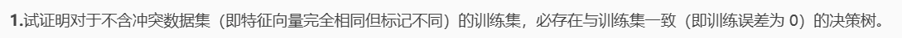
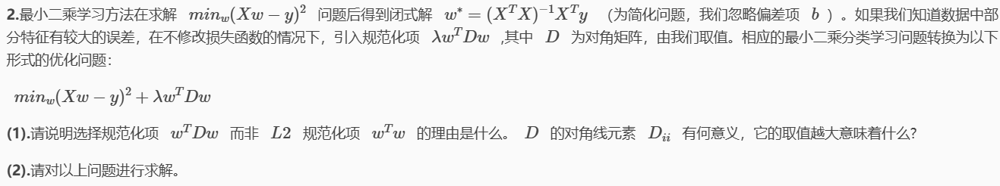
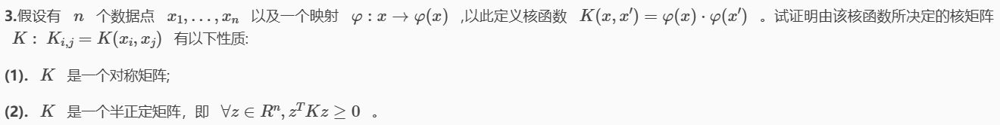
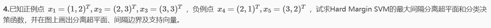
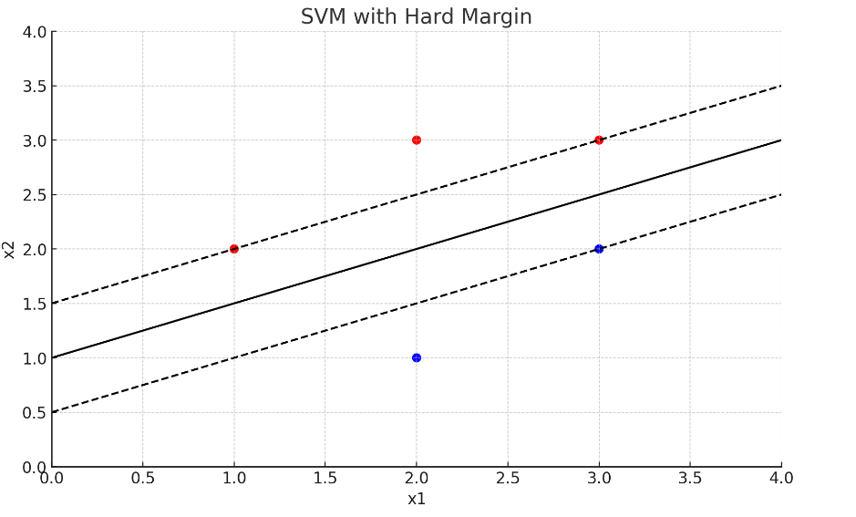
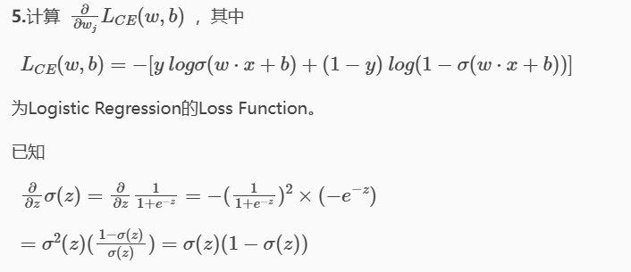
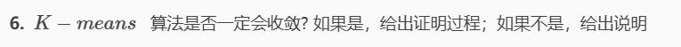

# HW8

## 1

按照如下方法构造：

- 每次选择划分属性，将数据集划分，得到的所有子集的数据都各自是同一个类别，则停止划分，否则继续

- 每个非叶节点对应一个划分属性，每个叶节点对应一个数据的类别

由于数据集不含冲突数据，因此在每个子集中，所有的数据都属于同一类别，每个叶节点对应一个数据的类别

这样决策树可以将每个特征向量映射到其正确的类别，与训练集一致

## 2

### （1）

- 使用$w^TDw$而不是$w^Tw$是为了允许对$w$的不同分量施加不同的正则化强度，在处理非均匀误差的数据时更为有效
- $D_{ii}$的意义：矩阵$D$的对角元素$D_{ii}$表示相应分量$w_i$的正则化强度，较大的$D_{ii}$值意味着更强的正则化，有助于减少噪声或不可靠特征的影响

### （2）

$$J(w)=(Xw-y)^T(Xw-y)+\lambda w^TDw$$

$$\nabla J(w)=2X^T(Xw-y)+2\lambda Dw$$

所以：

$$X^T(Xw-y)+\lambda Dw=0$$

$$X^TXw-X^Ty+\lambda Dw=0$$
$(X^TX+\lambda D)w=X^Ty$
所以最优权重$w$的解为：
$$w^*=(X^TX+\lambda D)^{-1}X^Ty$$

## 3

### （1）

$$K_{i,j}=K(x_i,x_j)=\varphi(x_i)\cdot\varphi(x_j)$$

根据内积的对称性性质：

$$K_{i,j}=\varphi(x_i)\cdot\varphi(x_j)=\varphi(x_j)\cdot\varphi(x_i)=K_{j,i}$$

因此，矩阵$K$是对称的

### （2）

$\forall z\in\mathbb{R}^n$，有
$$z^TKz=\sum_{i=1}^n\sum_{j=1}^nz_iz_jK_{i,j}=\sum_{i=1}^n\sum_{j=1}^nz_iz_j\varphi(x_i)\cdot\varphi(x_j)$$
将内积展开：
$$z^TKz=\sum_{i=1}^n\sum_{j=1}^nz_iz_j(\varphi(x_i)\cdot\varphi(x_j))$$
可以将上式重新组织为一个整体的内积：
$$z^TKz=(\sum_{i=1}^nz_i\varphi(x_i))\cdot\left(\sum_{j=1}^nz_j\varphi(x_j)\right)$$
设$\psi=\sum_{i=1}^nz_i\varphi(x_i)$,则：
$z^TKz=\psi\cdot\psi=\|\psi\|^2\geq0$

因此，
$$z^TKz\geq0$$
即$K$是半正定的

## 4

硬间隔SVM的优化问题可以表示为：$$\min_{w,b}\frac12\|w\|^2$$

约束条件为$$y_i(w\cdot x_i+b)\geq1\quad\forall i$$
其中，$y_i$是第$i$个样本的标签，$y_i=1$表示正例，$y_i=-1$表示负例

求解：使用拉格朗日乘子法：

- 引入拉格朗日乘子$\alpha_i$,拉格朗日函数为：$$L(w,b,\alpha)=\frac12\|w\|^2-\sum_{i=1}^5\alpha_i[y_i(w\cdot x_i+b)-1]$$

- 对$w$和$b$求偏导并令其为零，可以得到：$w=\sum_{i=1}^5\alpha_iy_ix_i$

最终解得：

$w=[-1.00000925,2.00003571]$

$b=-2.0000617429468743$

则取$w_1=-1,w_2=2,b=-2$

所以决策函数为$\mathrm{f(x)=sign(-x_{1}+2x_{2}-2)}$

用下图表示：

- 数据点：红色和蓝色的圆圈分别表示负例点和正例点
- 支持向量：用黑色圆圈标记的点
- 分离超平面：黑色实线表示分离超平面
- 间隔边界：黑色虚线表示间隔边界

## 5

$n$个样本，每个样本的特征向量为$x_i$和标签为$y_i$

逻辑回归模型的预测值为：
$$\hat{y}_i=\sigma(w\cdot x_i+b)$$     $$\sigma(z)=\frac1{1+e^{-z}}$$

则$\begin{aligned}
\frac{\partial L_{CE}(w,b)}{\partial w_j}& =\frac{\partial L_{CE}(w,b)}{\partial z}\times\frac{\partial z}{\partial w_{j}}  \\
&=-(\frac y{\sigma(z)}\times\frac{\partial\sigma(z)}{\partial z}+\frac{1-y}{1-\sigma(z)}\times\frac{\partial(1-\sigma(z))}{\partial z})\times x_j
\end{aligned}$

其中$\begin{aligned}
&\frac\partial{\partial z}\sigma(z)=\frac\partial{\partial z}\frac1{1+e^{-z}}=\sigma(z)(1-\sigma(z))
\end{aligned}$

代入则有：$(\sigma(z)-y)\times x_j$

而$z=w\cdot x+b$

所以最后结果为$(\sigma(w\cdot x+b)-y)x_j$

## 6

一定收敛，分别对算法的两个步骤：

- 对算法第一步：分配数据点

在分配数据点到最近的簇中心时，目标函数$J$不会增加。对于每个数据点$x_i$,将它分配到最近的簇中心$\mu_k$使得：$\min_{1\leq k\leq K}\|x_i-\mu_k\|^2$是最小的。此操作可能会减小或保持$J$不变，但不会增加$J$，即所有点和中心点的距离在这一步必定减小。

- 对算法第二步：重新计算簇中心

新的簇中心是簇内数据点的均值，均值化会减少或保持簇内数据点的方差，目标函数同样不增

因此，目标函数不增（1）

而目标函数显然大于等于0，即有下界（2）

同时，对于给定的$n$个数据点和$K$个簇中心，可能的划分是有限的（3）

> 因为每个数据点只能属于一个簇，所以总共有$K^n$种可能的划分方式。每次迭代中，K-means 算法要么使目标函数严格减小，要么在某个稳定的划分上保持不变，因此在有限步数内算法一定会停止

综合以上（1）（2）（3）三点，该算法一定收敛