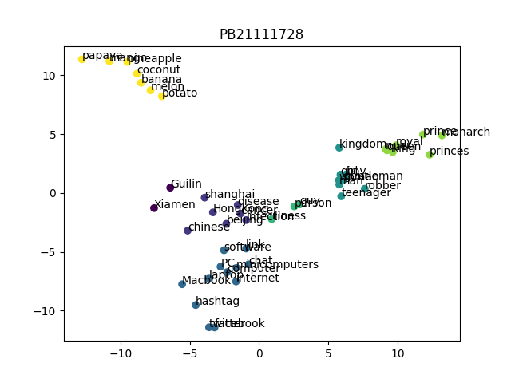
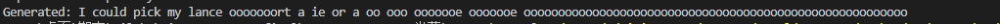

# Report

## Part1

### 决策树

#### 原理和步骤

**1.数据加载和预处理**：

```python
def load_dataset(datapath='./data/ObesityDataSet_raw_and_data_sinthetic.csv'):
    df = pd.read_csv(datapath)
    discrete_features = ['Gender', 'CALC', 'FAVC', 'FCVC', 'NCP', 'SCC', 'SMOKE', 'CH2O',
                         'family_history_with_overweight', 'FAF', 'TUE', 'CAEC', 'MTRANS']

    X = df.drop(columns=['NObeyesdad'])  # 假设 'NObeyesdad' 是目标列
    y = df['NObeyesdad']

    # 编码离散特征
    label_encoder = LabelEncoder()
    for feature in discrete_features:
        X[feature] = label_encoder.fit_transform(X[feature])
    y = label_encoder.fit_transform(y)

    X_train, X_test, y_train, y_test = train_test_split(X, y, test_size=0.2, random_state=42)

    return X_train.to_numpy(), X_test.to_numpy(), y_train, y_test

```


- 使用 Pandas 加载数据集，并且指定了一些离散特征。
- 使用 `LabelEncoder` 对离散特征进行编码，将字符串标签转换为数值标签，使其适用于决策树分类器的训练。

**2.决策树节点类 **：

```python
class TreeNode:
    def __init__(self, is_leaf=False, class_label=None, attribute=None, threshold=None, left=None, right=None):
        self.is_leaf = is_leaf
        self.class_label = class_label
        self.attribute = attribute
        self.threshold = threshold
        self.left = left
        self.right = right

```


- `TreeNode` 类定义了决策树的节点，包括是否是叶子节点、类别标签、划分属性、划分阈值以及左右子节点。

**3.决策树分类器类**：

```python
class MyDecisionTreeClassifier:
    def __init__(self):
        self.root = None

    def train(self, X, y):
        self.root = self.trBuild(X, y)

    def trBuild(self, X, y):
        if len(set(y)) == 1:
            return TreeNode(is_leaf=True, class_label=y[0])

        B_attr, B_thr = self._find_best_split(X, y)
        if not B_attr:
            return TreeNode(is_leaf=True, class_label=np.bincount(y).argmax())

        ld = X[:, B_attr] < B_thr
        rd = X[:, B_attr] >= B_thr
        lt = self.trBuild(X[ld], y[ld])
        rt = self.trBuild(X[rd], y[rd])

        return TreeNode(attribute=B_attr, threshold=B_thr, left=lt, right=rt)
    
   def _find_best_split(self, X, y):
        B_gain = -1
        B_attr = None
        B_thr = None
        entropy_D = self.cal_epy(y)

        # 遍历所有可能的属性和阈值，进行扰动
        for attr, thr in self._generate_split_candidates(X, y):
            # 引入随机扰动到阈值
            perturbation = random.uniform(-0.1, 0.1)  # 调整范围以适应需求
            thr += perturbation
            ld = X[:, attr] < thr
            rd = X[:, attr] >= thr

            if not np.sum(ld) or not np.sum(rd):
                continue

            entropy_Dv = np.sum(ld) / len(y) * self.cal_epy(y[ld]) + \
                        np.sum(rd) / len(y) * self.cal_epy(y[rd])

            gain = entropy_D - entropy_Dv

            if gain > B_gain:
                B_gain = gain
                B_attr = attr
                B_thr = thr

        return B_attr, B_thr

    def _generate_split_candidates(self, X, y):
        candidates = []
        for attr in range(X.shape[1]):
            values = np.unique(X[:, attr])
            for thr in values:
                candidates.append((attr, thr))
        return candidates
```


- `MyDecisionTreeClassifier` 类实现了决策树的训练和预测功能。
- `train` 方法使用训练数据对决策树进行训练，通过调用 `_find_best_split` 方法递归地构建决策树的各个节点。
- `_find_best_split` 方法根据信息增益（基于信息熵）选择最佳的划分属性和阈值，其中引入了随机扰动以增加模型的泛化能力。
- `_generate_split_candidates` 方法生成所有可能的属性和阈值的组合作为划分候选。

**4.预测和评估**：

- `predict` 方法利用训练好的决策树模型对输入样本进行预测。
- `calculate_accuracy` 函数用于评估模型在测试集上的精确度。


#### 结果


### PCA和Kmeans

#### PCA

**1. 数据中心化：**

   ```python
   self.X_centered = X - np.mean(X, axis=0)
   ```

对输入数据 `X` 进行中心化处理，即每个特征减去其均值，使得数据集中在原点附近

**2. 计算核矩阵：**

   ```python
   K = get_kernel_function(self.kernel, self.X_centered)
   ```

调用 `get_kernel_function` 函数计算核矩阵 `K`，根据选择的核函数来计算数据在特征空间的相似性

**3. 特征值分解和选择主成分：**

   ```python
   eigenvalues, eigenvectors = np.linalg.eigh(K)
   idx = np.argsort(eigenvalues)[::-1]
   self.eigenvectors = eigenvectors[:, idx][:, :self.n_components]
   ```

使用 `numpy` 的 `linalg.eigh` 函数计算核矩阵 `K` 的特征值和特征向量

`idx = np.argsort(eigenvalues)[::-1]` 对特征值进行降序排序

**4. 数据转换：**

   ```python
   X_reduced = np.dot(K, self.eigenvectors)
   ```

将中心化后的数据 `X_centered` 通过核矩阵 `K` 与已计算好的主成分 `self.eigenvectors` 相乘，得到投影后的降维表示 `X_reduced`


以上代码也就是fit和transform的主要代码


#### Kmeans

**1. 初始化聚类中心：**
   ```python
   # 初始化聚类中心
   def initialize_centers(self, points):
       n, d = points.shape
       self.centers = np.zeros((self.n_clusters, d))
       for k in range(self.n_clusters):
           random_index = np.random.choice(n, size=10, replace=False)
           self.centers[k] = points[random_index].mean(axis=0)
       return self.centers
   ```

根据输入的数据点 `points`，它选择随机的数据点作为初始的聚类中心

**2. 分配数据点到最近的聚类中心：**

   ```python
   # 分配样本到最近的聚类中心
   def assign_points(self, points):
       n_samples = points.shape[0]
       self.labels = np.zeros(n_samples, dtype=int)
       for i in range(n_samples):
           distances = np.linalg.norm(points[i] - self.centers, axis=1)
           self.labels[i] = np.argmin(distances)
       return self.labels
   ```

根据数据点 `points` 的距离将每个数据点分配到离它最近的聚类中心所在的簇中

**3. 更新聚类中心：**

   ```python
   # 更新聚类中心
   def update_centers(self, points):
       for k in range(self.n_clusters):
           cluster_points = points[self.labels == k]
           if len(cluster_points) > 0:
               self.centers[k] = np.mean(cluster_points, axis=0)
   ```

根据当前簇中所有数据点的平均值重新计算每个簇的聚类中心

**4. 完整的K均值聚类过程：**

   ```python
   # 拟合KMeans模型
   def fit(self, points):
       self.initialize_centers(points)
       for _ in range(self.max_iter):
           self.assign_points(points)
           self.update_centers(points)
   ```

K 均值算法通常会在达到最大迭代次数或者聚类中心不再显著变化时停止迭代，则表示算法已经收敛到局部最优解或者达到了预定的停止条件


#### 结果



## Part2

未完成，如下：模型效果太差，代码bug仍存在，未来有机会希望精进

