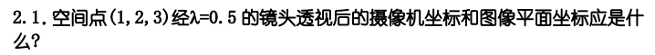
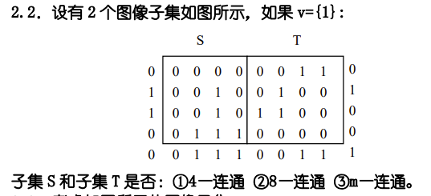
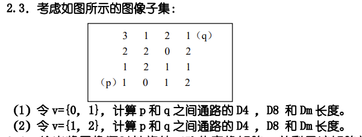
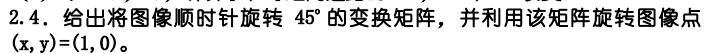
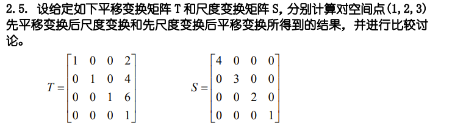
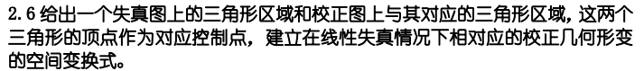

# HW1

## 2.1

利用投影变换矩阵

摄像机坐标：$\begin{bmatrix}
\frac{\lambda X}{\lambda - Z}  & \frac{\lambda Y}{\lambda - Z}  & \frac{\lambda Z}{\lambda - Z}
\end{bmatrix}^ \mathrm{ T } = \begin{bmatrix}
-0.2  & -0.4  & -0.6
\end{bmatrix}^ \mathrm{ T }$

图像平面坐标：$\begin{bmatrix}
\frac{\lambda X}{\lambda - Z}  & \frac{\lambda Y}{\lambda - Z}
\end{bmatrix}^ \mathrm{ T } = \begin{bmatrix}
-0.2  & -0.4
\end{bmatrix}^ \mathrm{ T }$

## 2.2

T不是4-连通，而S是4-连通的

都是是8-连通和m-连通的

## 2.3

### (1)

D4：$\infin$，无4-连通

D8：4   

Dm：5

### (2)

D4：6    

D8：4   

Dm：6

## 2.4

变换矩阵为

$$
\begin{bmatrix}
  \frac{\sqrt{2} }{2} & \frac{\sqrt{2} }{2}&0  \\
  -\frac{\sqrt{2} }{2} & \frac{\sqrt{2} }{2}&0  \\0&0&1
  
\end{bmatrix}
$$

旋转 $(1,0)$ 

$$
\begin{bmatrix}
  \frac{\sqrt{2} }{2} & \frac{\sqrt{2} }{2}  &0\\
  -\frac{\sqrt{2} }{2} & \frac{\sqrt{2} }{2}  &0\\0&0&1
  
\end{bmatrix}\begin{bmatrix}
 1\\
 0\\1
\end{bmatrix}=\begin{bmatrix}
 \frac{\sqrt{2} }{2}\\
 -\frac{\sqrt{2} }{2}\\1
\end{bmatrix}
$$

旋转后： $(x^{'},y^{'})=(\frac{\sqrt{2} }{2},-\frac{\sqrt{2} }{2})$

## 2.5

- 先平移变换后尺度变换：

$
\begin{bmatrix}
  4 & 0 & 0 & 0 \\
  0 & 3 & 0 & 0 \\
  0 & 0 & 2 & 0 \\
  0 & 0 & 0 & 1
\end{bmatrix} \begin{bmatrix}
  1 & 0 & 0 & 2 \\
  0 & 1 & 0 & 4 \\
  0 & 0 & 1 & 6 \\
  0 & 0 & 0 & 1
\end{bmatrix}\begin{bmatrix}
 1\\
 2\\
 3\\
 1
\end{bmatrix}=\begin{bmatrix}
 12\\
 18\\
 18\\
 1
\end{bmatrix}$

- 先尺度变换后平移变换：

$ \begin{bmatrix}  1 & 0 & 0 & 2 \\  0 & 1 & 0 & 4 \\  0 & 0 & 1 & 6 \\  0 & 0 & 0 & 1 \end{bmatrix} \begin{bmatrix}  4 & 0 & 0 & 0 \\  0 & 3 & 0 & 0 \\  0 & 0 & 2 & 0 \\  0 & 0 & 0 & 1 \end{bmatrix}\begin{bmatrix} 1\\ 2\\ 3\\ 1 \end{bmatrix}=\begin{bmatrix} 6\\ 10\\ 12\\ 1 \end{bmatrix}$

两者结果不同，因为先平移后尺度变换会造成平移量也进行了尺度变换，而先尺度变换再平移，这个平移量没有进行尺度变换，类似于a(x+b)和ax+b的效果

## 2.6

$\begin{bmatrix}
 x^{'}\\
 y^{'}\\
 1
\end{bmatrix}=\begin{bmatrix}
 a1 & a2 & a3\\
 b1 & b2 & b3\\
 0  & 0  & 1
\end{bmatrix}\begin{bmatrix}
 x\\
 y\\
 1
\end{bmatrix}$

对i=1，2，3

有:

$x_i^{\prime}=a_1x_i+a_2y_i+a_3$

$y_i^{\prime}=b_1x_i+b_2y_i+b_3$

可得到解($a_1,a_2,a_3,b_1,b_2,b_3$)

由此得:

$x=\frac{b_2 x^{\prime}+b_3a_2-a_2y^{\prime}-a_3b_2}{a_1b_2-a_2b_1}$

$y=\frac{b_1 x^{\prime}+b_3a_1-a_1y^{\prime}-a_3b_1}{a_2b_1-a_1b_2}$