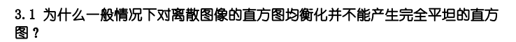
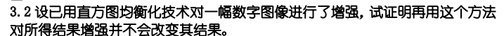
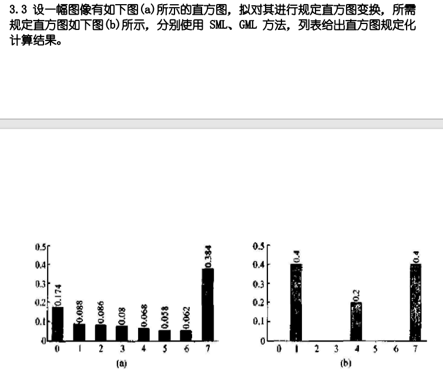
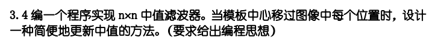

# HW2

## 3.1



直方图均衡化前后的灰度级的映射关系是一对一或者多对一，调整后灰度级的概率基本不能取得相同的值，所以得不到完全理想的均衡，也就是不能产生完全平坦的直方图


## 3.2



直方图均衡化通过变换函数将原始图像的灰度级映射到新的灰度级，这个过程有的一一对应，有的进行了合并，最后得到均衡化后的直方图，如果再次对这个直方图进行均衡化，该合并的在上一步已经合并过，所以第二次均衡化都是一一对应的关系，所以最后结果不变


## 3.3




| 序号 | 运算               | 步骤以及结果     |       |       |       |            |         |       |       |
| ---- | ------------------ | ---------------- | ----- | ----- | ----- | ---------- | ------- | ----- | ----- |
| 1    | 原始灰度级         | 0                | 1     | 2     | 3     | 4          | 5       | 6     | 7     |
| 2    | 原始直方图         | 0.174            | 0.088 | 0.086 | 0.08  | 0.068      | 0.058   | 0.062 | 0.384 |
| 3    | 原始累计直方图     | 0.174            | 0.262 | 0.348 | 0.428 | 0.496      | 0.554   | 0.616 | 1.000 |
| 4    | 规定直方图         | 0.0              | 0.4   | 0.0   | 0.0   | 0.2        | 0.0     | 0.0   | 0.4   |
| 5    | 计算规定累计直方图 | 0.0              | 0.4   | 0.4   | 0.4   | 0.6        | 0.6     | 0.6   | 1.0   |
| 6    | SML                | 1                | 1     | 1     | 1     | 1          | 4       | 4     | 7     |
| 7    | 确定映射关系       | 0，1，2，3，4->1 |       |       |       |            | 5，6->4 |       | 7->7  |
| 8    | 变换后直方图       | 0                | 0.496 | 0     | 0     | 0.120      | 0       | 0     | 0.384 |
| 9    | GML                | 1                | 1     | 1     | 1     | 4          | 4       | 4     | 7     |
| 10   | 确定映射对应关系   | 0，1，2，3->1    |       |       |       | 4，5，6->4 |         |       | 7->7  |
| 11   | 变换后直方图       | 0                | 0.428 | 0     | 0     | 0.188      | 0       | 0     | 0.384 |


## 3.4



要求随着模板移动，中值能够不断更新，自然想到保持n*n个数永远保持有序，直接取中值即可，在插入和删除的过程中还是保持元素有序的性质，C++的set容器便可以实现，再考虑到可能有相同的元素，所以采用muiltset容器即可，在O(logn)的时间完成插入和删除一个元素的操作

由此得到基本算法思想：

- 将初始的n*n个元素放入muiltset容器中，形成一个有序序列，记录中值

- 每次移动，移出n个元素，放进n个元素，总共可以在O（nlogn）内完成，然后更新中值

  相比于对n*n个元素排序，时间复杂度低了很多

```c++
vector<vector<int>> medianFilter(const vector<vector<int>>& image, int n) {
    int rows = image.size(); // 图像行数
    int cols = image[0].size(); // 图像列数
    vector<vector<int>> result(rows, vector<int>(cols)); // 存储滤波后的结果
    for (int i = 0; i < rows; ++i) {
        multiset<int> window; 
        // 初始化
        for (int j = 0; j < n; ++j) {
            for (int k = 0; k < n; ++k) {
                window.insert(image[j][k]);
            }
        }
        auto mid = next(window.begin(), n * n / 2); //求中值
        result[i][0] = *mid; 
        // 水平滑动窗口
        for (int j = 1; j < cols; ++j) {
            // 移除左边一列的元素
            for (int k = 0; k < n; ++k) {
                window.erase(window.find(image[i + k][j - 1]));
            }
            // 加入右边一列的元素
            if (j + n - 1 < cols) {
                for (int k = 0; k < n; ++k) {
                    window.insert(image[i + k][j + n - 1]);
                }
            }
            mid = next(window.begin(), n * n / 2); // 更新中值
            result[i][j] = *mid; 
        }
    }

    return result;
}
```

