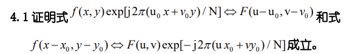
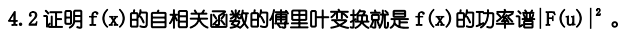
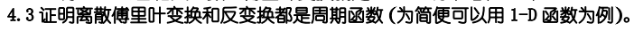

# HW3

## 4.1

对傅里叶变换公式:

$F(u,v)=\frac{1}{N}\sum_{x=0}^{N-1}\sum_{y=0}^{N-1}  f(x,y)exp[-j2\pi(ux+vy)/N]$

代入$u-u_0,v-v_0$有：

$\begin{align} 
  F(u-u_0,v-v_0) & = \frac{1}{N}\sum_{x = 0}^{N-1}\sum_{y = 0}^{N-1}  f(x,y)exp[-j2\pi((u-u_0)x+(v-v_0)y)/N]\\
& = \frac{1}{N}\sum_{x = 0}^{N-1}\sum_{y = 0}^{N-1}  f(x,y)exp[j2\pi(u_0x+v_0y)/N]exp[-j2\pi(ux+vy)/N]
\end{align}$

所以 $f(x,y)exp[j2\pi(u_0x+v_0y)/N]\Leftrightarrow F(u-u_0,v-v_0)$ 得证

同样的，对傅里叶逆变换公式：

$f(x,y)=\frac{1}{N}\sum_{u=0}^{N-1}\sum_{v=0}^{N-1}  F(u,v)exp[j2\pi(ux+vy)/N]$

代入$x-x_0,y-y_0$有：

$\begin{align} 
  f(x-x_0,y-y_0)&=\frac{1}{N}\sum_{u=0}^{N-1}\sum_{v=0}^{N-1}  F(u,v)exp[j2\pi(u(x-x_0)+v(y-y_0))/N]\\
&=\frac{1}{N}\sum_{u=0}^{N-1}\sum_{v=0}^{N-1}  F(u,v)exp[-j2\pi(ux_0+vy_0)/N]exp[j2\pi(ux+vy)/N]
\end{align}$

所以 $f(x-x_0,y-y_0)\Leftrightarrow F(u,v)exp[-j2\pi(ux_0+vy_0)/N]$ 得证

## 4.2

证明：

由相关定理结合自相关函数，可以得到： 
$$
f(x)\circ f(x)\Leftrightarrow F^{*}(u)F(u)
$$

而根据共轭 
$$
F^{^*}(u)F(u)=\left|F(u)F(u)\right|=\left|F^2(u) \right|=\left|F(u) \right|^2
$$

综上，f(x)的自相关函数的傅里叶变换就是f(x)的功率谱$\left|F(u)\right|^2$

## 4.3

周期T=N，证明如下：

首先由欧拉公式可以得到$exp[-j2\pi x]和exp[j2\pi x]=1$

傅里叶变换公式：$F(u)=\frac{1}{N}\sum_{x=0}^{N-1} f(x)exp[-j2\pi ux/N]$

$\begin{align} 
  F(u+T)&=F(u+N)\\&=\frac{1}{N}\sum_{x=0}^{N-1} f(x)exp[-j2\pi (u+N)x/N]\\
&=\frac{1}{N}\sum_{x=0}^{N-1} f(x)exp[-j2\pi ux/N]exp[-j2\pi x]\\
&=\frac{1}{N}\sum_{x=0}^{N-1} f(x)exp[-j2\pi ux/N]\\
&=F(u)
\end{align}$

傅里叶逆变换公式$f(x)=\sum_{u=0}^{N-1}F(u)exp[j2\pi ux/N]$

$\begin{align}
f(x+T)&=f(x+N)\\&=\sum_{u=0}^{N-1}F(u)exp[j2\pi u(x+N)/N]\\
&=\sum_{u=0}^{N-1}F(u)exp[j2\pi ux/N]exp[j2\pi u]\\
&=\sum_{u=0}^{N-1}F(u)exp[j2\pi ux/N]\\
&=f(x)
\end{align}$

证毕