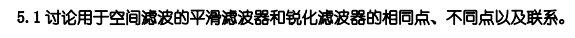
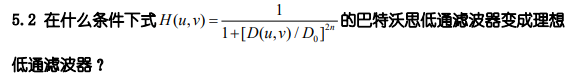
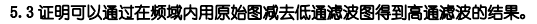
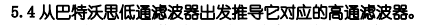
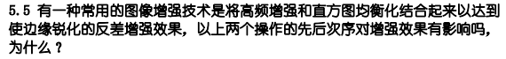

# HW4

## 5.1

- 相同点：都是空间域增强的图像处理方式，基于滤波操作对图像进行处理，都能减弱或消除傅里叶空间的某些分量，而不影响其他分量

- 不同点：平滑滤波器采用低通滤波，使图像更加平滑；锐化滤波器采用高通滤波，增强图像细节和边缘

- 联系：两者是相对应，常用的有，同种之间是互补的
  理想低通（高通)滤波器

  巴特沃斯低通（高通)滤波器

  指数低通（高通)滤波器

  梯形低通(高通)滤波器

## 5.2

n趋于无穷大时，变为理想低通滤波器

当$D(u,v)\lt D_0$，分母趋于1，所以H(u,v)趋于1

当$D(u,v)\gt D_0$，分母趋于无穷，所以H(u,v)趋于0

## 5.3

设原始图为$F(u,v)$，低通滤波器变换函数为$H(u,v)$，则高通滤波器的变换函数为$1-H(u,v)$

原始图减去低通滤波器图：$F(u,v)-F(u,v)H(u,v)=F(u,v)(1-H(u,v))$

得到的结果就是原始图经过高通滤波变换得到的结果

## 5.4

对应的高通滤波器:

$1-H(u,v)&=1-\frac{1}{1+[D(u,v)/D_0]^{2n}}\\&=\frac{1}{1+[D_0/D(u,v)]^{2n}}$

## 5.5

有影响

高频增强是一种线性操作，直方图均衡化是一种非线性操作，因此交换先后次序对增强效果有影响