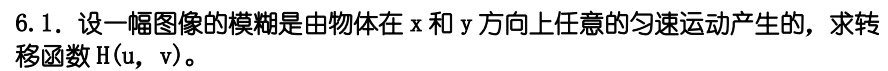
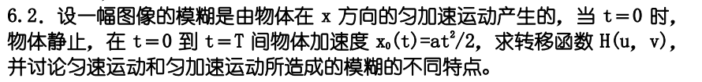
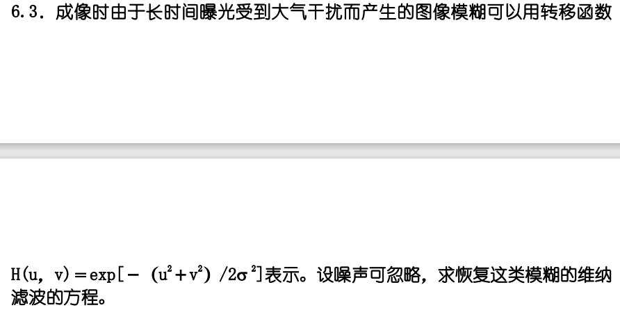

# HW5

## 6.1

设 $x_0(t)=at/T,y_0(t)=bt/T$ 为物体在x和y方向上的任意匀速运动，则转移函数 

$\begin{align}
H(u,v) & = \int_{0}^{T} e^{-j2\pi (ux_0(t)+vy_0(t))}dt\\
& = \int_{0}^{T} e^{\frac{-j2\pi (ua+vb)}{T}t }dt\\&=\dfrac{T}{\pi(ua+vb)}\sin(\pi(ua+vb))\exp[-j\pi(ua+vb)]\end{align}$

## 6.2

转移函数 

$\begin{align}
H(u,v) & = \int_{0}^{T} e^{-j2\pi ux_0(t)}dt\\
& = \int_{0}^{T} e^{-j\pi uat^2 }dt
\end{align}$

匀速运动在运动方向各处产生的模糊程度是相同的，匀加速运动在运动方向上模糊程度逐渐增强或减小

匀速运动所造成的模糊，H(u,v)可能在u,v平面上某些位置取零或很小，而匀加速H(u,v)在平面没有零点，所以匀速运动的模糊，恢复结果与预期的结果可能有很大的差距，而匀加速运动没有这个问题

## 6.3

忽略噪声，维纳滤波退化为逆滤波，则

$\begin{align}
\hat{F}(u,v) & = \frac{1}{H(u,v)}G(u,v) \\
& = exp[(u^2+v^2)/2{\sigma}^2]G(u,v)
\end{align}$

