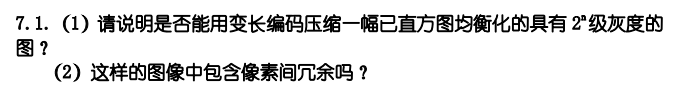
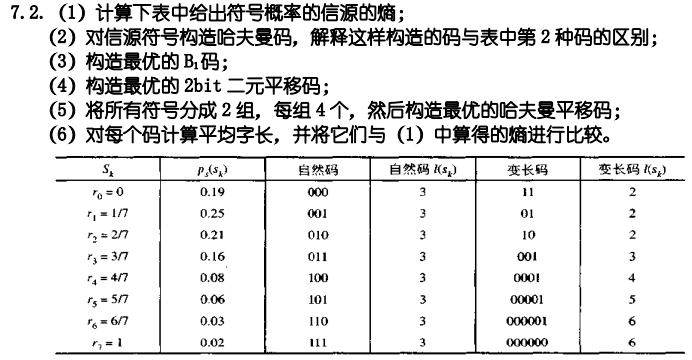
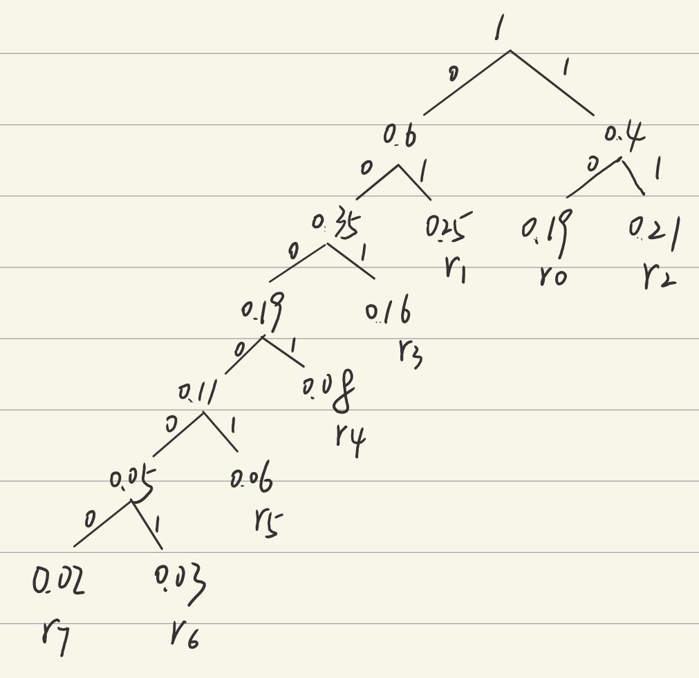
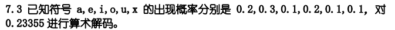
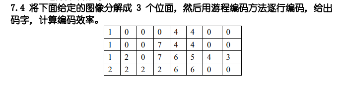

# HW6

## 7.1

### （1）

可以但效率不高

因为直方图均衡化通过重新分配灰度级来使得这些灰度级在图像中出现的频率大致相同但不能保证完全相同，而变长编码通过为常见的数据分配较短的编码，而为不常见的数据分配较长的编码来减少数据的整体表示长度，所以可以压缩但是效率不高

### （2）

直方图是一维的，所以均衡化后的图像仅能减少灰度级之间的冗余，对于像素之间的冗余仍包含

## 7.2

### （1）

$ -\sum_{i=0}^7 p_i\log_{2}{p_i} = 2.65 $

### （2）

得到哈夫曼编码：

| r0   | r1   | r2   | r3   | r4   | r5    | r6     | r7     |
| ---- | ---- | ---- | ---- | ---- | ----- | ------ | ------ |
| 10   | 01   | 11   | 001  | 0001 | 00001 | 000001 | 000000 |

和表中第二种码平均长度相同，并且每个字符对应的码的位数也相同，只是个别字符对应的具体码字不同，没有本质区别

### （3）

最优B1码：

| r0   | r1   | r2   | r3   | r4   | r5   | r6     | r7     |
| ---- | ---- | ---- | ---- | ---- | ---- | ------ | ------ |
| C0C0 | C0   | C1   | CC1  | C1C0 | C1C1 | C0C0C0 | C0C0C1 |

### （4）

最优 2bit二元平移码：

| r0   | r1   | r2   | r3   | r4   | r5   | r6     | r7     |
| ---- | ---- | ---- | ---- | ---- | ---- | ------ | ------ |
| 10   | 00   | 01   | 1100 | 1101 | 1110 | 111100 | 111101 |

### （5）

最优哈夫曼平移码：

| r0   | r1   | r2   | r3   | r4    | r5    | r6    | r7     |
| ---- | ---- | ---- | ---- | ----- | ----- | ----- | ------ |
| 01   | 10   | 11   | 001  | 00001 | 00010 | 00011 | 000001 |

### （6）

哈夫曼编码：2.7

最优B1码：3.18.

最优2bit二元平移码：2.8

最优哈夫曼平移码：2.75

每个码的平均字长都大于熵

## 7.3

区间划分：

a:[0,0.2)

e:[0.2,0.5)

i:[0.5,0.6)

o:[0.6,0.8)

u:[0.8,0.9)

x:[0.9,1]

- 0.23355落在[0.2,0.5]上，所以第一位是e
- 0.23355落在[0.2,0.5]的[0,0.2]上，即[0.2,0.26]上，所以第二位是a
- 0.23355落在[0.2,0.26]的[0.5,0.6]上，即[0.23,0.236]上，所以第三位是i
- 依次类推，后面几位分别落在了[0.5,0.6]、[0.9,1]、[0,0.2]、[0.8,0.9]、[0.2,0.5]……对应ixaue……
- 所以解码结束应该是eaiixaue……

取前六位即eaiixa

## 7.4

bit0：

| 1    | 0    | 0    | 0    | 0    | 0    | 0    | 0    |
| ---- | ---- | ---- | ---- | ---- | ---- | ---- | ---- |
| 1    | 0    | 0    | 1    | 0    | 0    | 0    | 0    |
| 1    | 0    | 0    | 1    | 0    | 1    | 0    | 1    |
| 0    | 0    | 0    | 0    | 0    | 0    | 0    | 0    |

游程：0 1 7,    0 1 2 1 4,    0 1 2 1 1 1 1 1,    8

bit1：

| 0    | 0    | 0    | 0    | 0    | 0    | 0    | 0    |
| ---- | ---- | ---- | ---- | ---- | ---- | ---- | ---- |
| 0    | 0    | 0    | 1    | 0    | 0    | 0    | 0    |
| 0    | 1    | 0    | 1    | 1    | 0    | 0    | 1    |
| 1    | 1    | 1    | 1    | 1    | 1    | 0    | 0    |

游程：8,   3 1 4,    1 1 1 2 2 1,    0 6 2

bit2：

| 0    | 0    | 0    | 0    | 1    | 1    | 0    | 0    |
| ---- | ---- | ---- | ---- | ---- | ---- | ---- | ---- |
| 0    | 0    | 0    | 1    | 1    | 1    | 0    | 0    |
| 0    | 0    | 0    | 1    | 1    | 1    | 1    | 0    |
| 0    | 0    | 0    | 0    | 1    | 1    | 0    | 0    |

游程：4 2 2,    3 3 2,    3 4 1,    4 2 2

| 码字 | 概率  | 哈夫曼编码 |
| ---- | ----- | ---------- |
| 0    | 4/42  | 101        |
| 1    | 15/42 | 00         |
| 2    | 10/42 | 01         |
| 3    | 4/42  | 110        |
| 4    | 5/32  | 100        |
| 5    | 0     |            |
| 6    | 1/42  | 11110      |
| 7    | 1/42  | 11111      |
| 8    | 2/42  | 1110       |

$ H=-\sum p_i\log_{2}{p_i} = 2.5704 $

平均编码长度=$(2*25+3*13+2*4+5*2)/42=2.5476$

编码效率=76.87%