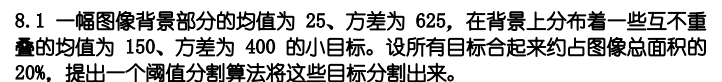
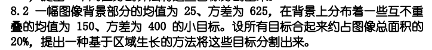

# HW7

## 8.1

背景和目标的均方差都较小，可以采用单一阈值分割

使用双峰直方图的方法来选择阈值，考虑到目标和背景的均值差异约为3个标准差，而目标总和约占总面积的20%，通过找到直方图中的两个极大值点，并以这两个极大值点中间的极小值点作为阈值，可以将图像分割成背景和目标两部分，其中大于阈值的部分就是需要分割出来的目标

## 8.2

1. **选择种子点**：对于灰度值大于150的像素，将其作为种子点开始区域生长

2. **区域生长**：对于每个种子点，进行区域生长

   生长准则是将相邻像素的灰度值与已有区域的灰度平均值的差小于60（3σ）的像素扩展进来，也就是说相邻像素的灰度值接近于已有区域的平均灰度值时，才将其加入到同一区域中

3. **标记已生长的区域**：一旦无法再生长，标记已生长的区域

4. **结束条件**：如果扫描到图像的右下角，则结束过程。否则，回到步骤1，继续进行扫描和区域生长

通过上述方式，可以逐步将所有符合条件的像素加入到目标区域中，并将目标从背景中分割出来