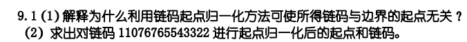
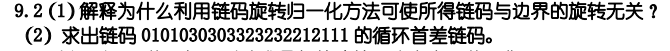
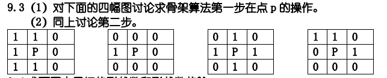
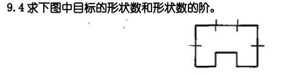
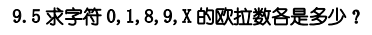

# HW8

## 9.1

### （1）

一串数码循环移位可以得到同一个边界的不同起点的各个链码

链码起点归一化是得到所有有可能的串中对应最小自然数的那一串，与原链码在边界上的起点无关，仅仅是由循环起点所决定

### （2）

将0 作为起点放到最高位，得到07676554332211

## 9.2

### （1）

链码旋转归一化通过链码的一阶差分重新构造1个序列来实现

边界旋转后差分与边界旋转无关，所以利用链码的一阶差分重新构造的序列不会随边界旋转而变化

### （2）

3131331313031313031300

## 9.3

### （1）

$\begin{array}{l|l|l|l|l}\hline\mathrm{N}(p_1)=5&\mathrm{N}(p_1)=1&\mathrm{N}(p_1)=4&\mathrm{N}(p_1)=3\\\hline\mathrm{S}(p_1)=1&\mathrm{S}(p_1)=1&\mathrm{S}(p_1)=3&\mathrm{S}(p_1)=2\\\hline p_2\cdot p_4\cdot p_6=0&p_2\cdot p_4\cdot p_6=0&p_2\cdot p_4\cdot p_6=1&p_2\cdot p_4\cdot p_6=0\\\hline p_4\cdot p_6\cdot p_8=0&p_4\cdot p_6\cdot p_8=0&p_4\cdot p_6\cdot p_8=1&p_4\cdot p_6\cdot p_8=0\\\hline\end{array}$

只有第一个满足4个条件，打删除标记，其后该p点被删除

### （2）

$\begin{array}{l|l|l|l|l}\hline\mathrm{N}(p_1)=5&\mathrm{N}(p_1)=1&\mathrm{N}(p_1)=4&\mathrm{N}(p_1)=3\\\hline\mathrm{S}(p_1)=1&\mathrm{S}(p_1)=1&\mathrm{S}(p_1)=3&\mathrm{S}(p_1)=2\\\hline p_2\cdot p_4\cdot p_8=0&p_2\cdot p_4\cdot p_8=0&p_2\cdot p_4\cdot p_8=1&p_2\cdot p_4\cdot p_8=0\\\hline p_2\cdot p_6\cdot p_8=1&p_2\cdot p_6\cdot p_8=0&p_2\cdot p_6\cdot p_8=1&p_2\cdot p_6\cdot p_8=0\\\hline\end{array}$

所有都不同时满足4个条件，所以没有删除标记

## 9.4

以该图的左上顶点为起点

链码：000332123211

循环首差码：300303311330

形状数为：003033113303，形状数阶为12

## 9.5

0：E=C-H=1-1=0

1：E=C-H=1-0=1

8：E=C-H=1-2=-l

9：E=C-H=1-1=0

X：E=C-H=1-0=1