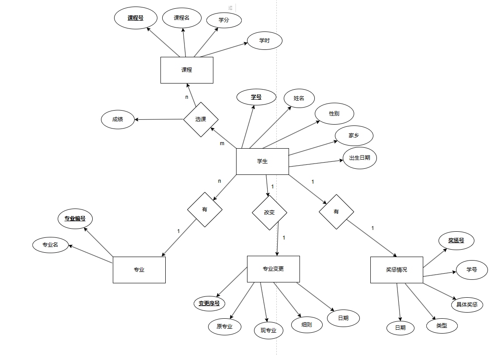
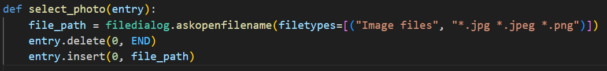
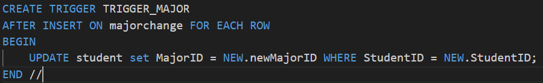
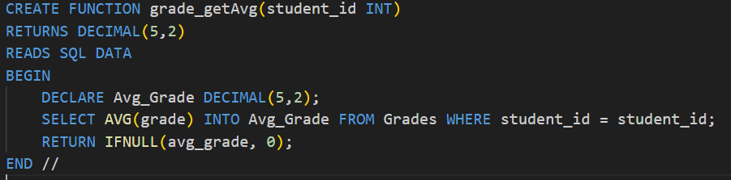
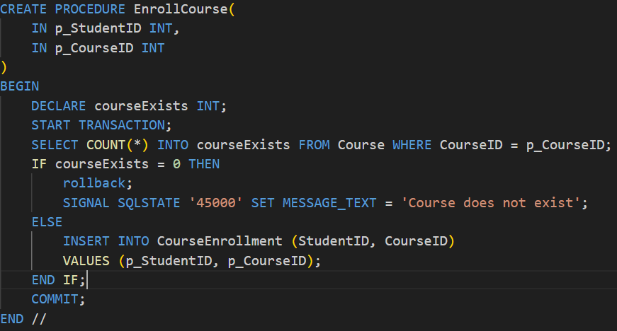
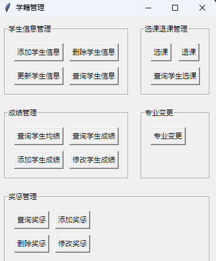

 

 

# 数据库实验设计报告

PB21111728刘芷辰

## 设计要求与目的

- 数据库设计合理
- 需求分析合理
- 包含概要设计
- 系统功能覆盖需求分析
- 加入对图片、视频、文件至少一项的管理
- 针对特定需求设计的合理的存储过程、函数、事务、触发器，四项均有

## 需求分析

- 学籍信息的增删改查
- 选课信息的增删改查
- 奖惩信息的增删改查
- 转专业功能

## ER图

## ER图转关系模式

> 满足3NF

学生与专业的联系，一个专业有多个学生，对应的联系情况是一对多；

学生与选课的联系是报课情况，对应的关系是多对多；

专业变更表（**变更序号**、学号、原专业号、现专业号、详情）

专业(**专业号**、专业名) 

学生(**学号**、姓名、性别、出生日期、籍贯、民族、专业号)

课程（**课程号**、课程名、学时、学分)

选课（**学号**、**课程号**、成绩)

奖惩情况（**奖惩号**、学号、类型、详细情况、日期）

## 关系模式转表

加粗的为主键

**表 1 专业变更表**

| 属性         | 数据类型 | 数据长度 |
| ------------ | -------- | -------- |
| **变更序号** | int      |          |
| 学号         | int      |          |
| 原专业号     | int      |          |
| 现专业号     | int      |          |
| 详情         | varchar  | 50       |

 

**表2 专业信息表**

| 属性       | 数据类型 | 数据长度 |
| ---------- | -------- | -------- |
| **专业号** | int      | 10       |
| 专业名     | varchar  | 10       |

 

**表3 学生基本信息表**

| 属性     | 数据类型 | 数据长度 |
| :------- | -------- | -------- |
| **学号** | int      |          |
| 姓名     | varchar  | 20       |
| 性别     | Varchar  | 2        |
| 籍贯     | Int      |          |
| 民族     | Varchar  | 10       |
| 专业号   | int      |          |
| 出生日期 | date     |          |

 

**表4 课程信息表**

| 属性       | 数据类型 | 数据长度 |
| ---------- | -------- | -------- |
| **课程号** | int      |          |
| 课程名     | varchar  | 10       |
| 学分       | int      |          |
| 学时       | int      |          |

 

**表5 选课成绩表**

| 属性       | 数据类型 | 数据长度 |
| ---------- | -------- | -------- |
| **学号**   | int      |          |
| **课程号** | int      |          |
| 成绩       | int      |          |

 

 

**表6 奖惩情况表**

| 属性       | 数据类型 | 数据长度 |
| ---------- | -------- | -------- |
| **奖惩号** | int      | 20       |
| 学号       | int      | 100      |
| 类型       | Varchar  | 10       |
| 详细情况   | Varchar  | 100      |
| 日期       | date     |          |

## 框架结构 

采用C/S架构

python后端处理数据

python的Tkinter库作为前端

## 核心代码解析

### 图片管理

主要体现在学生信息中可以增删改查学生的有关图片

定义选择照片文件函数，调用PIL库，获取照片文件

   

### 触发器

在对专业变更表进行添加时，设置触发器，将对应学生的专业修改

### 函数

用于计算平均成绩，每次按下显示平均成绩的按钮就会调用该函数

 

### 存储过程、事务

对选课过程添加存储过程，并且用事务保持原子性，如果出现选的课不存在的情况，应该回滚

## 结果展示

## 总结

通过对本次实验的设计，对如何从需求分析到数据库表的创建的流程更加熟悉，并且学习了一些前端知识，是学习本门课的一个额外收获

 

 

 

​    

 

 

