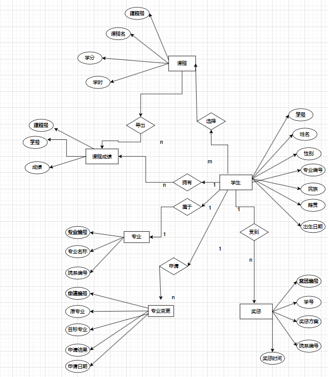

## 数据需求

### 学生表

- 学号

- 姓名

- 性别

- 出生时间

- 专业编号

- 民族

- 籍贯

  

### 专业表

- 专业编号（主键）
- 专业名
- 系编号

### 系表

- 系编号
- 系名

### 专业信息变更表

- 学生编号（主键）
- 原专业编号
- 现专业编号
- 变更时间
- 变更说明

### 课程表

- 课程编号
- 课程名称
- 学分
- 学时

### 课程成绩表

- 学号
- 课程编号
- 成绩

### 奖惩情况表

- 奖惩编号

- 学号

- 奖惩内容

- 奖惩时间

- 实施系编号

  

## 功能需求

- 基本信息增删改查
- 在专业变更表中修改后将对应学生的专业修改
- 计算平均成绩并展示

## ER图

