 

# 算法 

**带（*）的是附加题会出现的**

## 渐近标记和递归方程

2.pdf

#### 函数迭代：


（就是lglg...lgn这样

#### 主定理：

（卷子会给

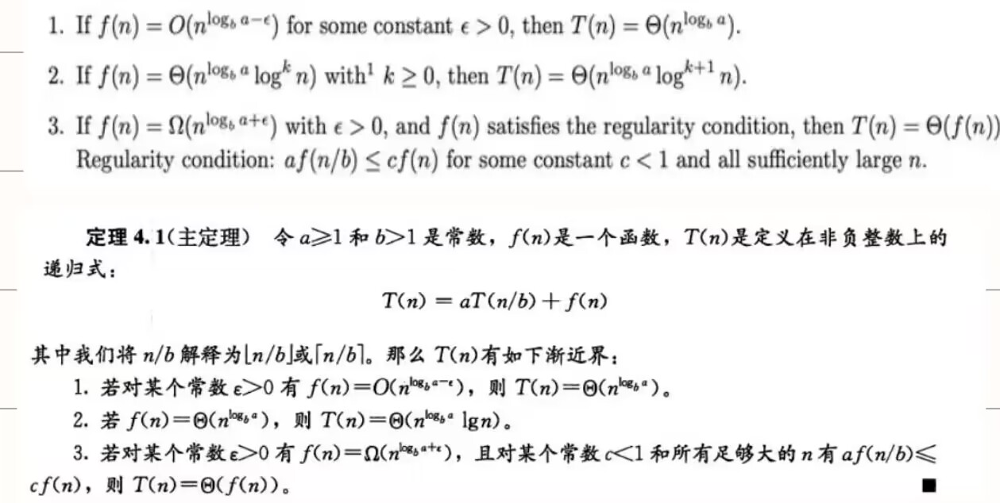

- 求$n^{log_ba}$与f（n）比较（阶），谁大取谁(f(n)大时还要判断一下后续条件）

- $f(n)=\Theta(n^{log_ba}lg^kn),$，取$\Theta(n^{log_ba}\cdot lg^{k+1}n)$

  

  例子如下：

  

## 基于比较的排序算法

3.pdf

**假定在待排序的记录序列中，存在多个具有相同的关键字的记录，若经过排序，这些记录的相对次序保持不变，即在原序列中，A1=A2，且A1在A2之前，而在排序后的序列中，A1仍在A2之前，则称这种排序算法是稳定的**

#### 八大排序比较表：

| 排序法 | 最好情况 |      平均时间      |  最差情形   | 稳定度 | 额外空间 |             备注              |
| :----: | -------- | :----------------: | :---------: | :----: | :------: | :---------------------------: |
|  冒泡  | $O(n)$   |      $O(n^2)$      |  $O(n^2)$   |  稳定  |   O(1)   |           n小时较好           |
|  选择  | $O(n^2)$ |      $O(n^2)$      |  $O(n^2)$   | 不稳定 |   O(1)   |           n小时较好           |
|  插入  | $O(n)$   |      $O(n^2)$      |  $O(n^2)$   |  稳定  |   O(1)   |      大部分已排序时较好       |
|  基数  |          |      O(logRB)      |  O(logRB)   |  稳定  |   O(n)   | B是真数(0-9)，R是基数(个十百) |
|  希尔  |          | 与分组有关O(nlogn) | O(ns) 1<s<2 | 不稳定 |   O(1)   |          s是所选分组          |
|  快速  | O(nlogn) |      O(nlogn)      |  $O(n^2)$   | 不稳定 | O(logn)  |           n大时较好           |
|  归并  |          |      O(nlogn)      |  O(nlogn)   |  稳定  |   O(1)   |           n大时较好           |
|   堆   | O(nlogn) |      O(nlogn)      |  O(nlogn)   | 不稳定 |   O(1)   |           n大时较好           |


####  插入排序：

在一个已经有序的小序列（刚开始第一个元素）的基础上，一次插入一个元素。从这个小序列的末尾开始的。想要插入的元素和小序列的最大者开始比起，如果比它大则直接插在其后面，否则一直往前找它该插入的位置

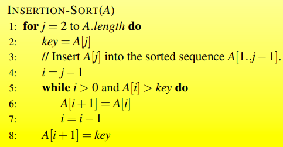

#### 选择排序：

首先在未排序序列中找到最小（大）元素，存放到排序序列的起始位置。再从剩余未排序元素中继续寻找最小（大）元素，然后放到已排序序列的末尾

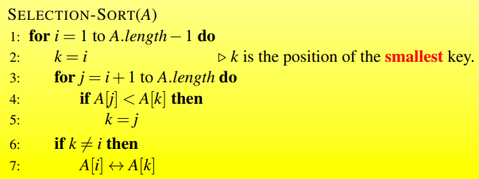

（可以通过元素后移而不是交换实现稳定排序

#### 冒泡排序：

每次比较相邻两个元素，不符合顺序就交换


#### 希尔排序：

对增量序列t1-tk，总共k次排序

每次排序按照ti对序列进行分组，在组内进行插入排序

（一般分组间隔从n/2开始，每次分组间隔减半，最后分组间隔为1进行插入排序效率就比较高了

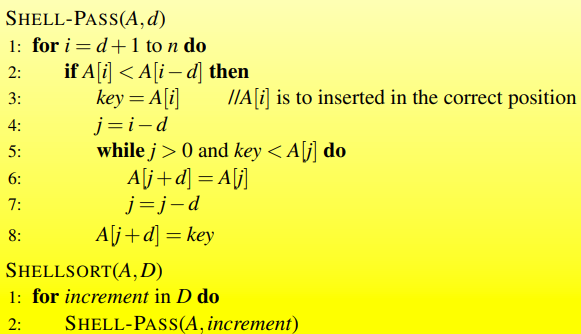

#### 堆排序：

堆是完全二叉树

最大堆：父节点大于子节点

局部维护：最大值放在根


创建最大堆：（这里假设从1开始索引，如果是从0开始应该是[n/2]-1  to 0）一步步构建最大堆，注意交换后可能产生新的不符合堆性质的需要再次调整


完成排序：每次从堆顶取出最大值（最后一个孩子结点与其交换），然后维护堆性质


#### 快速排序：

选取一个基准数，将大于和小于分在这个基准树两边（i,j遍历，i是小于，j是大于，j对应大于基准j++，小于基准则i++，swap，j++），再在两边分别快排

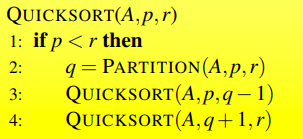


## 线性时间内排序

4_ch8.pdf

**基本思想都是为了不比较，使用已经有顺序的结构存储，然后取出来**

缺点就是有范围限制和需要额外空间

#### 计数排序

用一个额外的数组C来存储每个元素出现的次数，C中第i个元素就是等于i的值的次数，然后进行分配

$O(n)$

但是要求数据有确定的范围的整数

####  基数排序

将每一个被排序元素按位数切分为不同的数字，按不同的位放入相应的第几个队列中，然后按顺序取出来，就将这一位排序完成，有多少位就需要进行多少轮排序

要求整数


#### 桶排序

根据不同的取值范围放入不同的桶中，桶内排序然后取出即可——桶很小就逼近计数排序了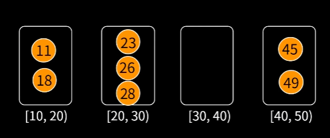

## 中位数和顺序统计

4_ch9.pdf

#### 随机选择算法

求无序数组第k大/小的数据

快排只做partition，直到命中k

## 二叉搜索树、红黑树

5_1.pdf

#### 二叉搜索树

左小于根，右大于根

## 二项式堆、斐波那契堆、不相交集的数据结构

5_2.pdf

#### 二项堆


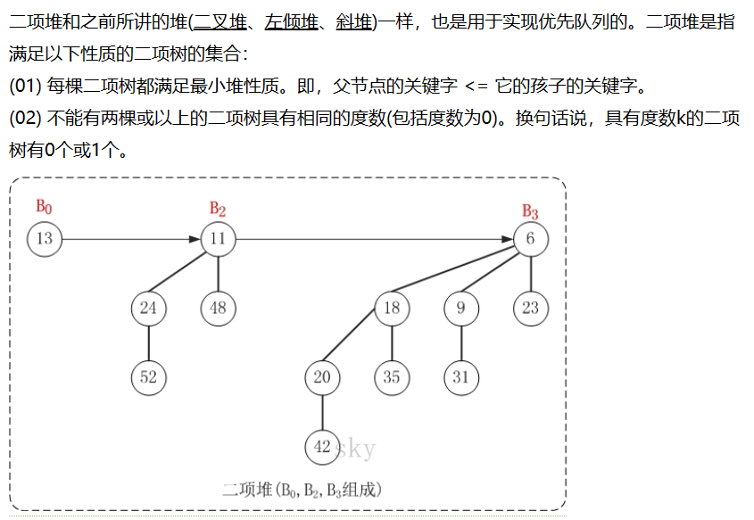

#### 斐波拉契堆

[斐波那契堆(Fibonacci heap)原理详解-CSDN博客](https://blog.csdn.net/u013148167/article/details/54236076)

## 动态规划

6_1_ch15

- 优化解包含子问题的优化解（优化子结构）
- 子问题不独立

解题步骤：

状态定义、状态转移方程、初始状态/边界条件

#### 棒切割


#### 矩阵链乘法


ans=m[1] [n]

$O(n^3)$

#### 最长公共子序列

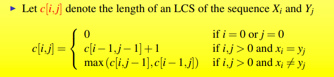

O（mn）

ans=c[n] [m]

## 贪心算法

6_1_ch16

局部最优解

#### 分配问题

优先使用最小的补给分配给最少需求

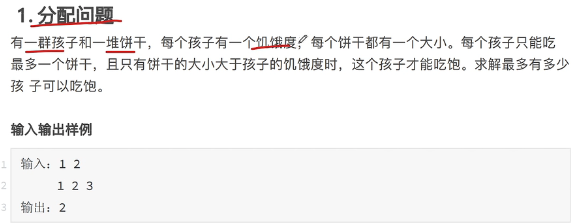

#### 区间问题

优先保留结尾最小的区间，为了给剩下预留更多空间


#### Huffman 编码

每次选取频率最低的两个字符作为子节点，向上生成父节点，将两者之和作为父节点的频率接入频率集合中

## *背包问题

01backpack.pdf

背包问题(Knapsack problem)是一种组合优化的NP完全问题。问题可以描述为：给定一组物品，每种物品都有自己的体积和价值，在限定的总体积内，我们如何选择，才能使得物品的总价值最高

**01背包:** 有N件物品和一个体积为V的背包。（每种物品均只有一件）第i件物品的体积是volume[i]，价值是value[i]。求解将哪些物品装入背包可使这些物品的体积总和不超过背包体积，且价值总和最大

## 摊还分析

6_3_ch17.pdf

**与渐进分析区别**


#### 合计法


#####  动态表的插入：

- 未满，直接插入，代价1
- 满了，开新表，移入数据，代价1+移入次数

如果是渐进分析，总是考虑满的情况

摊还分析：

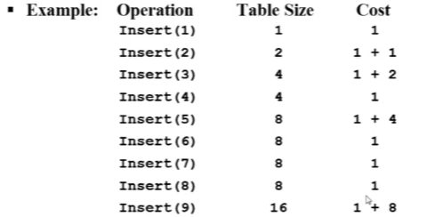


##### 栈操作

 


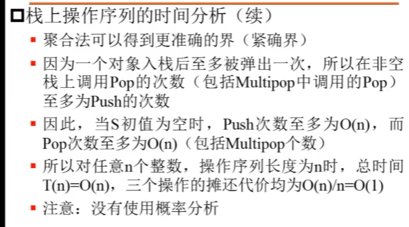

##### 二进制计数器


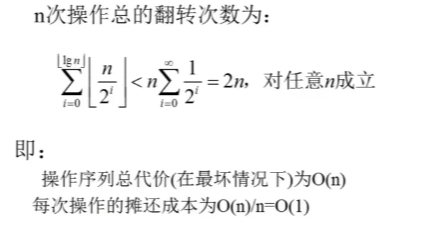


#### 核算法


##### 动态表的插入

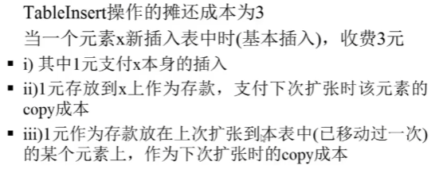


##### 栈操作

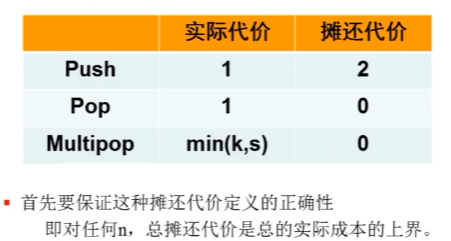

push多出来的一个代价就是储存在刚刚入栈的数据上，保证出栈的时候摊还代价始终大于等于实际代价


##### 二进制计数器


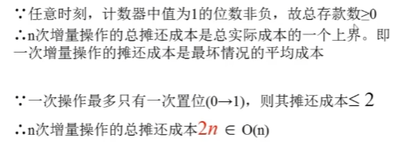


#### 势能法


##### 栈操作


 

## 分治策略

6_4.pdf

求解递归式的方法：代入法，递归树法，主方法

#### 大整数乘法

切分：


减少了子问题，从需要计算ac、ad、bc、bd转为计算E、F、G三个子问题


#### Strassen算法

普通矩阵乘法：


#### 残缺棋盘

没有特殊格子的三个[n/2]用一个L形覆盖，变为四个相同的子问题，再同样对四个子问题进行同样处理

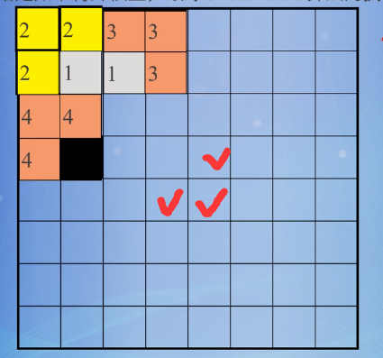


## *在线算法

onlineAlgorithm.pdf

离线算法是算法设计策略都是基于在执行算法前输入数据已知的基本假设，例如选择排序，需要知道后面所有的最小值

在线算法是可以以序列化的方式一个个的处理输入，也就是说在开始时并不需要已经知道所有的输入，比如插入排序，只需要直到插入位置即可

## 基本图算法

7_ch22.pdf

#### 邻接表

链表指向相邻的所有结点，所有链表组成一个数组


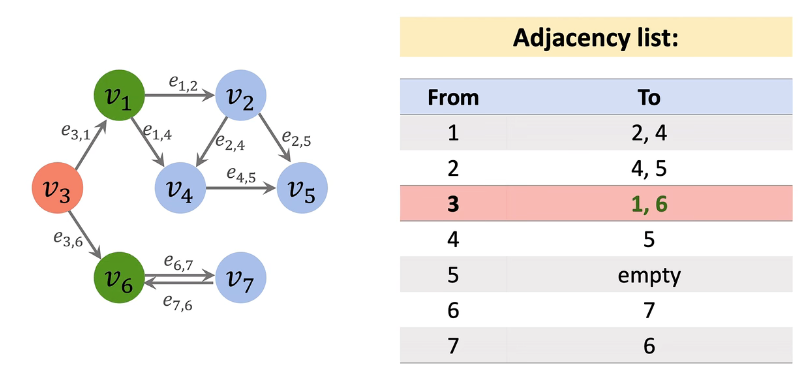

#### 邻接矩阵

表格中为横到纵的权重

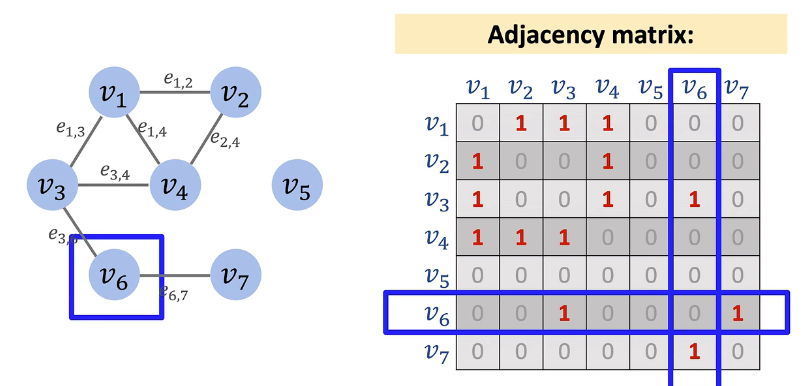

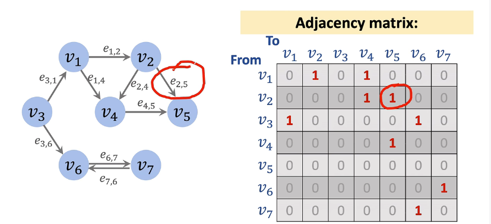

#### BFS

广度优先，用先进先出的队列

- 访问初始顶点并标记
- 入队
- 进入循环，出队，所有（未访问的）邻接点入队
- 先进入的结点先出队，并把其未访问的邻接点入队，放在队尾（这样就实现了先遍历在队头的上一层的结点

#### DFS

对初始顶点的邻接点进行DFS，递归调用DFS，先进后出用栈，内存消耗少

##### 边分类


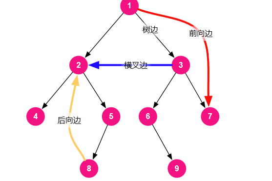

#### 拓扑排序

只对有向无环图


从入度为0的结点开始，删去与其相连的边，继续找入度为0的结点

#### 强连通分量

有向图中，两个顶点互相连通，则两个顶点强连通，图G所有顶点都强连通，则为强连通图，非强连通图的极大强连通子图为强连通分量

##### Tarjan算法

DFS遍历，形成两个时间戳，i(DFS(u))表示在DFS中访问的顺序，j（low(u) ）表示在回溯过程中可以回溯到的最早的时间点（在DFS时相同），然后进行回溯，更新j，一起出栈的就是一个强连通分量

时间复杂度：邻接表存储：$O(V+E)$

邻接矩阵存储：$O(V^2)$

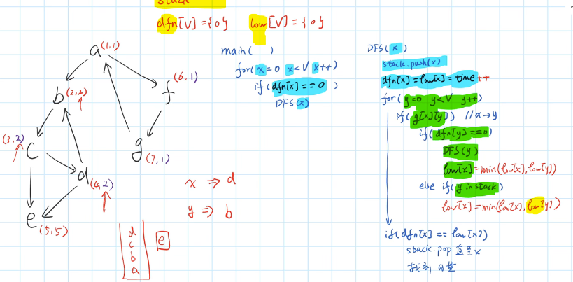

如上图中d，本应该是(4,4)，但是可以找到d->b的回边，所以d的最早时间回溯为2，改为(4,2)，再往后回溯c，本是(3,3)，d改为(4,2)后，c也可以回溯到b，所以改为(3,2)...

## 最小生成树

7_ch23.pdf

**Def：**n个结点，以及n-1条边，生成的树，其中最小权重之和的即为最小生成树

**安全边：**


**轻边：**


若割不妨碍A，则把轻边加入A中是安全的

Prim算法和Kruskal算法都是不断加入安全边的过程

#### Prim算法

（贪心算法

- 选一个作为根结点，加入集合U

- 从剩下的结点中选出与U相连的权重最小的边，这个边连接的另一个顶点加入U

  


#### Kruskal算法

（贪心算法

思想是将图的结点视为单独的树，整个是一个森林，然后每次找最短的边（边连接的两个结点不在同一棵树中），合并两棵树，直到只有一棵树

可以基于并查集实现

## 单源最短路径

7_ch24.pdf

起点s到其他所有顶点的最短路径

#### Bellman-ford算法

**适用**：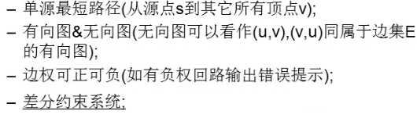

> 为什么不能处理负权回路：如果存在负权回路，一定会在下一次遍历边时继续松弛，因为绕一圈回路就会使得路径更短

**核心思想**：对所有的边进行n-1轮松弛操作，第一轮松弛可以得到距离已知最短路径一条边的顶点的最短路径，后续一样操作......

> 松弛操作： 

```c++
for (var i = 0; i < n - 1; i++) {
    for (var j = 0; j < m; j++) {//对m条边进行循环
      var edge = edges[j];
      // 松弛操作
      if (distance[edge.to] > distance[edge.from] + edge.weight ){ 
        distance[edge.to] = distance[edge.from] + edge.weight;
      }
    }
}
```

**最后再进行一次遍历边，如果还需要松弛就说明存在负权回路**

时间复杂度为$O(VE)$


#### Dijkstra算法

不能处理含负权的图

set集合为最短路径包含结点集合

path为最短路径前一个结点

dist为最短路径

对每一个目标顶点（不在set中），计算在set中的点到该顶点的最短路径，在这一轮计算中选出路径最短的结点加入set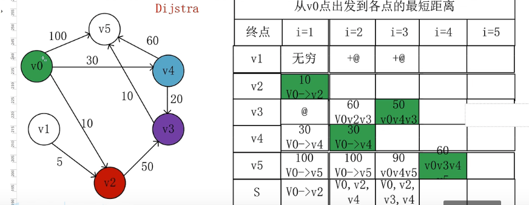

时间复杂度：

- 数组维护：$$ O(V^2 + E) = O(V^2) $$
- 二叉堆优化：$$ O((V+E)lgV) $$
- 斐波那契堆优化：$$ O(VlgV + E) $$

## 所有点对最短路径 

7_ch25.pdf

#### Floyd算法

适用于有向图、无向图，允许边的权重为负，但不能有负环回路

计算有向图中任意两点之间的最短路径，此算法利用动态规划的思想将计算的时间复杂度降低为$O(V^3)$，核心思想是，最短路路径的本质就是比较在两个顶点之间中转点，比较经过与不经过中转点的距离哪个更短。类似Bellman-Ford算法，我们将此操作也称为松弛

```c++
for(k=0;k<n;k++)//中转站0~k
        for(i=0;i<n;i++) //i为起点
            for(j=0;j<n;j++) //j为终点
                if(d[i][j]>d[i][k]+d[k][j])//松弛方程，判断中转点
                     d[i][j]=d[i][k]+d[k][j]; 
```

手解方法：

> 理解：对角线画十字实际上就是最外层遍历k的取值，横的是d[k] [j]，竖的是d[i] [k]，十字和它无穷部分行列值不变是因为不可能d[i] [j]>d[i] [k]+d[k] [j]，剩余部分就是比较d[i] [j]>d[i] [k]+d[k] [j]是否成立，也就是i，j列相交的地方用对应的十字相加和比较，和更小则替换，即d[i] [j]=d[i] [k]+d[k] [j]
>
> 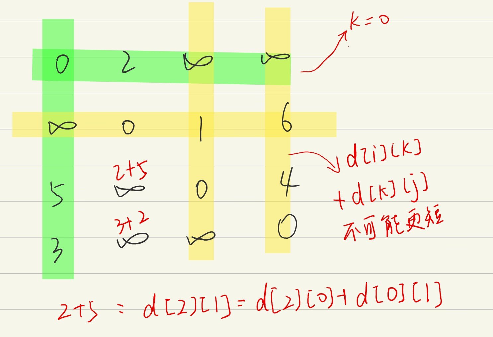


#### Johnsons算法

**要求无负环**

> 

想到只要能使边权全部都是正就可用Dijkstra算法解决了，但又不能直接加上一个数变为正再减去（错误的，证明网上有）

- 新建一个虚拟节点，从这个点向其他所有点连一条边权为 0 的边
- 用 Bellman-Ford 算法求出从该虚拟结点点到其他所有点的最短路，记为$h_i$
- 假如存在一条从 u点到 v点，边权为 w 的边，则我们将该边的边权重新设置为 $w+h_u-h_v$（这是因为根据Bellman算法，$w+h_u\ge h_v$）
- 然后以每个点为起点，跑n遍Dijkstra算法就可以了

时间复杂度：V*Dijkstra时间复杂度

 

## 最大流

7_ch26.pdf

#### Ford-Fulkerson 算法

- 得到剩余流量图（初始即为容量图）

- 选择一条简单路径

- 找出简单路径最小剩余量x，这条路径上全部减去x，删去为0的边，为整个路径添加权重均为x的反向边

- 继续找简单路径，直至没有

  [09. 13-2- Ford-Fulkerson Algorithm 寻找网络最大流_哔哩哔哩_bilibili](https://www.bilibili.com/video/BV1g24y1Y7wa?p=9&spm_id_from=pageDriver&vd_source=fb023418259bdf946fe320ce030e5bed)

时间复杂度$O(E|f*|)$（最坏情况）


#### Edmonds-Karp算法

是Ford-Fulkerson 算法的特例，在更好的复杂度下完成

区别在于寻找路径时找最短路径（看成无权图进行寻找）$O(V)$

时间复杂度$O(VE^2)$


#### Dinic's 算法

$O(V^2E)$

[11. 13-4- Dinic's Algorithm 寻找网络最大流_哔哩哔哩_bilibili](https://www.bilibili.com/video/BV1g24y1Y7wa?p=11&spm_id_from=pageDriver&vd_source=fb023418259bdf946fe320ce030e5bed)


#### S-T cut

分为两个结点集合，切断S->T的边则切断了流


S-T cut的容量为切断的S->T的边的容量和


**最小割**

所有S-T cut中容量最小的

**最大流流量=最小割容量**

- 得到最大流
- 根据最大流得到对应的剩余图
- 在剩余图中从源头s出发能到达的结点就是集合S的元素，剩余就是集合T的元素


## 二部图


二部图判定：两种颜色对领居进行染色，每次换另一种，最后没有相同颜色的领居即为二部图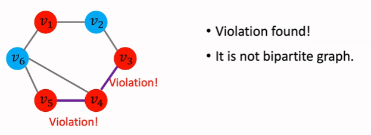

#### 最大/最小二分匹配

##### 无权图

转为最大流问题

<table frame=void>	
	<tr>		  
    <td><center>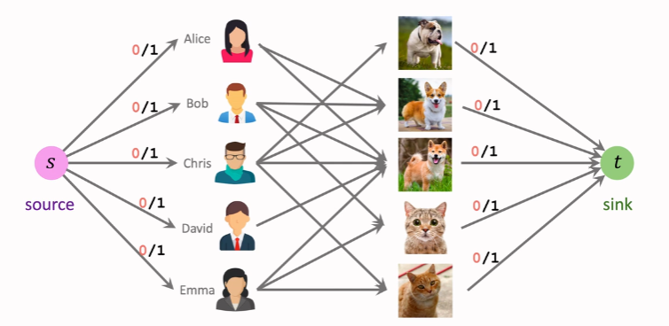</center></td>	
    <td><center>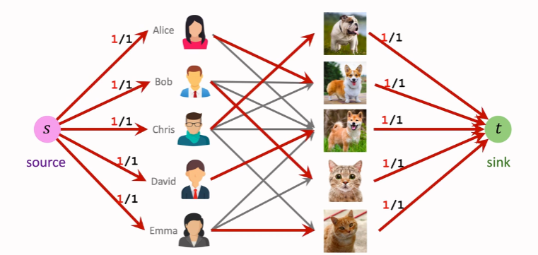</center></td>
    </tr>
</table>

##### 有权图

匈牙利算法$O(n^3)$

适用：两边结点数量相同

用于求最小匹配，要求最大匹配只需要把权值取反求最小匹配即可 

[16. 14-4- 匈牙利算法 Hungarian Algorithm_哔哩哔哩_bilibili](https://www.bilibili.com/video/BV1g24y1Y7wa/?p=16&spm_id_from=pageDriver&vd_source=fb023418259bdf946fe320ce030e5bed)

## 字符串匹配

8_ch32.pdf

#### Rabin-Karp算法

利用哈希来加速匹配过程（哈希不需要全部进行匹配，只需要比较对应的哈希值即可），对于可能的哈希冲突进行一一匹配检验


#### KMP算法

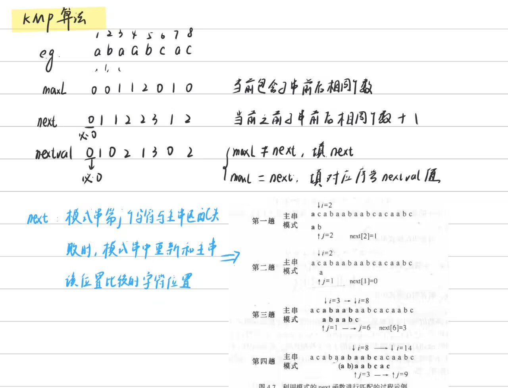

$O(n)$

## NP完备

9_1_ch34.pdf

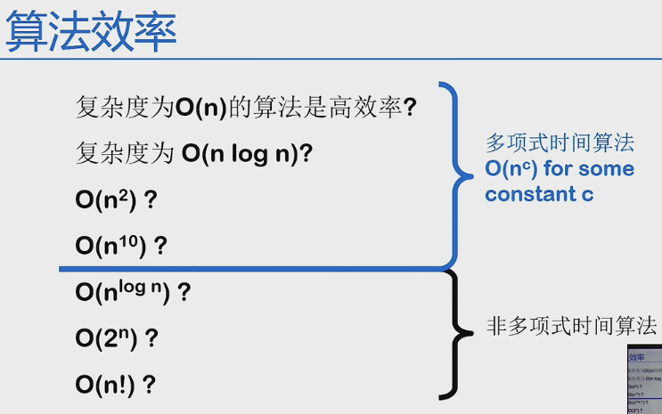

#### P类问题

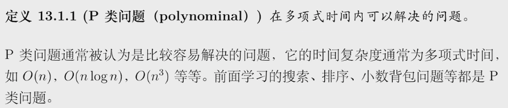

#### NP类问题

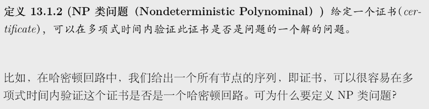

> 如果一个问题是P问题，则一定是NP问题


#### NPC问题

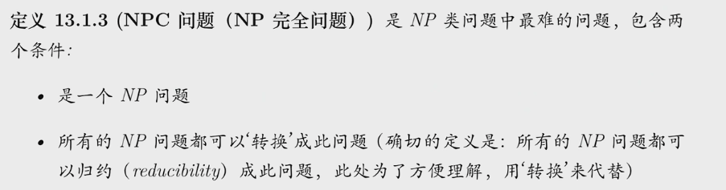

#### NP-hard问题

NPC问题去掉第一个条件

## *近似算法

9_2_ch32.pdf