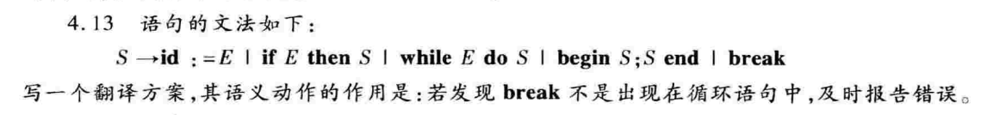
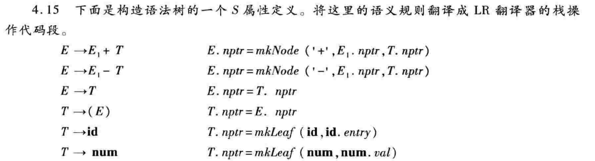
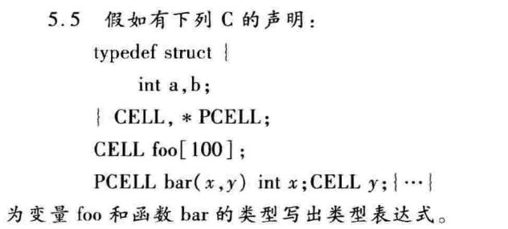
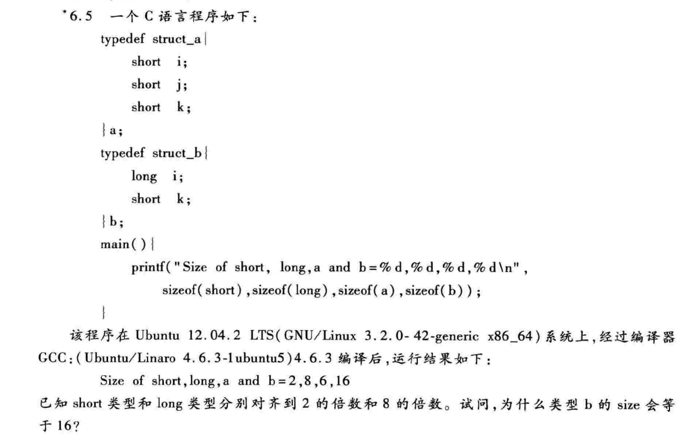
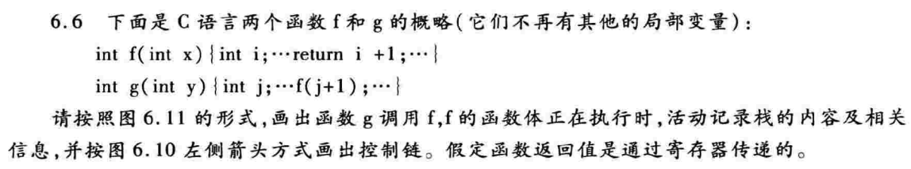

# HW5

## 4.13

loop是S的一个继承属性

$S'\rightarrow \left\{S.loop=false;\right\} S $

$S->id:=E $

$S->if\quad E \quad then \left\{S_1.loop=S.loop;\right\} S_1 $

$S->while\quad E\quad do \left\{S_1.loop=true;\right\} S_1 $

$S->begin\quad \left\{S_1.loop=S.loop;\right\} S_1;\left\{S_2.loop=S.loop;\right\} S_2\quad end $

$S->break\quad \left\{if(!S.loop)\quad print("error");\right\}$

## 4.15

代码段等号左部为val[top-r+1],r为待归约的产生式右部符号数，分别为3、3、1、3、1、1

| 产生式               | 代码段                                       |
| -------------------- | -------------------------------------------- |
| $E\rightarrow E_1+T$ | $val[top-2]=mknode('+',val[top-2],val[top])$ |
| $E\rightarrow E_1-T$ | $val[top-2]=mknode('-',val[top-2],val[top])$ |
| $E\rightarrow T$     |                                              |
| $T\rightarrow (E)$   | $val[top-2]=val[top-1]$                      |
| $T\rightarrow id$    | $val[top]=mkleaf(id,val[top])$               |
| $T\rightarrow num$   | $val[top]=mkleaf(num,val[top])$              |

## 5.5

foo的类型表达式：$array(0..99,record((a\times integer)\times(b\times integer)))$

bar的类型表达式：$(integer\times record((a\times integer)\times(b\times integer)))\rightarrow pointer(record((a\times integer)\times (b\times integer)))$

## 6.5

结构体中可以存放不同类型的数据，但是大小并不是简单的各个类型之和，由于读取内存的要求，例如在本题中，long是对齐8的倍数，当结构体b以数组形式出现时，若只是按照简单相加求和为10，为了保证long类型元素的对齐，只能数组元素之间空6个字节，但是这样不满足数组size的计算原则（元素个数×元素size），因此整个结构体的大小应该是最大对齐数的整数倍，本题中有两个元素，则总大小为8*2=16

## 6.6

|           |
| :-------: |
| 局部变量i |
|  old ebp  |
| 返回地址  |
|   参数x   |
| 局部变量j |
|  old ebp  |
| 返回地址  |
|   参数y   |
|    ……     |

