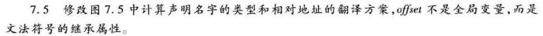
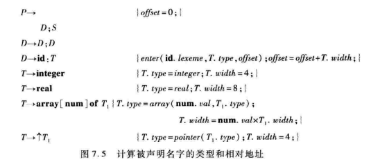
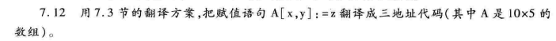
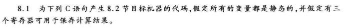
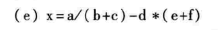
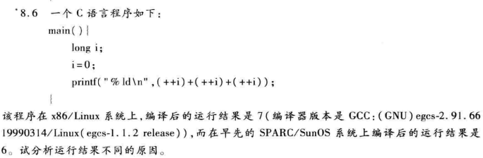

# HW6

## 7.2(c)

翻译为三地址码：

```c
L1:    if i>10 goto L2
	t1 = c			//常量c=base_a - 4
	t2 = t1 + i
	t1[t2] = 0
	goto L1
L2：
```


## 7.5





```c++
P->	{D.offset = 0}      D;S     {P.offset2 = D..offset2}
D->	{D1.offset = D.offset} D1; 
	{D2.offset = D1..offset2}  D2  {D..offset2 = D2..offset2}
D->  id:T {enter(id.lexeme, T.type, D.offset) ; D..offset2=D.offset+T.width;}
T->	 integer {T.type = integer  ;   T.width = 4;}
T->	 real {T.type = real; T.width = 8;}
T->	 array[num] of T1 {T.type = array(num.val, T1.type); 
         T.width = num.val *T1.width;}
T->   ↑T1 {T.type = pointer(T1.type) ;  T.width = 4;}
```

D的offset是继承属性，表示分析D前原来使用的变量offset的大小；offset2是综合属性，表示分析D后原来使用的变量offset的大小 

P的offset2是综合属性，记录该过程分配的空间


## 7.12



取w=4

```c
t1=x*5
t1=t1+y
t2=c 		//常量c==base_A-44
t3=t1*4 	
t2[t3]=z
```


## 8.1（e）





```assembly
LD  R1 ,  b
LD  R2 ,  c
ADD R2 , R1 , R2
LD  R1 ,  a
DIV R1 , R1 , R2
LD  R2 ,  e
LD  R3 ,  f
ADD R3 , R2 , R3
LD  R2 ,  d
MUL R2 , R2 , R3
SUB R1 ,  R1 , R2
ST x , R1
```


## 8.2（e）

字母表示偏移量，使用沿指针取值的模式

```assembly
LD  R1 ,  b(SP)
LD  R2 ,  c(SP)
ADD R2 , R1 , R2
LD  R1 ,  a(SP)
DIV R1 , R1 , R2
LD  R2 ,  e(SP)
LD  R3 ,  f(SP)
ADD R3 , R2 , R3
LD  R2 ,  d(SP)
MUL R2 , R2 , R3
SUB R1 , R1 , R2
ST x(SP) , R1
```


## 8.6



- 结果是6，每次++i计算结果保留在某个寄存器中，用于上一层的计算，因此次序是i++得到1，保存在某个寄存器，再i++得到2，保存在另一个寄存器，再i++得到3，保存在又另一个寄存器，最后相加得到6
- 结果是7，显然一定是某个i=i+1的结果没有保存在寄存器中，上层计算对其的引用落在了另一个i=i+1的后面，所以可能都计算顺序是在计算前两项相加的时候，是先计算了两次i++，然后再引用i进行相加，这样就得到了2+2=4，最后再i++后相加，得到4+3=7