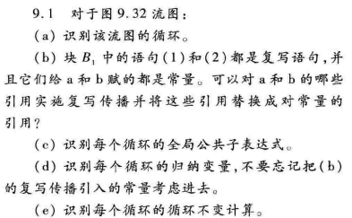
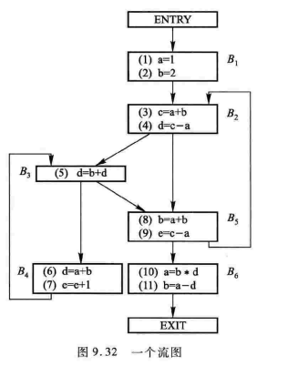
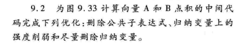
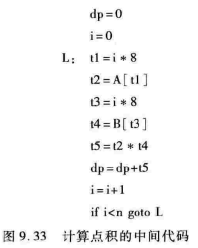

# HW7


## 9.1





### a

B3和B4构成一个循环

B2,B3,B4,B5构成一个循环，以B2为入口（嵌套循环）


### b

对a：(3)(4)(6)(8)(9)

对b：无


### c

B3和B4构成的循环：无

B2,B3,B4,B5构成的循环： a+b和c-a


### d

B3和B4构成的循环：e

B2,B3,B4,B5构成的循环：b、c（内循环中也是）


### e

B3和B4构成的循环：a+b

B2,B3,B4,B5构成的循环：无（内循环也是无）

## 9.2





公共子表达式：i*8

归纳变量：i，t1，t3

```assembly
	dp=0
	t1=-8
	t2=8*n
L: 	   t1=t1+8
	t2=A[t1]
	t4=B[t1]
	t5=t2*t4
	dp=dp+t5
	if t1<t2 goto L
```


## 9.3

> 对图9.32的流图，计算：
>
> - 为到达-定值分析，计算每个块的gen、kill、IN和OUT集合
> - 为可用表达式分析，计算每个块的e_gen、e_kill、IN和OUT集合
> - 为活跃变量分析，每个块的def、use、IN和OUT集合

### a

| 基本块 |   gen    |    kill     | OUT0 |        IN1         |         OUT1         |           IN2            |         OUT2          |
| :----: | :------: | :---------: | :--: | :----------------: | :------------------: | :----------------------: | :-------------------: |
|   B1   |  (1)(2)  | (8)(10)(11) |  空  |         空         |        (1)(2)        |            空            |        (1)(2)         |
|   B2   |  (3)(4)  |   (5)(6)    |  空  |       (1)(2)       |     (1)(2)(3)(4)     |  (1)(2)(3)(4)(5)(8)(9)   |  (1)(2)(3)(4)(8)(9)   |
|   B3   |   (5)    |   (4)(6)    |  空  |    (1)(2)(3)(4)    |     (1)(2)(3)(5)     | (1)(2)(3)(4)(6)(7)(8)(9) | (1)(2)(3)(5)(7)(8)(9) |
|   B4   |  (6)(7)  |  (4)(5)(9)  |  空  |    (1)(2)(3)(5)    |   (1)(2)(3)(6)(7)    |  (1)(2)(3)(5)(7)(8)(9)   |  (1)(2)(3)(6)(7)(8)   |
|   B5   |  (8)(9)  | (2)(7)(11)  |  空  |  (1)(2)(3)(4)(5)   |  (1)(3)(4)(5)(8)(9)  | (1)(2)(3)(4)(5)(7)(8)(9) |  (1)(3)(4)(5)(8)(9)   |
|   B6   | (10)(11) |  (1)(2)(8)  |  空  | (1)(3)(4)(5)(8)(9) | (3)(4)(5)(9)(10)(11) |    (1)(3)(4)(5)(8)(9)    | (3)(4)(5)(9)(10)(11)  |

再往后迭代不变


### b

| 基本块 |  e_gen  |       e_kill        | OUT0 |     IN1     |    OUT1     |     IN2     |    OUT2     |
| :----: | :-----: | :-----------------: | :--: | :---------: | :---------: | :---------: | :---------: |
|   B1   |   1 2   | a+b c-a b+d b*d a-d |  U   |     空      |     1 2     |     空      |     1 2     |
|   B2   | a+b c-a |   b+d b*d a-d c-a   |  U   |     1 2     | 1 2 a+b c-a |     1 2     | 1 2 a+b c-a |
|   B3   |   空    |     b+d b*d a-d     |  U   | 1 2 a+b c-a | 1 2 a+b c-a | 1 2 a+b c-a | 1 2 a+b c-a |
|   B4   |   a+b   |   b+d e+1 b*d a-d   |  U   | 1 2 a+b c-a | 1 2 a+b c-a | 1 2 a+b c-a | 1 2 a+b c-a |
|   B5   |   c-a   |   a+b b+d e+1 b*d   |  U   | 1 2 a+b c-a |  1 2  c-a   | 1 2 a+b c-a |  1 2  c-a   |
|   B6   |   a-d   | a+b c-a b+d b*d a-d |  U   |  1 2  c-a   |   1 2 a-d   |  1 2  c-a   |   1 2 a-d   |

迭代已经不变


### c

| 基本块 | def  |  use  |    IN1    |   OUT1    |    IN2    |   OUT2    |
| :----: | :--: | :---: | :-------: | :-------: | :-------: | :-------: |
|   B1   | a b  |  空   |     e     |   a b e   |     e     |   a b e   |
|   B2   | c d  |  a b  |   a b e   | a b c d e |   a b e   | a b c d e |
|   B3   |  空  |  b d  | a b c d e | a b c d e | a b c d e | a b c d e |
|   B4   |  d   | a b e |   a b e   |    空     |  a b c e  | a b c d e |
|   B5   |  e   | a b c |  a b c d  |    b d    |  a b c d  |  a b d e  |
|   B6   |  a   |  b d  |    b d    |    空     |    b d    |    空     |

再往后迭代不变


## 9.15（a）（f）

> 对图9.32的流图：
>
> (a)计算支配关系
>
> (f)找出该流图的自然循环

### a

D(1)={1} 

D(2)={1,2} 

D(3)={1,2,3} 

D(4)={1,2,3,4} 

D(5)={1,2,5} 

D(6)={1,2,5,6}


### f

回边4->3:   B3和B4构成一个循环

回边5->2:   B2,B3,B4,B5构成一个循环，以B2为入口