# LR分析

## LR(0)分析

不能处理移进归约冲突和归约归约冲突，即DFA中出现两种冲突即不是LR(0)文法


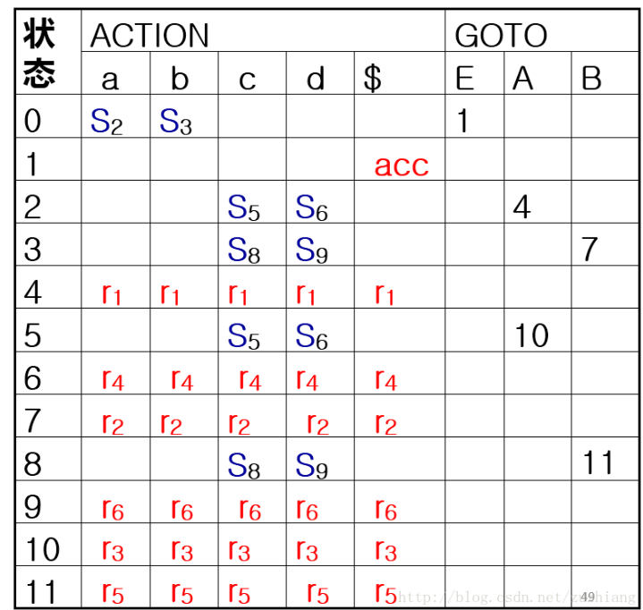

## SLR(1)分析

SLR(1)文法能处理归约归约冲突，但不一定能处理移进规约冲突，如果用follow集能解决则是SLR(1)文法（也就是说在LR(0）的基础上使用follow集处理，处理后不产生冲突的即为SLR(1)


分析表与LR(0)的区别在于对归约项的处理，要归约到的非终结符的follow集的元素才进行归约（对照后面建立语法分析树，判断要移进还是归约时，看归约到的follow集是否含有要移进的终结符，含有则归约，不含则移进）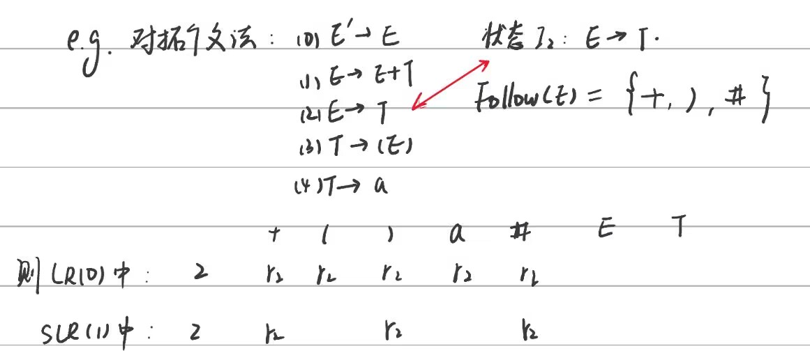

如图，只在follow集元素下进行归约

## LR(1)分析

拓广文法同上，在LR(0)基础上使用向前搜索符进行处理

（指B的向前搜索符集合


分析表指对对应的向前搜索符进行归约（区别与LR(0)的全部归约和SLR(1)的follow集归约）

# 语法制导翻译

## 语法制导定义


 **仅仅使用综合属性的语法制导定义为S属性定义（自下而上）**


### 语义计算


**依赖图：**


**拓扑排序**是有向无环图的结点的一种排序，使得有向边只会从先出现的结点指向后出现的结点，所以依赖图的任何拓扑排序都可以给出语法树中语义规则计算的有效顺序


**树遍历：**
从根节点出发，遍历儿子，若是终结符，直接计算，若是非终结符，先算继承属性，再遍历儿子，最后遍历完往回计算综合属性

 

## S属性文法

只有综合属性（属于L属性文法）

**栈操作**：


xyz压入栈进行运算后出栈，所以归约后A进栈在top-2位置，后续栈顶指针的调整没写

## L属性文法


## 翻译模式

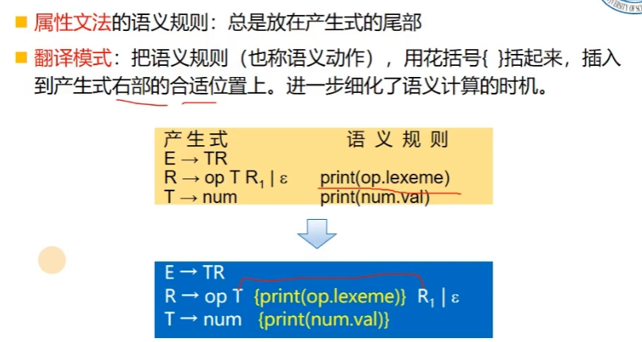


# 运行时存储组织

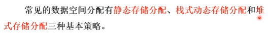

## 静态存储分配

绝对地址=静态数据区首地址+偏移量


## 动态存储分配


### 栈式动态存储分配


### 堆式存储分配

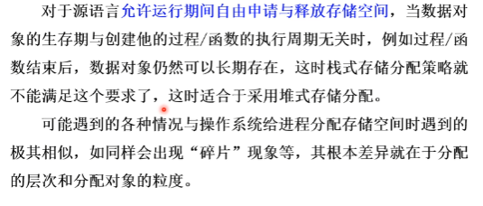

即在编译时无法确定大小的对象放在堆区，比如malloc、new等等

## 活动记录


RA：返回地址

DL：动态链

SL：静态链

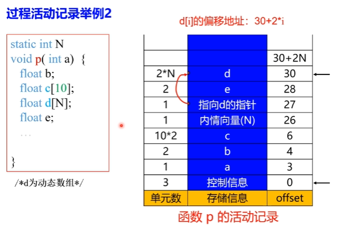


调用者在栈下面，被调用者在栈上面，符合栈先进后出的特性，所以活动树的根在栈底，程序控制所在的活动在栈顶

## 非局部数据的访问

### 支持过程嵌套声明（如Pascal）

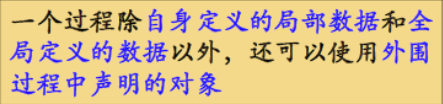


在相互嵌套的过程的活动记录中添加访问链，使得内嵌的过程可以访问外层过程中声明的对象

### 不支持过程嵌套声明（如C）

一定是栈顶活动的局部变量，可以通过运行时刻栈道栈顶指针访问

# 中间语言

## 中间语言表示

### 图形表示

DAG:


抽象语法树：


语法推导树和抽象语法树的区别：


### 三地址码（四元式）

x = y op z

op y z x

可以看成抽象语法树或DAG的一种线性表示


### 静态单赋值（SSA）


### 数组元素地址计算

c=base-num

num为[1,1]的偏移量？

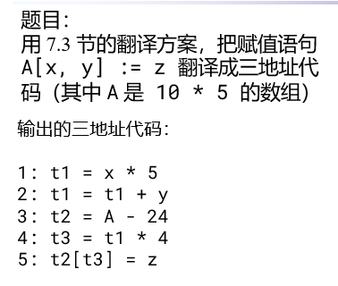

## 类型表达式

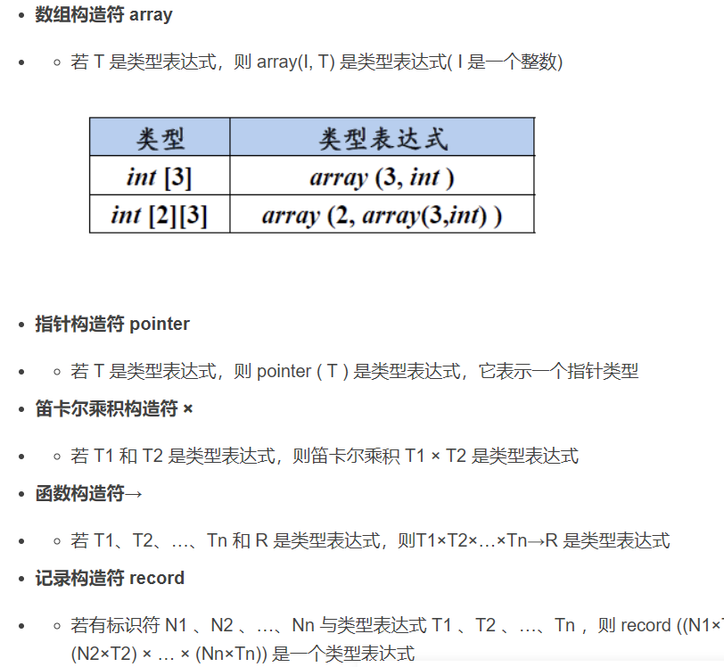

例子：

```c++
struct stype
{
	char[8] name;
	int score;
};
stype[50] table;
stype* p;
stype* func (x,y)
    int x;
    stype y;{}
```

对于stype是一个结构体，用record记录，其中的char[8] name为数组，为array（8，char），所以总体是record((name$\times$array(8,char))$\times$(score$\times$integer))

对于table是一个结构体数组，类型是stype，数组为array(50,stype)

对于p是指针，所以是pointer(stype)

对于func是函数，所以用参数列表指向返回值，参数是一个int x和一个stype y，即(int $\times$stype)展开为(integer$\times$record((name$\times$array(8,char))$\times$(score$\times$integer)))，返回值为pointer(stype)


## 布尔表达式和控制流语句

### 布尔表达式代码回填


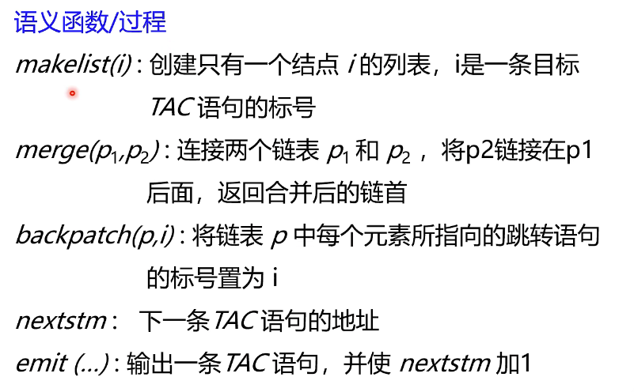

为了回填，需要添加非终结符M

比如：

M记录B2的第一条语句标号，当B1为false时，需要继续判断B2，所以用M.quad回填B1的falselist

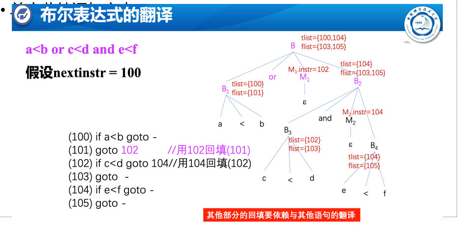

例如：B3中的tlist为真时，必然跳到B4判断，所以应该用104回填B3中tlist中所有元素，这里是102


### 控制流语句回填

#### S → if B then S1


M记录S1第一条序号，用M.quad回填B.truelist


#### S → if B then S1 else S2

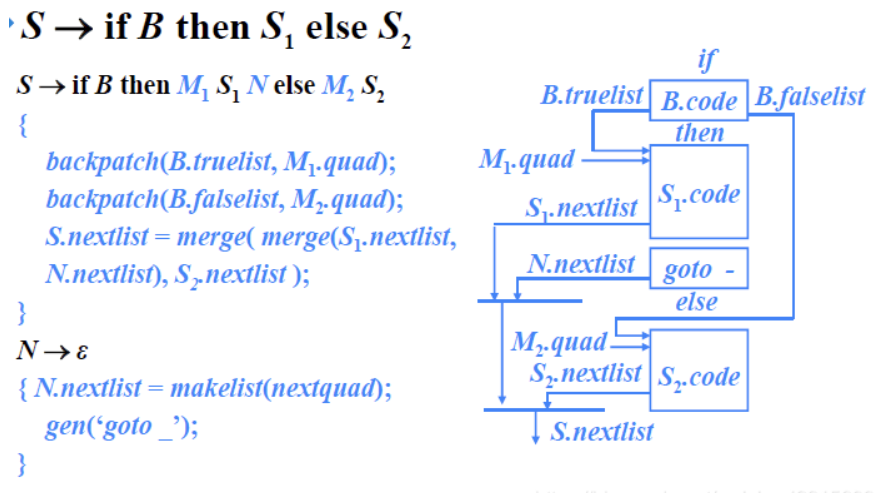

除了M之外，需要N产生一条goto语句

#### 过程调用语句


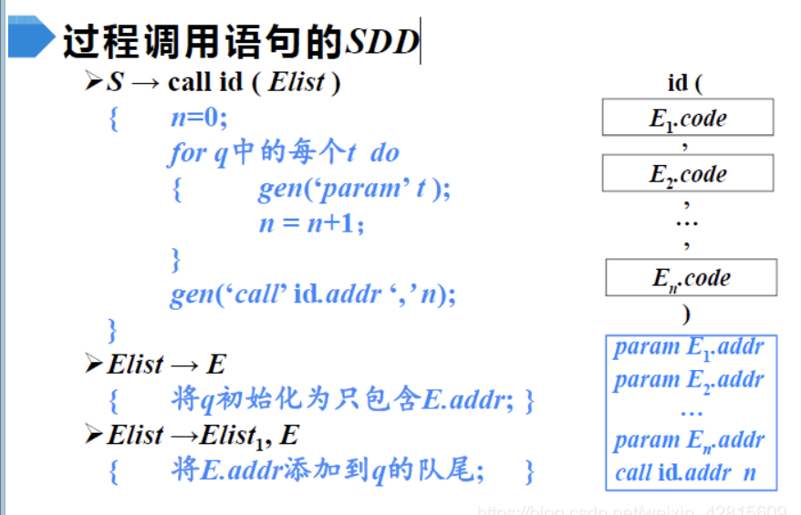


# 代码生成

## 指令集和代价

指令集：op 源 目的

MOV：源存到目的

SUB：目的减源

ADD：源加到目的

变址：

c（R）=c+contents（R）

*c（R）=contents（c+contents（R））

在指令中，要把值取出来相当于有一个*，例如

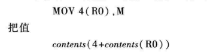


代价：包含内存单元或者常数的代价是1，寄存器模式代价是0


例子：


## 寄存器选择

寄存器分配和指派：把哪个值放在哪个寄存器中

指令排序：按照什么顺序来安排指令的执行

寄存器描述符：记录每个寄存器当前存放的是哪些变量的值

地址描述符：记录运行时每个名字的当前值存放在哪些位置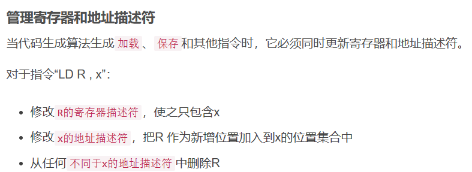

getReg函数：

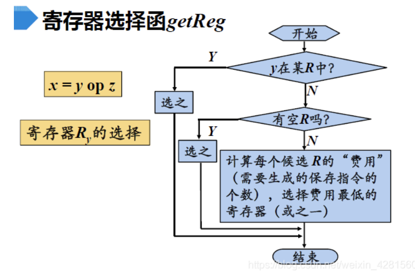


# 独立于机器的优化


## 基本块的划分


## 流图


然后把跳转的对应的编号改为所在的基本块编号（后面优化可能导致某些语句消失）

## 公共子表达式

全局公共子表达式：在指定范围中所有基本块中，表达式已经计算过，而且到再次出现变量值没有改变

局部公共子表达式：在某个基本块中，表达式已经计算过，而且到再次出现变量值没有改变


优化为：


公共子表达式的消除会导致很多复写，所以可以进行复写传播优化（所有用刚刚删除公共子表达式时用的 变量t进行的定值的引用，全部改为t）：


复写传播后会导致某些定值的引用链为空，即产生了死代码，所以可以进行死代码删除：

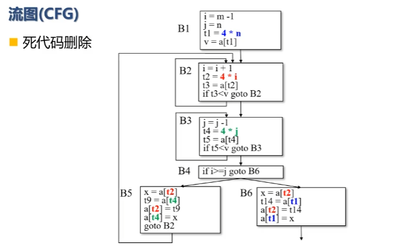

之后再检查是否产生新的公共子表达式，再这样操作优化直到没有新的公共子表达式产生，最后结果：

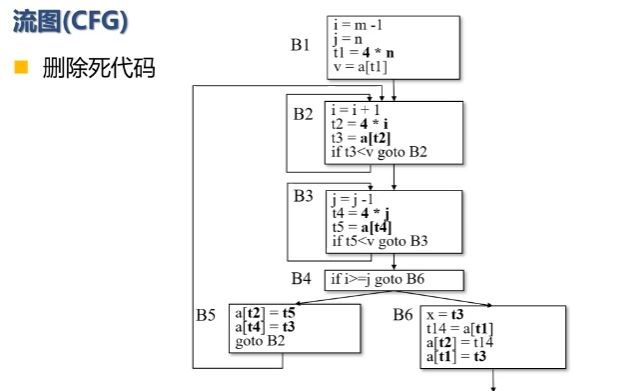

（还可以继续优化，只是全局子表达式在这里删除完毕


## 归纳变量

循环中：

基本归纳变量：i=i+c（c为常量）这一类为基本归纳变量

归纳变量：由基本归纳变量线性相关的变量

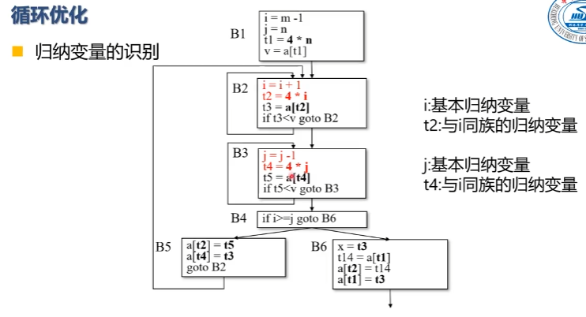

**归纳变量强度削弱**：乘法改加法，例如i=i+1，j=4*i，则改为：

j=4*i （循环外）, i=i+1，j=j+4

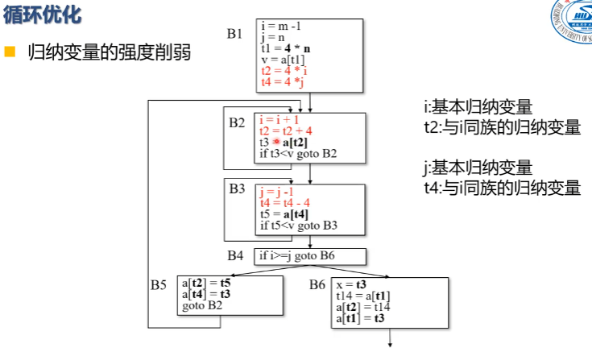

**基本归纳变量的删除**：如果只需要用到同族归纳变量，则对应的基本归纳变量可以删除，但是要注意替换循环出口条件

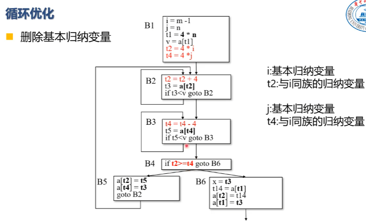

## 循环不变

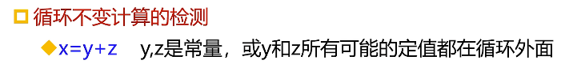

## 流图支配关系

支配结点是指到目标结点必须经过的结点

- 初始化D（1）={1}，其他全集
- 从2开始，D（n）={n}并上n的前驱基本块的支配集的交集

例：


初始化D（1）={1}，其余为全集

D（2）={2}并D（1）交D（5）={1，2}（1和5是2 的前驱）

依次类推


## 流图找自然循环

自然循环从回边出发找，要求只能有一个入口（否则就是普通循环）

回边：支配关系中从最后结点到支配集里面的结点的边

例如在上图中的支配集写全如下：

D(1)={1} 

D(2)={1,2} 

D(3)={1,2,3} 

D(4)={1,2,3,4} 

D(5)={1,2,5} 

D(6)={1,2,5,6}

回边则有：4->3      ,         5->2

回边结点加入循环，再由回边从最后结点回溯，找前驱（舍去已在循环中的结点）

例如：

回边4->3，4和3加入循环，从4开始，4的前驱是3，已在循环中，不变，循环为{3，4}

回边5->2，5和2加入循环，从5开始，5的前驱是3，2，将3加入循环，3的前驱是4和2，将4加入循环，4的前驱是3，已在循环中，不变，循环为{2，3，4，5}


## 流图的深度优先生成树

深度优先搜索形成深度优先生成树

如下：实线是流图的深度优先生成树的边


前进边：

后撤边：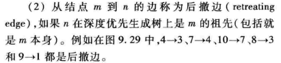

交叉边：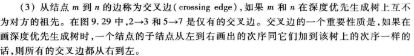

**可规约的**：在流图的深度优先生成树上，所有的后撤边都是回边

流图的深度：（和前面结点的深度不一样


## 到达定值分析

定值：变量v的定值是（可能）将一个值赋给v的语句

到达定值：存在一条从定值d到程序点p的路径，且在此路径上d没有被杀死，则称定值d到达程序点p（即路径上没有其他定值d’对变量v重新定值）  


kill：在该基本块中的定值语句会杀死其他对同样变量赋值的定值语句，这些被杀死的定值语句的集合为kill

gen:  该基本块产生的定值语句

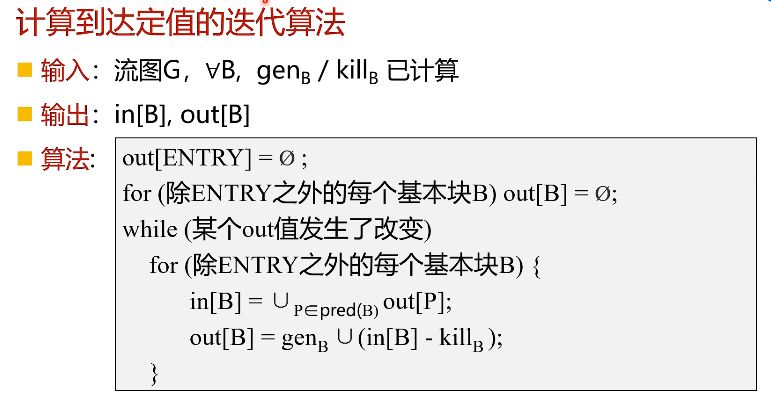


## 活跃变量分析

对于变量v和程序点p：流图中存在一条从p开始到通路引用v在p点的值，则v在点p是活跃的（即在被修改前用到了这个变量就是在p点活跃）

活跃变量分析是反向分析（找到引用往回追溯到定值处都是活跃的）

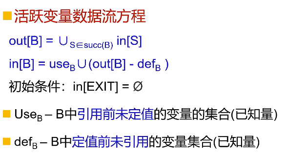

 use：B中右边引用的并且在引用前没有定值的

def：B中左边定值的变量集合


 

## 可用表达式分析

可用表达式：从流图入口结点到达程序点p的每条路径都对表达式x op y进行计算，并且从最后一个这样的计算到点p之间没有再次对x或y定值，那么表达式x op y在点p是可用的（即点p时，表达式在之前计算过而且没有被修改，不需要重新计算）


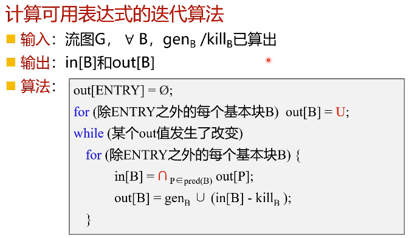

 

