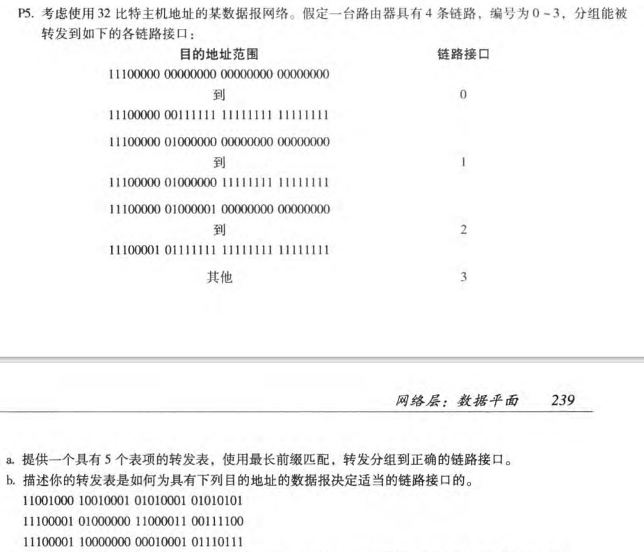
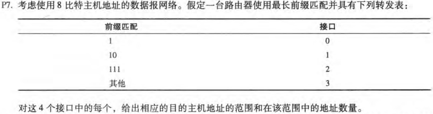
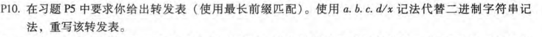
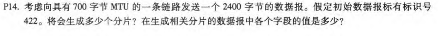

# HW4

## P5

- | 前缀匹配          | 链路接口 |
  | ----------------- | -------- |
  | 11100000 00       | 0        |
  | 11100000 01000000 | 1        |
  | 1110000           | 2        |
  | 11100001 1        | 3        |
  | 其他              | 3        |

  

- 第一个最长前缀匹配是其他，链路接口为3

  第二个最长前缀匹配是1110000，链路接口为2

  第三个最长前缀匹配是11100001 1，链路接口为3

## P7

1100 0000到1101 1111      接口0     地址数量：$2^5=32$

1000 0000到1011 1111      接口1     地址数量：$2^6=64$

1110 0000到1111 1111      接口2     地址数量：$2^5=32$

0000 0000到0111 1111      接口3     地址数量:$2^8-64-32-32=128$

## P8

子网1:60个接口，$2^6=64$,地址长度为26

子网2:90个接口，$2^7=128$,地址长度为25

子网3:12个接口，$2^4=16$,地址长度为28

所以，网络地址可以如下分配：

子网1    :     223.1.17.0/26

子网2    :     223.1.17.128/25

子网3    :     223.1.17.192/28

## P10

| 前缀匹配                     | 链路接口 |
| :--------------------------- | -------- |
| 224.0/10（11100000 00）      | 0        |
| 224.64/16(11100000 01000000) | 1        |
| 224/7(1110000)               | 2        |
| 225.128/9(11100001 1)        | 3        |
| 其他                         | 3        |

## P12

- 子网A:250个接口，$2^8=256$,地址长度为24

  子网B:120个接口，$2^7=128$,地址长度为25

  子网C:120个接口，$2^7=128$,地址长度为25

  子网D、E、F均是2个接口，可以从子网B中多出来的8个接口中分配

  综上，每个子网的分配为：

  子网A : 214.97.255/24
  子网B : 214.97.254.0/25 - 214.97.254.0/29

  子网C : 214.97.254.128/25

  子网D : 214.97.254.0/31 

  子网E : 214.97.254.2/31

  子网F : 214.97.254.4/30 

- 转发表

R1：

| 最长前缀匹配                       | 接口 |
| ---------------------------------- | ---- |
| 11010110 01100001 11111111         | A    |
| 11010110 01100001 11111110 0000000 | D    |
| 11010110 01100001 11111110 000001  | F    |

R2：

| 最长前缀匹配                       | 接口 |
| ---------------------------------- | ---- |
| 11010110 01100001 11111110 0       | B    |
| 11010110 01100001 11111110 0000000 | D    |
| 11010110 01100001 11111110 0000001 | E    |

R3：

| 最长前缀匹配                       | 接口 |
| ---------------------------------- | ---- |
| 11010110 01100001 11111110 000001  | F    |
| 11010110 01100001 11111110 0000001 | E    |
| 11010110 01100001 11111110 1       | C    |

## P14

数据字段最大：700-20=680

共2400-20=2380

分片数=[2380/680]=4

偏移：0 、85 、170、 255

MF：1、 1、 1、 0

标识号：均为422

DF：均为0
