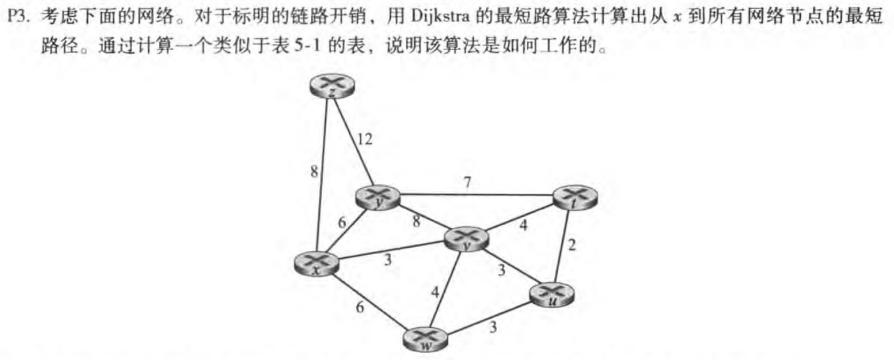
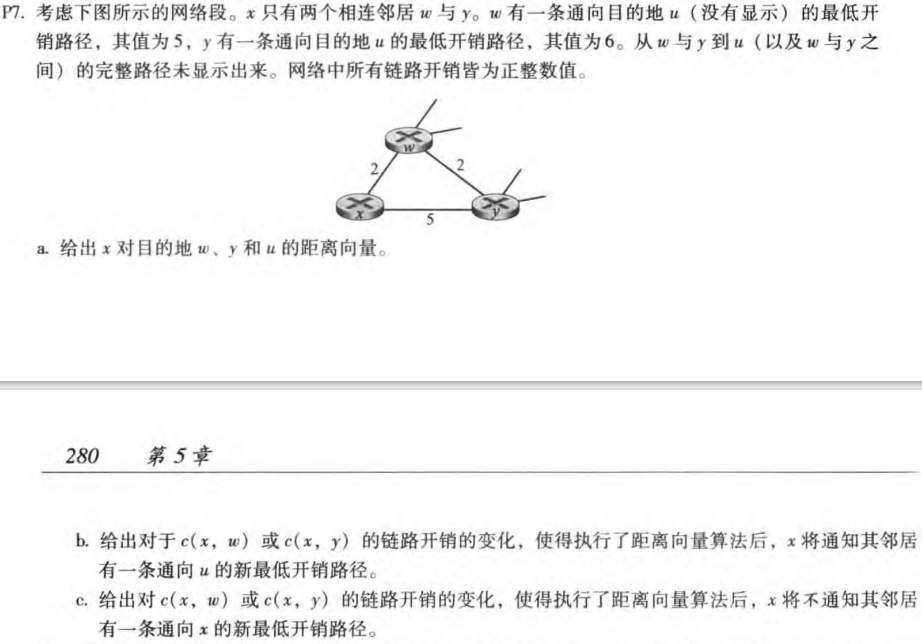
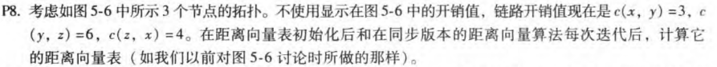
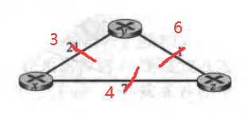
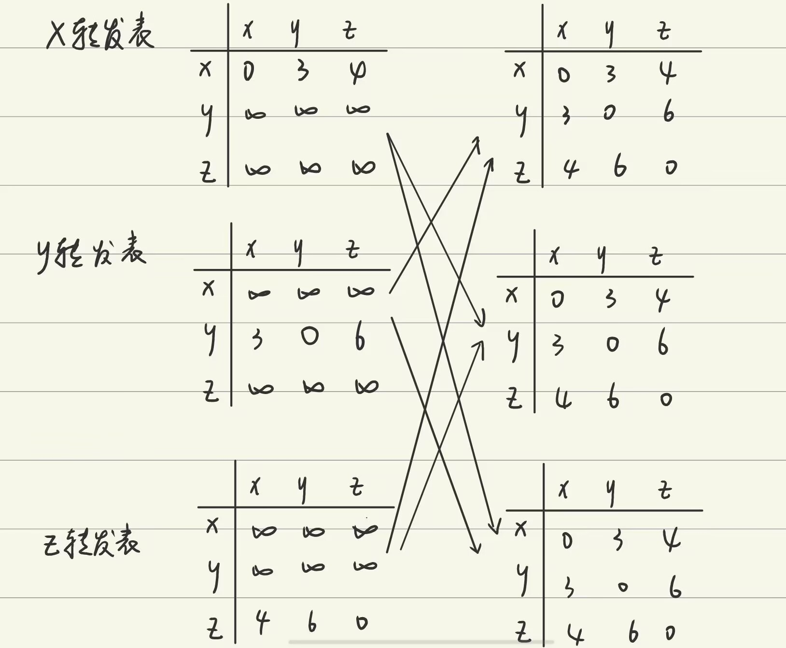
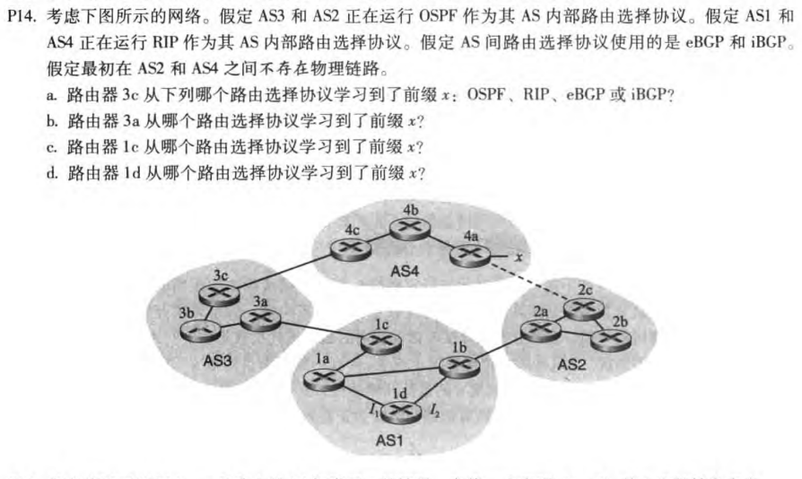
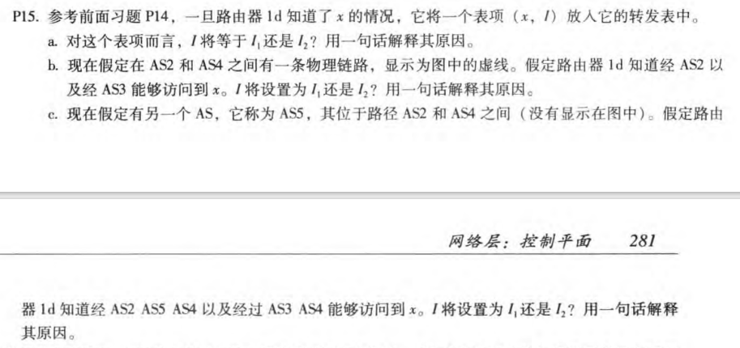

# HW5

## P3

| Step | N'      | D(t),p(t) | D(u),p(u) | D(v),p(v) | D(w),p(w) | D(y),p(y) | D(z),p(z) |
| ---- | ------- | --------- | --------- | --------- | --------- | --------- | --------- |
| 0    | x       | $\infty$  | $\infty$  | 3,x       | 6,x       | 6,x       | 8,x       |
| 1    | xv      | 7,v       | 6,v       | 3,x       | 6,x       | 6,x       | 8,x       |
| 2    | xvu     | 7,v       | 6,v       | 3,x       | 6,x       | 6,x       | 8,x       |
| 3    | xvuw    | 7,v       | 6,v       | 3,x       | 6,x       | 6,x       | 8,x       |
| 4    | xvuwy   | 7,v       | 6,v       | 3,x       | 6,x       | 6,x       | 8,x       |
| 5    | xvuwyt  | 7,v       | 6,v       | 3,x       | 6,x       | 6,x       | 8,x       |
| 6    | xvuwytz | 7,v       | 6,v       | 3,x       | 6,x       | 6,x       | 8,x       |

如何工作：

- N'为已找到最短路径的节点集合，初始化开始节点x 直接到各个节点v的路径代价D(v)，以及该路径的上个节点p（v）
-  找出D(v)最小的节点，将找到最短路径的节点加入N' 
- 更新到相关节点的路径代价
- 重复上述步骤直到N'中包含所有节点

## P7

- $D_x(w)=2,D_x(y)=4,D_x(u)=7$

- 如果c（x,y）变化，c（x,y）=t<1时，最小开销变为t+6

  如果c（x,w）变化，c（x,w）=t，

  ​    t<6时，最小开销变为t+5

  ​    t>=6时，最小开销变为11

- 如果c（x,y）变化，c（x,y）=t>=1时，最低开销还是xwu的7，所以不会通知

## P8 

## P14

x不在在AS3 AS1内，所以是BGP

- 3c 从4c学习前缀x，来自 AS4, 所以为 eBGP.
- 3a 从3c学习前缀x，来自 AS3 内部, 所以为 iBGP.
- 1c 从3a学习前缀x，来自 AS3, 所以为 eBGP.
- 1d从1c学习前缀x，来自 AS1 内部, 所以为 iBGP

## P15

- I1, 1d要从1c学习到x，而I1离1c更近
- I2, 可以从1b和1c学习到x，且都是2个AS，但1b离1d更近，所以选I2
- I1, 可以从1b和1c学习到x，但1c需要2个AS，1b需要3个AS，所以选I1

