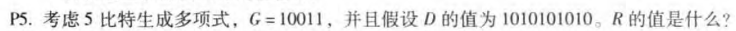
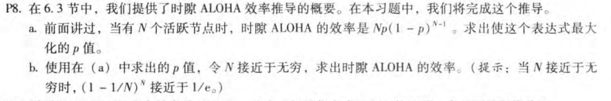
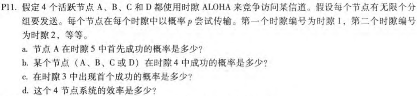
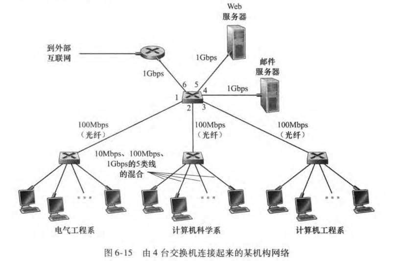
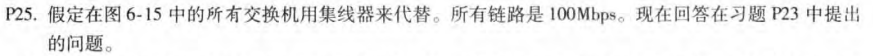
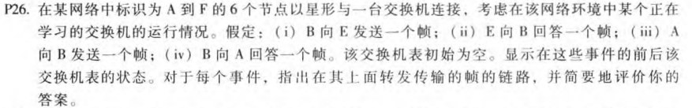

# HW7

## P5

10101010100000除以G=10011，余数为R=0100

## P8

### a

$\because f(p)=Np(1-p)^{N-1}$

$\therefore f'(p)=N(1-p)^{N-2}(1-Np)$

令$f'(p)=0,得p=1(\because p\lt1舍去)或者p=\frac{1}{N}$

$p=\frac{1}{N}$取最大值

### b

代入$p=\frac{1}{N}$，有$\lim\limits_{N->\infty}(1-\frac{1}{N})^{N-1}=\lim\limits_{N->\infty}\frac{1}{(1+\frac{1}{N})^N}=\frac{1}{e}$

## P11

### a

$p(A)=p(1-p)^3$

$\therefore p(a)=p(A)(1-p(A))^4=p(1-p)^3(1-p(1-p)^3)^4$

### b

四个节点是等效的

$\therefore p(b)=4p(A)=4p(1-p)^3$

### c

某个时隙成功概率为b中的$p(b)$

$\therefore p(c)=(1-p(b))^2p(b)=(1-4p(1-p)^3)^2(4p(1-p)^3)$

### d

效率是有节点成功的概率，为$4p(1-p)^3$

## P23

题中假设了任何主机或者服务器能够向任何其他主机和服务器发送分组，所以11条链路全部满载时，最大总吞吐量为$11\times100Mbps=1100Mbps$

## P24

每个系中心都是一个冲突域，每个系只能同时最多一台主机发送分组，所以一共3+2=5条链路可以同时满载，所以最大总吞吐量为$5\times100Mbps=500Mbps$

## P25

每次最多一台主机发送分组，所以最大总吞吐量为100Mbps

## P26

| 行为           | 状态                               | 链路      | 评价                                        |
| -------------- | ---------------------------------- | --------- | :------------------------------------------ |
| B给E发送一个帧 | 交换机表中添加B的MAC地址及对应端口 | A,C,D,E,F | 初始交换机表为空，交换机不知道E对应的端口号 |
| E给B回答一个帧 | 交换机表中添加E的MAC地址及对应端口 | B         | 交换机表中已经存有B的MAC地址和对应端口      |
| A给B发送一个帧 | 交换机表中添加A的MAC地址及对应端口 | B         | 交换机表中已经存有B的MAC地址和对应端口      |
| B给A回答一个帧 | 交换表不变                         | A         | 交换机表中已经存有A的MAC地址和对应端口      |

