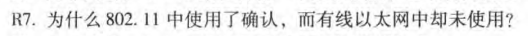
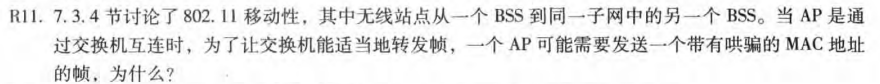
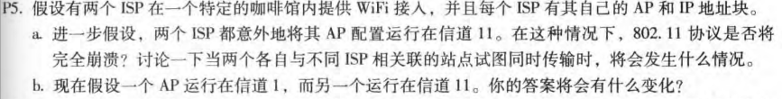
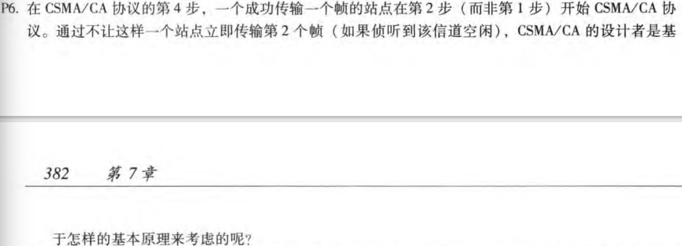

# HW7

## R7

因为802.11无线信道相比有线信道会有更高的误比特率，并且无法在发送信号的同时检测冲突，所以需要借助ACK信号来bbi避免冲突的发生，而有线以太网使用CSMA/CD的协议来调节，能够检测冲突，不必使用ACK

## R11

因为交换机是根据MAC地址来学习和转发数据帧的，当一个无线站点从一个BSS切换到另一个BSS时，它的MAC地址会发生改变，但如果交换机不更新其MAC地址表，将无法适当地转发数据帧。所以一个AP可能需要发送一个带有哄骗MAC地址的帧，以便在交换机上更新MAC地址表，通过使用伪造的源MAC地址，AP可以欺骗交换机并让其将该帧转发到正确的目的地

## P5

### a

两个AP配置在相同信道11上，会共享相同的无线信道，当接入主机与其中一个AP相关联时，另一个AP虽然会接受帧，但不会处理，所以两个ISP可以在同一信道上工作，但是不同的无线站不同的ISP同时发送会发生冲突，这种共享信道导致最大聚合传输速率在11Mbps

### b

两个AP在不同的信道上运行，通信不会相互干扰，两者的信道也没有共享，从而提高网络性能和可靠性，最大聚合传输速率也变成两者之和

## P6

1. 公平共享：CSMA/CA协议旨在提供公平的信道访问机制，使每个站点都能有机会传输数据。如果一个站点连续传输多个帧，将占用更多的信道资源，可能导致其他站点无法传输数据，造成不公平。通过延迟传输，其他站点有机会竞争信道访问权。
2. 避免冲突：通过等待一段时间，可以确保其他站点有时间侦听信道并避免在同一时间开始传输。这有助于减少碰撞，提高整体的网络性能和吞吐量。