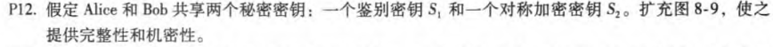
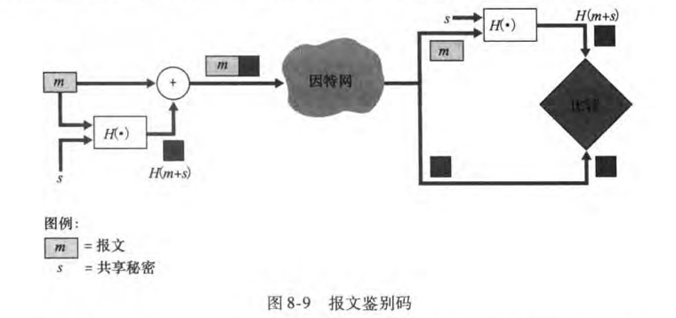
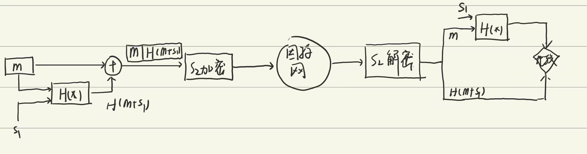
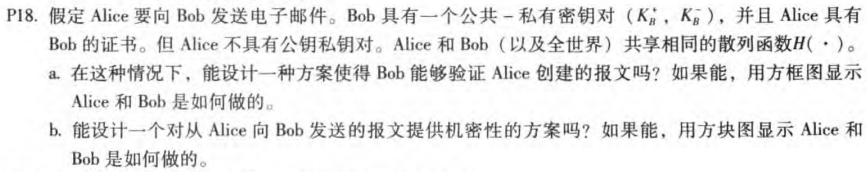
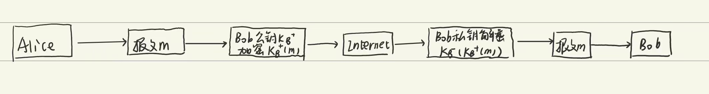

# HW8

## P8

### a

n=pq=55

z=(p-1)(q-1)=40

### b

$e=3\lt n$，并且和z互质

### c

d=27，满足27*3 mod 40=1

### d

加密：m=8，$m^e=512$，密文$c=m^e modn=17$

解密：$c^dmodn=17^{27}mod55=8$

## P12

扩充后：

## P18

### a

Alice没有公钥私钥对，Bob无法验证Alice创建了消息

### b

可以，因为Bob存在公钥私钥对

Alice可以通过Bob的公钥对消息进行加密，并发送对Bob的加密消息，Bob再用自己的私钥解密

如下图：

