# ARP实验

## Q1

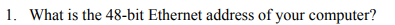

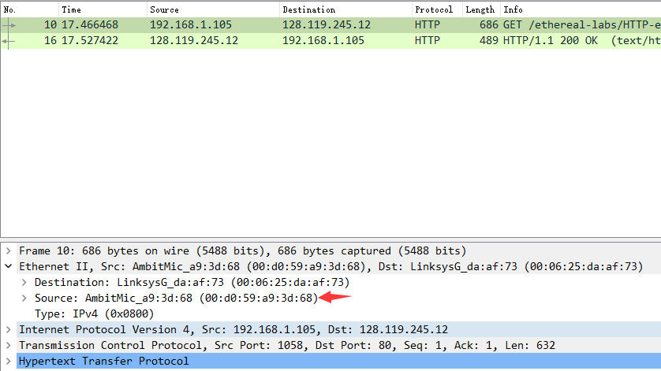

源地址：AmbitMic_a9:3d:68 (00:d0:59:a9:3d:68)

## Q2

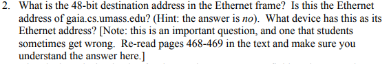

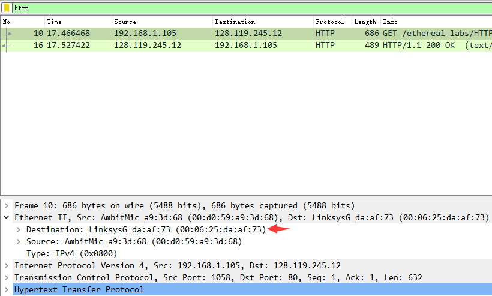

目的地址: LinksysG_da:af:73 (00:06:25:da:af:73)

不是gaia.cs.umass.edu的以太网地址

是出子网的路由器接口的地址

## Q3

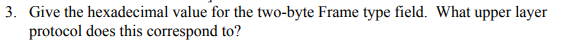

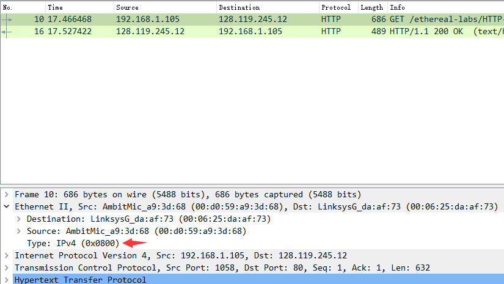

0x0800

表示上层协议是 IPv4

## Q4

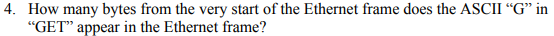

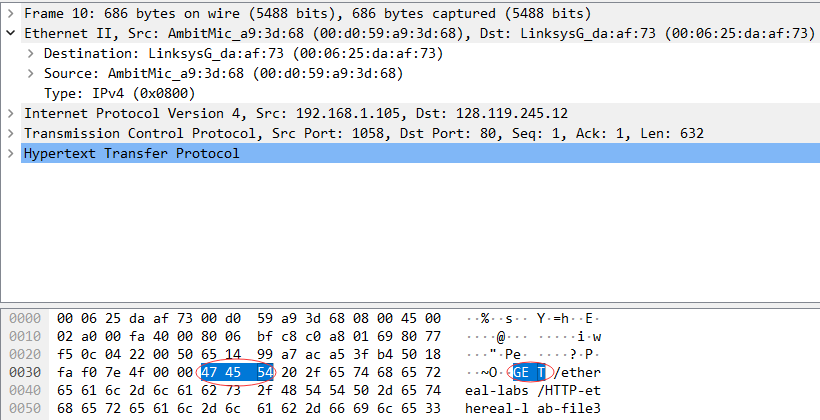

G对应47，之前一共3*16+6=54字节，算上G出现是55字节

## Q5

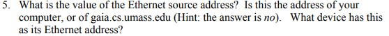

源地址：LinksysG_da:af:73 (00:06:25:da:af:73)

不是

是出子网的路由器的接口地址

## Q6

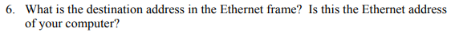

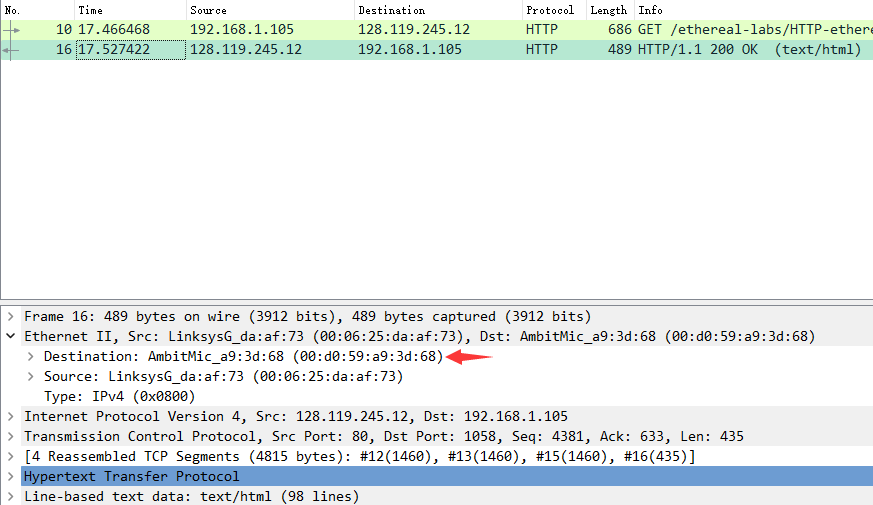

目的地址：AmbitMic_a9:3d:68 (00:d0:59:a9:3d:68)

是我的计算机的以太网地址

## Q7

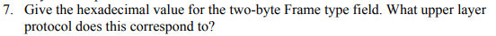

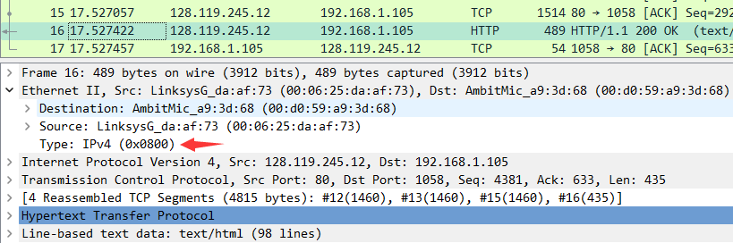

0x0800

表示上层协议是 IPv4

## Q8

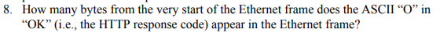

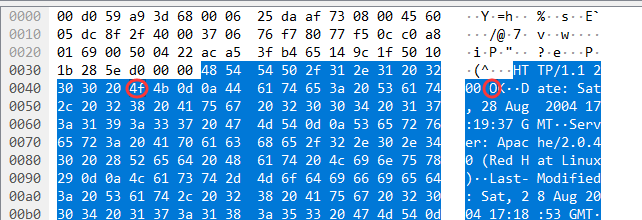

O对应4f，之前有16*4+3=67字节，算上O是68字节

## Q9

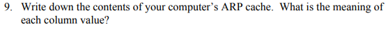

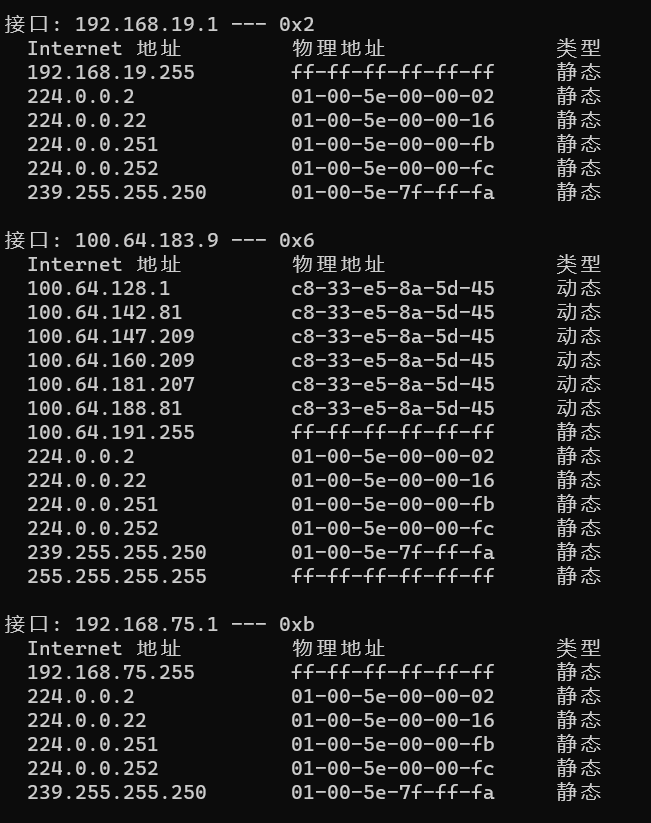

网卡、路由IP和MAC地址、广播地址、组播地址

## Q10

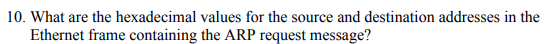

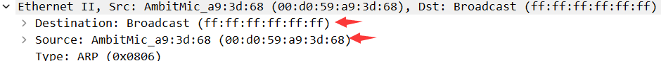

源地址      00:d0:59:a9:3d:68

目标地址   ff:ff:ff:ff:ff:ff

## Q11

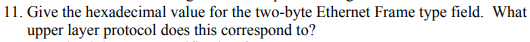

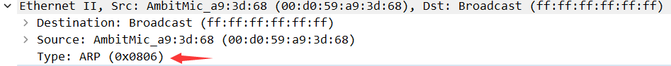

0x0806 

对应上层的ARP协议

## Q12

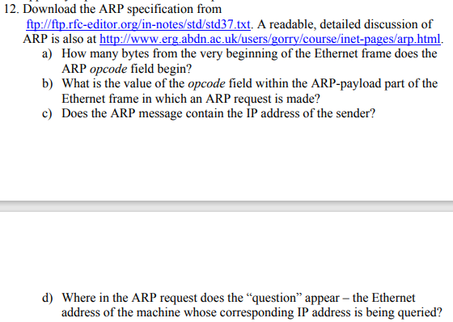

### a

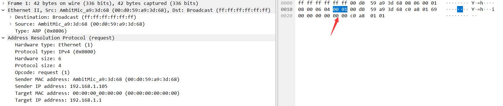

16+4=20 bytes

### b

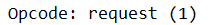

1

代表ARP请求

### c

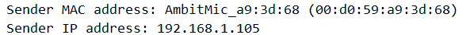

包含

### d

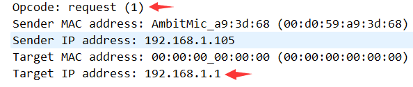

opcode可以看出request

## Q13

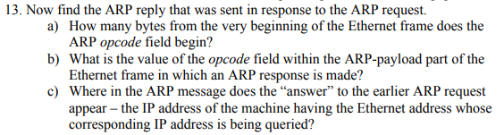

### a

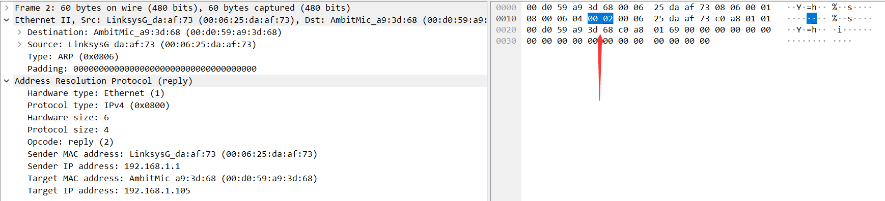

16+4=20 bytes

### b

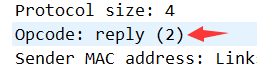

2

代表响应报文

### c

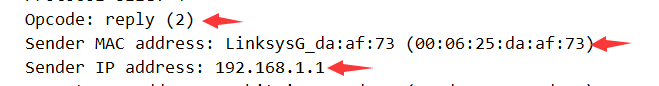

sender MAC address

sender IP address

## Q14

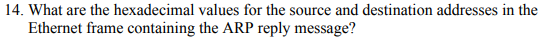

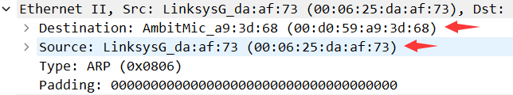

源地址       00:06:25:da:af:73 

目标地址    00:d0:59:a9:3d:68

## Q15

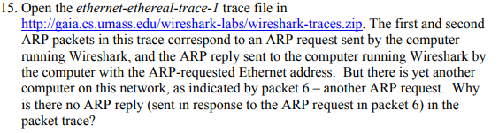

因为ARP查询报文是广播的，而响应是单播的， 只有对应IP地址的主机才能收到

## EX1

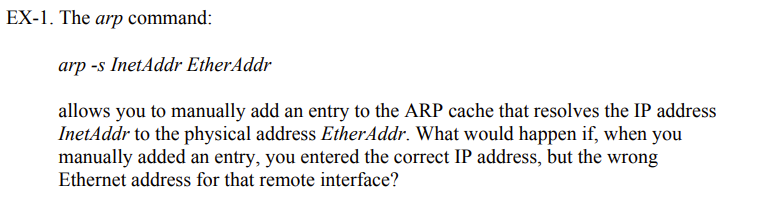

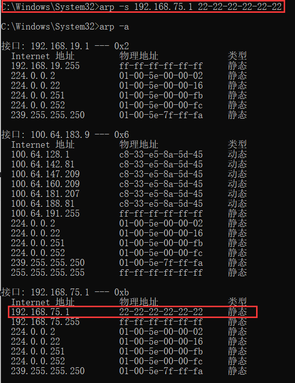

管理员权限下可以添加

## EX2

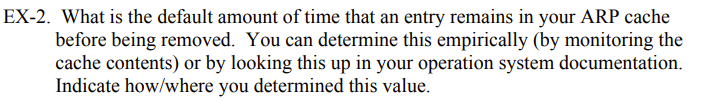

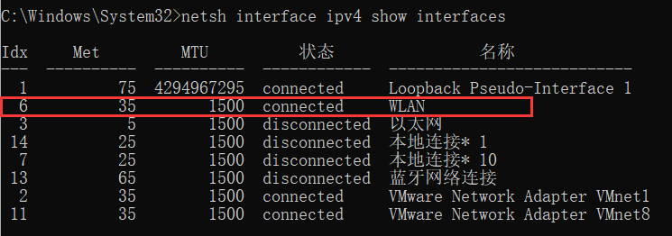

Idx为6对应WLAN

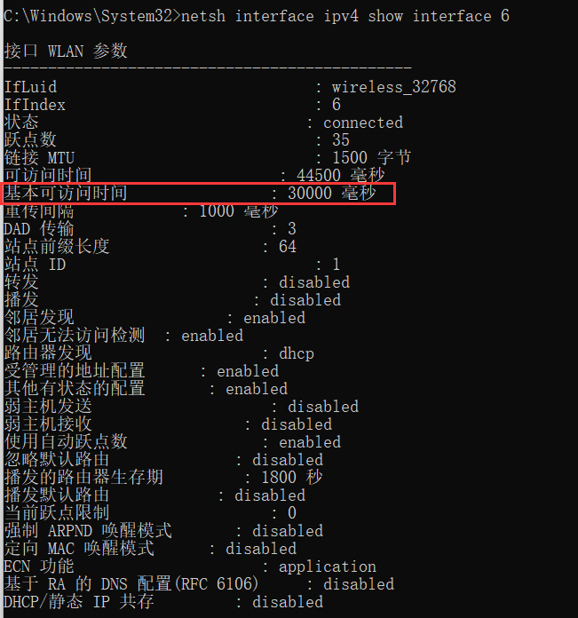

基本可访问时间为30000ms，所以ARP cache条目TTL为30000ms