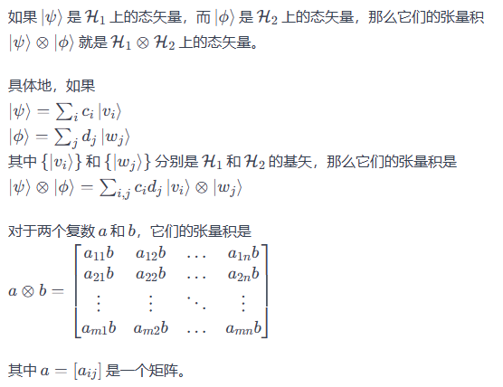
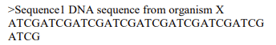
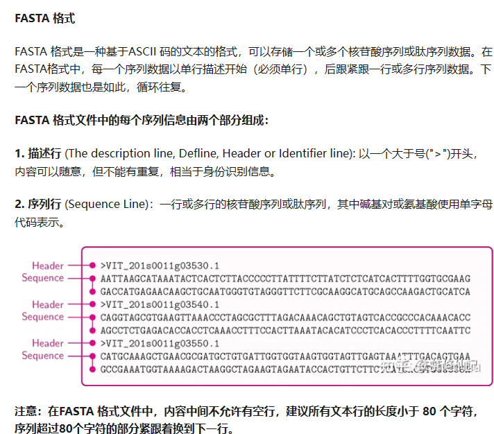
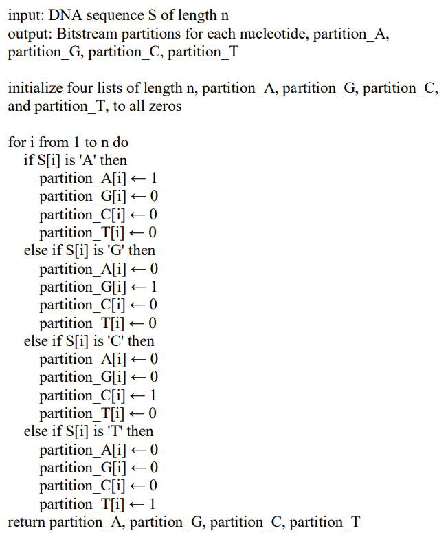
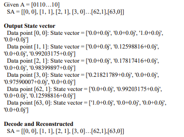
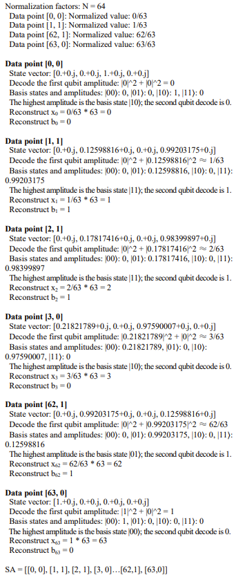
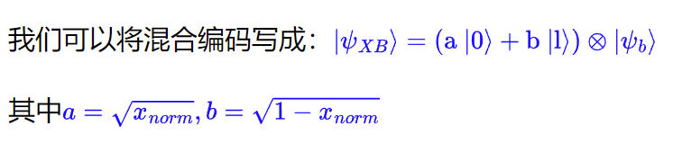

# 混合量子编码：结合振幅和基态编码，以增强量子计算中的数据存储和处理

2023年第20届计算机科学与软件工程国际联合会议（JCSSE）

会议论文

Publisher:IEEE

红色区域是对应的解释和相关资料

红色加粗字体是较为重要内容

## 摘要

本研究应用比特-分区混合量子编码方法在量子系统中高效存储和处理经典数据。 通过将**表示索引的振幅编码（Amplitude encoding）**和 **数据值的基态编码（Basis Encoding）**相结合，我们引入了一种利用两种方法优势的新技术。 **我们描述了对混合状态进行编码和解码的过程 ，强调了这种方法在数据存储和计算效率。** 此外，我们探索了解码过程，解决了与量子测量 相关的固有不确定性， 并讨论了最小化这种不确定性的策略。 我们的研究结果表明 ，混合编码可以改善量子信息处理任务， 使其成为 未来量子计算的一种有前途的技术应用。 需要进一步的研究来优化编码和解码过程，并探索这种方法在各种量子算法中的全部潜力

## 导言

​		量子计算利用量子力学的独特特性，有望彻底改变我们处理和计算信息的方式。这项技术的目标是在速度和计算能力方面超越经典计算，即量子至上。对于使用经典计算方法需要大量计算资源或时间才能解决的特定计算问题，量子计算机的性能要优于经典计算机。量子计算机能表现出显著优势的一些重要问题包括**整数因式分解、非结构化搜索、优化问题、量子模拟和机器学习**。**量子计算机利用叠加和纠缠等量子现象实现量子优势，这使它们能够同时执行复杂的计算，并且比经典计算机更高效**。

> 具体说明：（可以稍微讲一下，因为我们后面研究的内容主要是对DNA序列的匹配，和非结构化搜索有关）
>
> 量子计算机相对于经典计算机在某些问题上具有显著优势的原因主要源于量子力学的特性，例如超position和纠缠。以下是一些问题领域，量子计算机相对于经典计算机具有潜在优势的原因：
>
> 1. 整数因式分解： 经典计算机在解大整数的因式分解问题上的效率较低，而量子计算机可以利用量子并行性在多个可能的解同时进行计算，从而加速因式分解过程。Shor算法是一个经典例子，可以在多项式时间内因式分解大整数，这对于当前加密技术（如RSA加密）可能构成一种威胁。
> 2. **非结构化搜索**： 量子计算机在非结构化搜索问题上具有优势，因为它们可以在一次计算中处理多个可能的解。Grover算法是一个著名的例子，它能够在O(√N)次操作内找到未排序数据库中的目标项，相较于经典算法的O(N)复杂度，有指数级的加速。
> 3. 优化问题：量子计算机在解决某些优化问题（如旅行商问题和图着色问题）时可能更为高效。Quantum Approximate Optimization Algorithm (QAOA)是一个用于求解组合优化问题的量子算法，可以在一定情况下提供更好的解。
> 4. 量子模拟： 量子计算机天然适合模拟其他量子系统，因为它们能够更准确地表示和演化量子态。这对于研究分子结构、化学反应等问题具有重要意义。
> 5. 机器学习： 一些量子机器学习算法，如量子支持向量机和量子神经网络，被设计用于在量子计算机上执行机器学习任务。这些算法在一些特定问题上可能比经典算法更高效。

> **非结构化搜索以及与后面研究内容DNA序列的关系**：
>
> 非结构化搜索指的是在没有明确定义的目标或预定规则的情况下，寻找信息或解决问题的搜索过程。这类搜索任务通常涉及大量的潜在解，而且这些解的结构不容易预测。
>
> 在生物信息学中，搜索 DNA 序列确实可以被看作是一种非结构化搜索。DNA 序列是由四种碱基（腺嘌呤，胞嘧啶，鸟嘌呤和胞嘧啶）组成的，而在这样的序列中寻找特定的基因、蛋白质编码区域或其他生物学特征就属于非结构化搜索的范畴。对于大规模的基因组数据，如人类基因组，寻找特定基因或其他功能元素涉及到处理庞大的、复杂的非结构化信息。

> **Grover算法**（可以简单提一下，虽然和DNA序列搜索有很大关系，但是我们的主要内容是编码，后续进行这个算法并不是这篇文章的内容）
>
> 在DNA搜索的情境下，我们可以将DNA数据库看作是未排序的，其中包含大量基因序列。目标可能是某个特定的基因、蛋白质结合位点等。传统的经典算法在这种情况下可能需要遍历整个数据库来找到目标，其时间复杂度为O(N)，其中N是数据库的大小。相反，Grover算法可以在O(√N)次查询内找到目标项，因此在大规模DNA搜索问题上，它具有显著的加速潜力
>
> 算法：
>
> 1. 初始化：将量子比特初始化为均匀分布，即处于所有可能状态的叠加态。如果有N个可能的状态，需要使用log₂(N)个量子比特。
>
> 2. 振荡操作（Oracle）：应用一个特殊的运算，称为Oracle，以标记出搜索空间中的目标项。这个Oracle运算在经典计算中是难以模拟的部分。它对目标项施加相位反转，而对非目标项保持相位不变。
>
>    （Oracle是Grover算法中的一个关键部分，它负责在搜索空间中标记出目标项。**Oracle的设计目的是使得在目标项上的幅度反转，而在非目标项上保持幅度不变，这里也要用到受控旋转门**）
>
> 3. 均值操作： 应用均值操作，也称为Grover Diffusion Operator。这个操作有助于增强目标项的幅度，从而提高找到目标项的概率。它涉及到两个步骤：
>
>    - 将每个状态的幅度翻转关于均值的对称轴。
>    - 取负幅度的均值。
>
> 4. 重复步骤2和步骤3： 重复应用Oracle和均值操作若干次。经过多次迭代后，系统的状态会逐渐收敛到包含目标项的状态，提高找到目标项的概率。
>
> 5. 测量： 最终，对量子比特进行测量。由于Grover算法的设计，目标项的概率会显著增加，从而增加成功找到目标的机会。
>
> 总体而言，Grover算法通过利用量子并行性，即在同一时间内处理多个可能状态，以加速搜索过程。虽然它不能在所有情况下提供指数级的加速，但在某些特定的问题中，Grover算法可以在平方根级别上提高搜索效率

​		利用量子计算能力的一个重大挑战是如何使各种经典问题适应量子框架，从而实现量子资源的有效利用。**这项研究专注于涉及大规模数据的搜索问题，强调开发将经典系统中的数据转换为量子计算机有效工作的方法，从而加快处理时间**。

​		这项研究的**重点是为量子计算转换和优化经典搜索问题**，通过利用量子计算在处理和分析大规模数据方面比经典计算机更高效的固有优势，在数据密集型应用中充分发挥量子技术的潜力。主要目标是开发高效的数据准备技术，将大规模非结构化数据串(DNA数据）转换为适合量子计算机处理的格式，而无需考虑噪声或任何物理实施限制。通过为基于门的量子计算机创建专门的算法和数据准备方法，这项研究旨在证明在大规模字符串搜索问题中显著改进数据准备的潜力。

## 量子计算机与模式搜索

### 量子计算机

`基础知识介绍性内容，和文章关系不大，想要更理解可以看看，更详细可以看下面链接：`

https://qpanda-tutorial.readthedocs.io/zh/latest/

​		根据计算方法，量子计算机主要有两种类型:**基于门的量子计算（ gate-based quantum  computing ）和绝热量子计算（ adiabatic quantum computing）**。每种方法都有自己的优势和挑战，为处理和操作量子信息提供了独特的方法。
​		基于门的量子计算是一系列对量子比特进行计算的量子逻辑门。量子门通过利用量子力学原理(如叠加和纠缠)专门设计的操作来操纵量子比特的状态。基于门的量子算法的一个著名例子是肖尔算法。

> 以下是基于门的量子计算的一些关键概念和特点：
>
> 1. 量子比特（Qubits）： 与经典比特只能处于0或1状态不同，量子比特可以同时处于多个状态的叠加态。这种特性允许量子计算机在某些情况下执行并行计算。
> 2. 量子逻辑门： 类似于经典逻辑门，量子逻辑门执行特定的操作以改变量子比特的状态。不同之处在于，量子逻辑门可以在量子比特上施加干涉和纠缠等量子效应。
> 3. 量子叠加： 量子比特可以同时处于多个状态的叠加态，而不是像经典比特一样只能处于0或1。这使得在某些情况下，量子计算机能够处理大规模的并行计算。
> 4. 量子干涉： 量子计算中的一个重要现象是量子干涉，即在计算的不同路径上的概率干涉，以增强或减弱特定结果的概率。
> 5. 量子纠缠： 量子比特之间可以纠缠在一起，使它们的状态彼此关联。这种纠缠可以用于在量子计算中传递信息和实现特定计算。
> 6. 量子门操作： 基于门的量子计算使用一系列量子门操作，这些操作在量子比特上施加特定的变换。常见的量子门包括Hadamard门、CNOT门等。
> 7. 肖尔算法： 肖尔算法是基于门的量子算法的一个著名例子，用于因子分解大整数。它展示了量子计算在某些问题上的速度优势。

​		绝热量子计算是一种根本不同的方法，它依赖于**量子退火或绝热量子优化原理**。这种方法通过缓慢**改变量子系统的哈密顿**(Hamiltonian)，将量子系统从初始状态逐渐演化到最终状态。这个数学结构代表了系统的总能量。其目标是找到与给定问题的最优解相对应的最低能量状态。与基于门的量子计算不同，绝热量子计算不需要量子门来操纵量子比特。相反，它依赖于系统哈密顿的连续变换，如果进行得足够慢，结果将是最优的。

> `不重要，看看得了`
>
> 在量子计算中，量子退火（Quantum Annealing）是一种通过缓慢改变系统的哈密顿量来实现的优化方法。该过程利用了绝热量子计算原理，即绝热定理。
>
> 绝热定理表述了一个量子系统在接近绝对零温度时的行为。具体而言，如果一个量子系统处于其哈密顿量（描述系统总能量的算符）的基态（最低能量状态），并且哈密顿量的形式在一定时间内缓慢改变，那么系统将保持在其基态。这个基态演化的过程就是绝热演化。
>
> 在量子退火中，系统的哈密顿量被设计成一个包含问题的能量函数的形式，而初始时系统处于哈密顿量的易于制备的基态。通过慢慢地改变哈密顿量，将系统从易解的状态（初始状态）演化到问题的能量函数对应的状态（最终状态），期望在最终状态找到问题的优化解。
>
> 具体来说，量子退火包含以下步骤：
>
> 1. 初始化： 将系统准备在一个易于制备的基态，通常是哈密顿量的简单基态。
> 2. 绝热演化： 缓慢地改变系统的哈密顿量，使得系统从初始基态逐渐演化到目标基态。这个演化的速度需要足够慢，以便系统能够跟随哈密顿量的变化，保持在其基态。
> 3. 测量： 在绝热演化完成后，通过测量系统的某些性质（通常是能量）来获得问题的优化解，即系统最可能处于的基态。

​		这两种类型的量子计算机都利用了三种重要的量子现象:**量子干涉、量子并行和量子隧道**。
​		量子干涉是一种能让量子计算机操纵量子比特概率振幅的现象。它通过抛弃不正确的解决方案并强化正确的解决方案，使量子算法能够更高效地执行任务。
​		量子并行利用叠加原理，使量子计算机能够同时处理多个输入。这意味着量子比特可以同时表示0和1，而经典比特只能表示0或l。
​		量子隧道与绝热量子计算尤其相关，因为它能让系统克服能量障碍，更高效地找到优化问题的全局最小值。这种现象允许量子系统同时探索不同的解决方案，摆脱局部最小值并过渡到更优化的配置。通过结合量子隧道技术，绝热量子计算机可以比经典计算方法更高效地解决复杂的优化问题和组合搜索，成为整个量子计算领域的重要组成部分。

### DNA序列数据

​		DNA序列包含生物体基因构成的信息,但序列本身并没有确定的格式或组织。对**DNA数据的分析通常涉及模式识别和统计分析**，以确定遗传标记或突变。
​		图像或视频中的像素数据也被视为**非结构化数据**(`在导言中提到过量子计算优势包括这个`)。图像或视频帧中的每个像素都包含颜色或亮度信息，但像素的排列没有确定的结构。图像和视频分析涉及计算机视觉等技术和机器学习来识别数据中的对象或模式。**本研究特别关注对字符串数据的字符串匹配**。同样的方法也可能适用于其他类型的非结构化数据，包括像素数据和视频。不过，要使这种方法适用于其他数据类型，还需要进一步的研究和开发。

### 模式匹配的量子算法

​		**Grover算法**（详细解释在前面）的复杂度为$O(\sqrt n)$，其中n为未排序数据库的大小。特别是在处理大型数据库时，这种二次方速度的提高非常明显。不过，**Grover 算法是专门为搜索未排序数据库而设计的**。如果数据库已排序，在这种特定情况下，经典算法(如二叉搜索）的复杂度可比Grover 算法快$O(log n)$。对于大规模数据，Grover算法需要高效的数据准备和编码。此外，准备表示数据库的量子态和实现Oracle函数也是一项挑战，因为它需要有效的技术来编码和操作量子框架中的数据。在搜索功能方面，Grover算法旨在在未排序的数据库中找到目标项的单次出现。

​		**Grover算法可用于加速基因组测序中的模式匹配**，例如针对复杂的RNA二级结构。这些结构对于理解RNA的功能和调控至关重要，但由于其复杂的折叠模式和相互作用，给传统的模式匹配算法带来了巨大挑战。

### 将经典数据编码为Qbit（量子比特）

​		`重点是基态编码和振幅编码，后面有详细介绍`

​		许多量子信息处理应用需要将经典数据编码为量子态。
​		基态编码是用一个单独的量子比特来表示经典数据的每个比特，其状态$\ket{0}$或$\ket{1}$表示值。例如，经典数据1010是$\ket{1}\ket{0}\ket{1}\ket{0}$.
​		振幅编码用量子态的振幅表示经典数据。
​		角度编码用应用于单个量子比特的一组门的旋转角度来表示经典数据。
​		IQP编码用特定电路结构中的门电路模式表示经典数据。
​		哈密顿演化解析通过将经典数据编码成哈密顿，进而演化出所需的量子态。

## 编码设计

​		本节将详细介绍我们的**DNA数据编码方法**。首先，我们将详细介绍DNA数据的特点，以及我们如何利用量子计算技术解决编码问题。接下来，我们的架构由经典计算机和量子计算机的接口组成，使我们能够利用两者的优势。**Loop-Qbit编码器**是这项研究的主要目标。此外，我们还将**使用量子计算模拟器来测试**我们的方法，然后再进行实验实施。

### Amplitude Encoding(振幅编码)

给定波函数：

$\ket\psi =\sum_{i=0}^{N-1}\alpha_{i}\ket{i}\ket{0}^{\otimes m}$                           (1)

其中，$N=2^m$是m个量子比特的可能状态数,i是索引为i的状态，α是状态i对应的振幅。

> 解释：
>
> 1. $|\psi\rangle$：表示量子系统的总波函数。这是一个由一系列基态组成的线性叠加态。
>
> 2. $\alpha_i$：表示状态$i$的振幅。每个状态都有一个相应的复数振幅，描述了在总波函数中的贡献。
>
> 3. $|i\rangle$：表示一个$m$比特系统的基态，其中$i$是$m$比特二进制数的索引。比如，如果$m=2$，那么$i=0,1,2,3$，分别对应二进制数00、01、10和11。
>
> 4. $|0\rangle^{\otimes m}$：表示$m$个量子比特的纯$\ket{0}$态的张量积，表示把$m$个$|0\rangle$态相乘在一起。
>
>    辅助比特 $|0\rangle^{\otimes m}$是为了确保整个量子态的维度匹配:
>
>    波函数 $|\psi_A\rangle$ 描述了一个 $m$ 个量子比特系统，其中 $|i\rangle$ 部分对应于输入数据的编码，而 $|0\rangle^{\otimes m}$ 部分是辅助比特。整个波函数的维度是 $2^m$（$|i\rangle$ 的维度）乘以 $2^m$（$|0\rangle^{\otimes m}$ 的维度），确保了整个波函数是一个 $2^{2m}$ 维的量子态

振幅编码是将数据值编码为波函数$\ket{\psi_A}$的振幅:

$|\psi_{A}\rangle=\sum_{i=0}^{N-1}\sqrt{\frac{x_{i}}{\Sigma_{j=0}^{N-1}x_{j}}}|i\rangle|0\rangle^{\otimes m}$                         (2)

其中，x是以i为索引的数据元素的值

> `实际上就是上一步对振幅具体化`
>
> $\sqrt{\frac{x_{i}}{\Sigma_{j=0}^{N-1}x_{j}}}$：这是每个状态 $|i\rangle$ 对应的振幅。其中，$x_i$ 是以 $i$ 为索引的数据元素的值，$\Sigma_{j=0}^{N-1}x_{j}$ 是所有数据元素的和。
>
> 这个式子描述了振幅编码中每个状态 $|i\rangle$ 对应的振幅，并且使用了**归一化**的方法。
>
> - 分子 $x_i$：这是数据元素 $x_i$ 的值，表示状态 $|i\rangle$ 对应的权重。
> - 分母 $\Sigma_{j=0}^{N-1}x_{j}$：这是所有数据元素的和，表示输入数据的总权重。
>
>  $\frac{x_{i}}{\Sigma_{j=0}^{N-1}x_{j}}$，表示状态 $|i\rangle$ 在总体权重中的相对贡献。
>
> **由于量子态的归一性，我们需要确保振幅的平方和等于1**
>
> 参考：波函数归一化公式：$\int|\psi(\mathrm{x})|^{2}\mathrm{dx}=1$

### Hybrid Encoding(混合编码)

​		混合编码是一种同时使用基态编码和振幅编码对数据进行编码的方法。每个数据点的值$x_i$通过振幅编码被编码到一个量子比特的振幅中。每个数据点的值b(0或1)通过基态编码被编码到一个量子比特的基数中。由此产生的量子态是所有基态的叠加，每个基态的振幅由相应的x值决定。
​		给定数据S=[x, b]，其中x是0到N-1范围内的整数，b是0或1编码步骤如下:

1. 对数据S进行归一化处理：

   $x_{norm}=\frac{x}{N-1},b_{norm}=b$

2. 根据（2）对x进行振幅编码，得出：

   $|\psi_{x}\rangle=\sqrt{x_{norm}}|0\rangle+\sqrt{1-x_{norm}}|1\rangle$                      (3)

   > 振幅编码即是将一个长度为 $N$ 的数据向量 $x$ 编码至数量为 $\lceil log_2N\rceil$ 的量子比特的振幅上，具体公式如下：（还需要考虑归一化，所以求了$x_{norm}$和开方）
   > $$
   > |\psi\rangle=x_0|0\rangle+\cdots+x_{N-1}|N-1\rangle
   > $$

3. 对b应用基态编码：

   $\ket{\psi_b}=\ket{b}$                                                        (4)

   > 基态编码即是将一个 n 位的二进制字符串 x转换为一个具有 n个量子比特的系统的量子态 |x⟩=|ψ⟩

4. 应用两种编码状态的张量积，得到混合编码：

   $\ket{\psi_{XB}}=\ket{\psi_x}\otimes\ket{\psi_b}$                                          (5)

> ​	$\otimes$：
>
> 
>
> 

要解码混合编码状态$\ket{\psi_{XB}}$：

我们可以将混合编码写成：$|\psi_{XB}\rangle=(\text{a |0\rangle}+\text{b |l\rangle})\otimes|\psi_{b}\rangle$

其中$a=\sqrt{x_{norm}},b=\sqrt{1-x_{norm}}$

- 要解码b，我们可以测量第二个寄存器(即$\ket{\psi_b}$)的计算基础。结果将是状态$\ket{0}$或$\ket{1}$，与b的原始值相对应：

当$\ket{\psi_b}$=$\ket{0}$时，$State_b=0$

当$\ket{\psi_b}=\ket{1}$时，$State_b=1$

- 要解码x，需要应用**反向振幅编码变换，这可以通过受控旋转门来实现**。应用反向振幅编码后，我们可以测量计算基础中的第一个寄存器（应该是指$\ket{\psi_x}$），从而得到$x_{norm}$的估计值。

重建x和b：

$x=round(x_{norm}*(N-1))$

$b=State_b$

> 在量子门运算中，受控旋转门的矩阵形式如下：
>
> $CR(\theta)=\begin{bmatrix}1&0\\0&e^{i\theta}\end{bmatrix}$
>
> 其中 $\theta$ 是旋转的角度，而控制旋转门是由两个比特构成的，其中一个是控制
>  这个门的作用是，当控制比特处于状态 $|1\rangle$ 时，在目标比特上施加一个相位
>  为$\theta$ 的旋转。当控制比特处于状态$|0\rangle$时，门的作用相当于一个恒等变换。

## DNA数据的比特-分区编码(Bit-Partition Encoding)

> 解释:
>
> "Bit-Partition Encoding" 是一种量子计算中的编码策略，用于在量子比特上表示经典数据。这个编码策略的核心思想是将经典数据按位分割并分别编码到量子比特中，不同位的信息在不同的量子比特上，这使得在一些量子算法中进行并行计算更加容易。
>
> 例如，一个4位的二进制数 $x_3x_2x_1x_0$，可以使用4个量子比特来编码这个经典数据。

​		混合编码结合了从经典数据到量子位编码的多种编码方法。在混合编码中，数据需要通过映射每个1和0来设置基本编码部分的状态，我们称这一步为比特分区（BP）

### DNA数据

​		在DNA序列数据的背景下，这涉及在广泛的遗传信息中搜索特定的模式或序列。**在计算方面，DNA 序列数据表示为四个核苷酸的字符串**（`与前文 量子计算机与模式搜索 这一节用于字符串匹配对应`）：腺嘌呤 （A）、胞嘧啶 （C）、鸟嘌呤 （G） 和胸腺嘧啶 （T）。这些被存储在的特定文件格式来管理基因信息。**在这项研究中，我们使用以FASTA格式存储的 DNA数据**。如图1所示，FASTA格式是一种广泛使用的基于文本的 DNA序列表示格式。它由单行描述和序列组成，其中每个字符代表一个核苷酸。描述行以">"符号开头，随后是唯一标识符和附加元数据。FASTA格式简单易读，是存储和共享基因数据的首选格式。

> ​					
>

### 比特分区混合编码

​		传统的预处理步骤是将FASTA DNA序列转换成适合编码的格式。该算法使用FASTA DNA 作为测试数据，输入长度为n的 DNA序列，并输出每个核苷酸（A、G、C、T)的比特流分区。在经典预处理过程中，算法将四个列表初始化为全零，代表每个核苷酸的分区。然后，对于DNA序列中的每个字符，它都会将相应分区列表中的相应条目设为1，并将其他三个分区列表中的条目设为0。伪代码如图2所示。

> 输出结果应该是四个序列，对于DNA序列中的每个字符，算法会根据字符的类型将相应核苷酸的分区列表中的相应条目设为1，表示该核苷酸的存在。最终的输出是四个列表，分别代表了A、C、G、T核苷酸的比特流分区。这些列表中的元素值为0或1，表示对应位置上是否存在相应的核苷酸

### 架构

​		将BP混合编码应用于DNA数据时，需要实施四个独立的系统，每个系统对应于腺嘌呤、鸟嘌呤、胞喀啶和胸腺喀啶）中的一种。该算法可概括如下:

1. 为每类核苷酸(A、G、C和T)初始化量子寄存器，每个寄存器由8个量子比特组成(每个核苷酸2个量子比特)。
2. 通过将DNA序列转换为比特流表示来准备输入数据。对于DNA序列中的每个字符，将相应分区列表中的相应条目设置为l，将其他三个分区列表中的条目设置为0。
3. 使用混合编码方案将输入数据编码到每个核苷酸的量子寄存器中，将索引号编码到量子比特的振幅中，并根据矩阵第二列的值 (0或1)设置量子比特状态
4. 根据具体应用需要，对编码数据执行量子操作。
5. 测量由此产生的波函数，以获得所需的数据元素概率分布。

### 结果

​		**BP混合编码方案对非结构化数据（如DNA数据)**采用基数和振幅编码。要编码的数据是一个$i\times2$矩阵，其中第一列i代表索引，第二列代表值。目的是将索引号编码到量子比特的振幅中，同时根据矩阵第二列中的值设置量子比特的状态。在这项研究中，我们使用的是64x2矩阵;编码时每个核苷酸使用2个量子位。由此产生的波函数可以通过测量获得所需的数据元素概率分布。核苷酸A的编码和解码示例如图3所示，结果分析如图4所示。

图3：

​		图4中的结果分析展示了一种结合了振幅编码和基态编码的混合编码技术。我们使用振幅编码表示数据点的索引，而基编码则表示实际数据。具体来说，**我们用振幅编码对给定数据集的第一列(指数）进行编码，用基态编码对第二列(数据)进行编码**。通过这种方法，我们可以表示和分析经典数据，如通过量子计算概念以及Python和Qiskit等工具将AGCT转换为01串的比特流的DNA序列（这里应该是指架构中的第二步）

图4：

> 例子说明：
>
> Data point [2,1]   
>
> State vector: [0.+0.j,0.17817416+0.j,0.+0.j,0.98399897+0.j]
>
> Decode the first qubit amplitude: $|0|^2+|0.17817416|^2\approx\frac{2}{63}$
>
> Basis states and amplitudes: $\ket{00}:0,\ket{01}:0.17817416,\ket{10}:0,\ket{01}:0.98399897$
> The highest amplitude is the basis state $\ket{11}$; the second qubit decode is 1.
>
> Reconstruct $x_2= 2/63*63=2$
> Reconstruct $b_2= 1$
>
> 解释：
>
> **编码：**
>
> 数据$x=2,b=1,N=64$
>
> 所以：$x_{norm}=2/63\approx0.17817416$
>
> $b_{norm}=1$
>
> 所以：$\ket{\psi_x} = \sqrt{2/63}\ket{0} + \sqrt{61/63}\ket{1},\ket{\psi_b}=\ket{{1}}$
>
> 所以：$\ket{\psi_{XB}}=\sqrt{2/63}\ket{0}\ket{1} + \sqrt{61/63}\ket{1}\ket{1}$
>
> 所以：0.+0.j     0.17817416+0.j     0.+0.j     0.98399897+0.j
>
> （实部表示振幅，虚部表示相位（应该是）
>
> 查到这样一句话：在量子计算中，虚部通常用来表示不同量子态之间的相对相位，这是量子计算中的一个关键概念）
>
> **解码：**
>
> 
>
> 所以最后结果形式是$|\psi_{XB}\rangle=(\text{a |0\rangle}\ket{\psi_b}+\text{b |l\rangle}\ket{\psi_b})$
>
> $|0|^2+|0.17817416|^2\approx\frac{2}{63}$这是因为向量前两项(00,01)都是与$\sqrt{x_{norm}}$有关,这样得到了$x_{norm}$，然后乘上N-1即可得到x，解码b只需要看振幅最大的是11，第二个量子比特是1，所以b是1

​		编码过程包括对第一列中的索引值进行归一化处理，并将这些归一化值编码为量子态的振幅。然后，我们使用基础编码，以量子比特的二进制表示法来表示数据集的第二列。这样，我们就能以状态矢量和基态的形式来表示数据集，而状态矢量和基态是量子计算的基本要素。利用这种技术，我们可以保持量子计算机所利用的量子现象:量子干涉、量子并行和量子隧道。
​		混合编码结合了表示数据点索引的振幅编码和表示实际数据的基态编码。它平衡了每种方法的优缺点。**振幅编码能有效地表示连续数据，但可能存在分辨率低、易受噪声影响等问题。另一方面，基态编码能更稳健地表示离散数据，但需要更多的量子比特来处理高维数据。**通过对数据点的索引使用振幅编码，对实际数据使用基态编码，我们可以**利用振幅编码对连续索引值的高效性，同时利用基态编码对离散数据的鲁棒性**。这种组合减轻了单独使用其中一种编码方法的一些缺点，为在量子系统中表示经典数据提供了一种更通用、更实用的方法。

> 解释振幅编码和基态编码的优缺点：
>
> 1. **振幅编码对连续数据的有效性：** 振幅编码在表示连续数据时很有效，因为它利用了量子比特的叠加性和振幅的调控，使得可以在量子比特上表示连续概率分布。然而，由于实际量子计算资源的限制，可能无法使用足够多的量子比特来实现高分辨率的连续数据表示。这会导致振幅编码在分辨率上存在局限性。
> 2. **振幅编码易受噪声影响：** 量子计算系统受到噪声的影响，而振幅编码对于量子比特振幅的精确控制至关重要。噪声可能导致振幅的失真，进而影响对连续数据的准确表示。振幅编码可能因为噪声而变得不够鲁棒，尤其是在处理需要高精度的连续数据时。
> 3. **基态编码对离散数据的稳健性：** 基态编码通常用于表示离散数据，其中量子比特处于能量最低的基态。相比于振幅编码，基态编码对于离散数据的表示更为稳健。它不容易受到噪声的干扰，因为基态是一个非常稳定的状态。
> 4. **基态编码需要更多量子比特处理高维数据：** 尽管基态编码对于离散数据的表示稳健，但对于处理高维数据，可能需要更多的量子比特。基态编码通常以指数方式随着数据维度的增加而增长，这可能使得在高维情况下的处理变得昂贵和困难。

> 为什么要这样混合编码（自己理解的）：
>
> 1.直接用数组索引不适用于非结构化搜索
>
> 2.后续是要采用Grover算法这样类似的算法，适用于未排序的数据，不需要全局遍历，采用数组索引复杂度太高
>
> 3.就是上面和下面结论中讲到的混合编码对比单纯的振幅编码和基态编码的好处
>
> 4.通过混合编码建立对应的索引而不是单纯的编码数据对于后续使用Grover算法这些更方便（？从Grover算法的步骤看起来应该是，问了GPT，这是回答：在搜索问题中，目标项的索引是必需的，因为Oracle门需要知道哪个元素是目标。因此，Grover算法用于搜索问题，其中目标项具有可识别的索引

## 结论

​		**对字符串使用已实现的BP混合编码的优势在于，它允许我们将字符串中的每个字符表示为一个单独的数组，可用于排序和搜索等特定操作**。例如，如果我们有一个庞大的字符串数据集，而我们又想搜索这些字符串中出现的所有特定字符，那么BP混合编码就能提高这项任务的效率。这种编码还有助于减少字符串数据的存储需求。在某些情况下，字符串可能包含重复的字符或单词模式。BP混合编码可以识别这些模式并将其存储为单独的数组，然后可以在多个字符串中重复使用，从而大大节省内存。这种编码方法可以与量子算法集成，因此我们可以充分利用量子技术的潜力，提高大规模数据上各种操作的性能。
​		总之，BP混合编码是一种灵活高效的字符串数据表示方式，有助于提高对该数据进行各种操作的性能，同时降低存储要求。

## 今后的工作

我们未来的工作目标是扩展BP混合编码方法的功能，以更好地处理各种类型的数据，包括带有色彩深度值的像素数据。它的改进将使混合编码方法更具通用性，适用于各种应用。例如，像素数据可以使用颜色量化技术来减少图像中使用的颜色数量。BP混合编码可通过基于门的量子计算机和基于退火的量子计算机实现。门式量子计算机具有很高的灵活性，可以实现任意的单元操作，因此适合许多量子算法。另一方面，基于退火的量子计算机具有更简单的架构，更适合优化问题。
